# Phở Hà Nội — Platform Handbook

_Last updated: August 21, 2026_

One reference for the whole system: how the apps fit together, the full back-end
database design, the day-to-day workflows, and a role-by-role guide you can hand
to staff at any location for testing.

> **Owner:** Harry Nguyen · **Stack:** Node.js + Express + built-in `node:sqlite`,
> vanilla-JS front ends (no build step) · **Scale:** 10 stores + 1 central
> kitchen · **48 tables** across 2 databases.

A styled, interactive version of this document (with rendered diagrams and a
sticky table of contents) is also published as a Claude Artifact.

## Contents

1. [Platform overview](#1-platform-overview)
2. [System architecture](#2-system-architecture)
3. [Database design](#3-database-design)
4. [Table catalog](#4-table-catalog)
5. [The apps in detail](#5-the-apps-in-detail)
6. [Workflows](#6-workflows)
7. [Access levels](#7-access-levels)
8. [User guide by role](#8-user-guide-by-role)
9. [Test plan & logins](#9-test-plan--logins)

---

## 1. Platform overview

Phở Hà Nội runs on **two deployed services** that together present **four things**
a person actually uses. Everything is scoped by **location** and gated by **access
level**, so the same platform serves an owner watching all ten stores and a busser
who only sees their own tasks.

| Surface | Where | What it is |
|---|---|---|
| **Management app** | service · port 4001 | The back-office console — staff, locations, inventory, central kitchen, menu & recipes, scheduling, timesheets, reports, messaging. The **system of record**. |
| **Waitlist / Front Desk app** | service · port 4002 | The host station for a single store: run the waiting list, seat parties onto the floor, launch the guest kiosk and the staff time clock. |
| **Guest Check-in kiosk** | surface · no login | A public page (`/checkin`) or QR at the door. Guests join the waitlist themselves and track their spot live until "your table is ready." |
| **Staff app** | surface · staff PWA | The floor-facing phone app for servers, hosts and bussers: my tasks, my tables, the live floor, team messages, my hours. Installs to the home screen. |

> **"Check-in" and "check-out" mean two different things here.** Guests *check in*
> to the waiting list at the kiosk. Staff *check in / check out* on the time-clock
> station to start and end a shift. Both are covered in [Workflows](#6-workflows).

---

## 2. System architecture

Each service is a small Node.js + Express app with its own SQLite database, a
vanilla-JS single-page front end, and a REST API under `/api/*`. Auth is a 12-hour
JWT; passwords are bcrypt hashes.

The Management app holds the authoritative data. The Front Desk and Staff apps read
and write the shared operational data (floor plan, guest visits, staff messages,
time clock) by calling Management over a trusted **service key** — so both apps act
on one source of truth instead of keeping parallel copies.

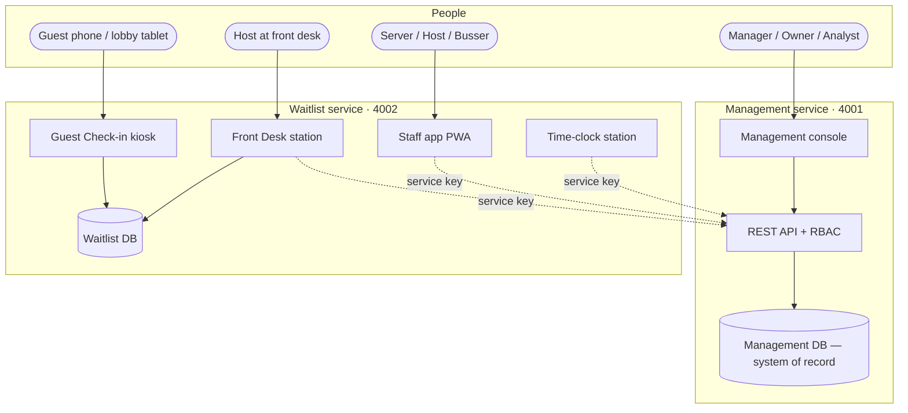

*Two services, two databases. Dotted lines are trusted server-to-server calls
carrying a service key.*

- **Single-source sign-in** — the Front Desk / Staff app authenticates against the
  Management directory (the system of record), so one password per person works
  across both apps and can't drift. Local Front-Desk accounts are an **offline
  break-glass** only: if Management is unreachable, a host can still sign in and keep
  the local waiting list running.
- **Service key + `as=`** — cross-app calls send `X-Service-Key` and act "as" the
  signed-in staff email, so Management applies that person's permissions.
- **Server-sent events** — one SSE stream pushes waitlist, visit and message
  changes to the boards sub-second; a seated guest appears on the floor instantly.

**Deployment.** Both services deploy to Fly.io on every push to `main` via GitHub
Actions — Management at `pho-ha-noi-management.fly.dev`, Waitlist at
`pho-ha-noi-waitlist.fly.dev`. HTTPS is forced; machines idle-sleep and cold-start
in ~1–2 s.

---

## 3. Database design

The Management database is organized into eight subject areas, each drawn on its own
below; the [table catalog](#4-table-catalog) then lists every table with its
purpose. The Waitlist database (§3.9) is deliberately small.

> **Reading the diagrams.** `PK` = primary key, `FK` = foreign key, `UK` = unique.
> A crow's-foot (many) at one end and a bar (one) at the other reads "one location
> has many staff." Only key columns are drawn to keep each figure legible — full
> columns live in the schema and the catalog.

### 3.1 People, access & locations

Every person is a `users` row with a `role` and a home `location_id`; their full HR
record is a 1:1 `staff_profiles` row, and `staff_locations` lists the other stores
they can cover. **SSN and bank details are intentionally not stored** — those stay
in the payroll provider.

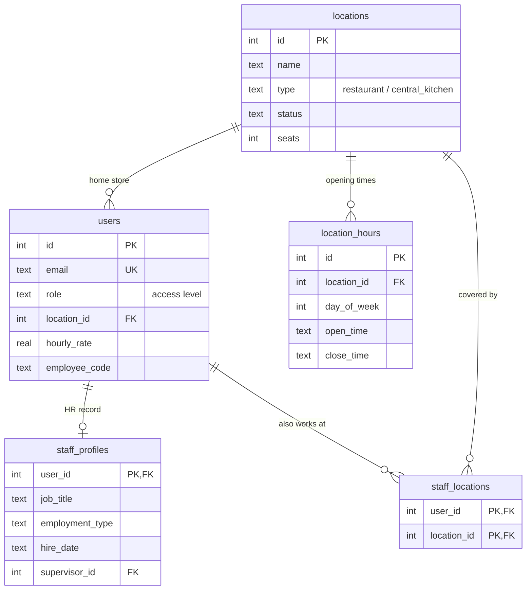

### 3.2 Floor plan & guest visits

`service_visits` is the spine of the guest experience: one row per party as it moves
`waiting → seated → in_service → paying → done`. Every move is appended to
`visit_events` for history and performance reporting.

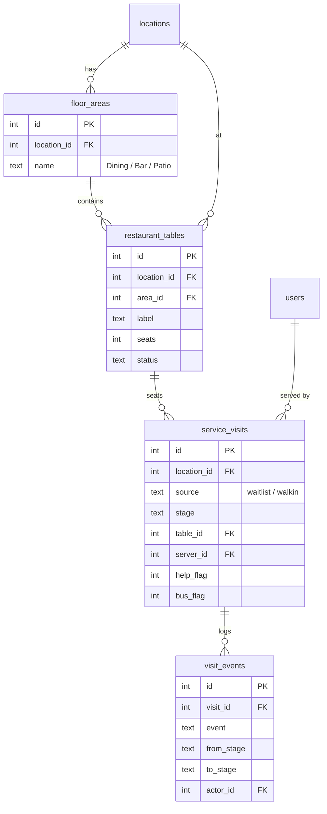

### 3.3 Scheduling & jobs

A weekly `shifts` row places a person at a store on a day; each shift can carry
several jobs from the shared `jobs` catalog and paid `shift_breaks`. Separately,
`task_assignments` pins a specific day-task to a working person. Breaks are 10 min &
paid; the grid enforces 8h/day and 40h/week soft limits. When a staff member works a
day task they tap **Start** (`started_at`) then **Done** (`done_at`), and may attach
one **proof photo**, stored as bytes in `task_photos`.

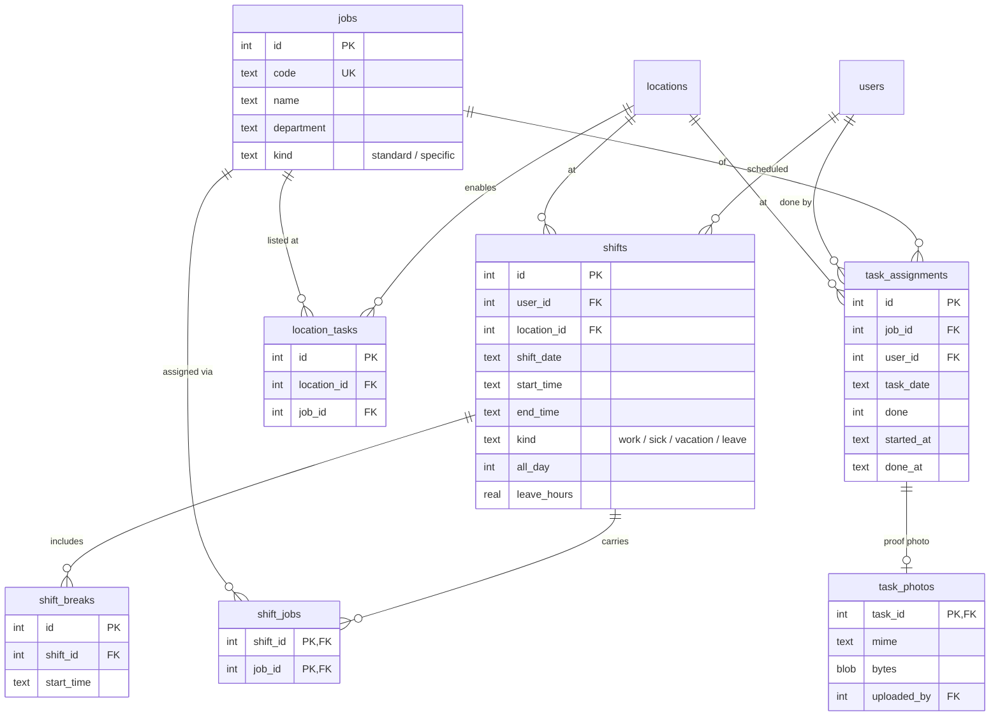

### 3.4 Time clock, overtime & approvals

A `time_entries` row is one work day: clock-in snapshots the scheduled span,
clock-out fills worked minutes and any `late_minutes`. Overtime needs a manager's
`ot_approvals` sign-off (which can be escalated to Owner / GM / Admin); managers can
`time_adjustments` (rounding) and finally `timesheet_approvals` a whole period.

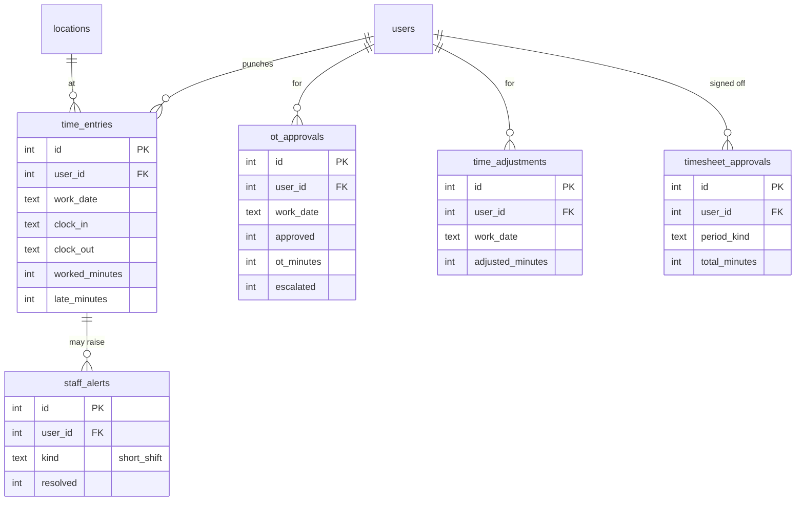

### 3.5 Inventory & stock movement

Stock is per `(item, location)`. Every movement is an immutable
`inventory_transactions` row; received stock also lands as `inventory_lots` drawn
down FIFO by expiry. Purchase orders, transfers, waste and cycle counts all feed the
ledger. PO lifecycle: `pending → approved → shipped → received` (receiving adds
stock).

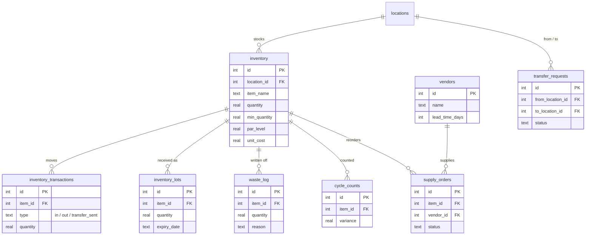

### 3.6 Central kitchen

The central kitchen produces broths and prepped proteins. Stores submit
`store_requests` (demand); `ck_production_runs` record batch output with
yield/shrinkage; fulfilling a request delivers stock into that store's inventory as
a logged transfer.

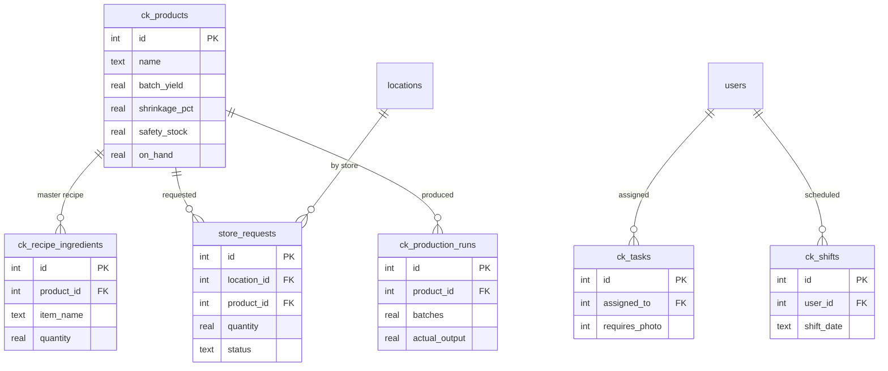

### 3.7 Menu & recipes

Menu items belong to categories; each item's `recipe_ingredients` link to inventory
items by name, so food cost is computed live from real stock unit costs.

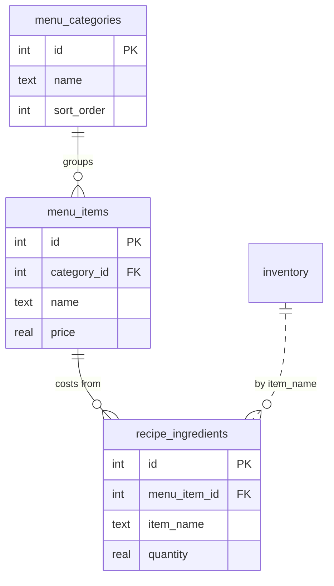

### 3.8 Equipment, sales, messaging & audit

The remaining tables round out the console: equipment registers per location, daily
sales for reporting, threaded team `messages` with per-recipient read state, and two
audit trails.

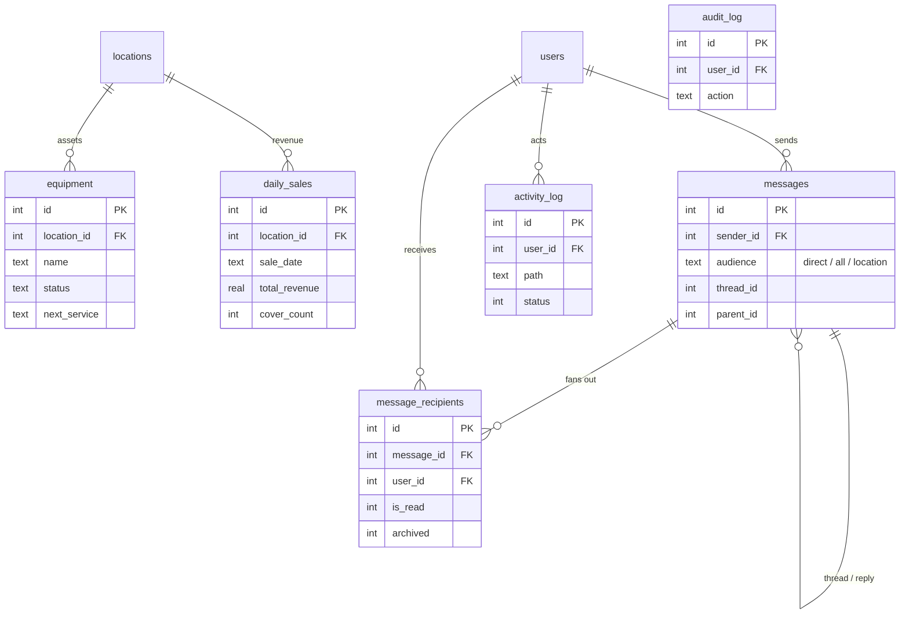

### 3.9 Waitlist database

The Front Desk app keeps a lean local database: its own `users`, the `waitlist`
parties (with `source` = staff or self-kiosk and a `public_ref` code for live
tracking), the page log, a local floor plan, and its own audit trails.

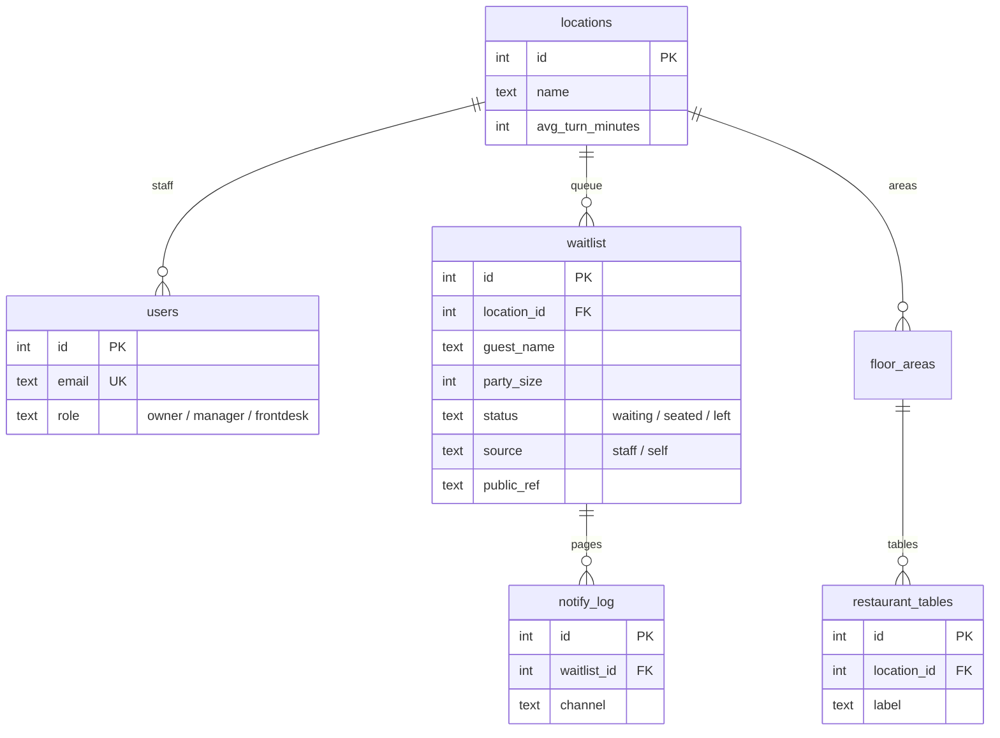

---

## 4. Table catalog

### Management database — 41 tables

| Table | Domain | Purpose |
|---|---|---|
| `users` | People | Staff accounts: name, email, role, home location, hourly rate |
| `staff_profiles` | People | Full HR record, 1:1 with users (no SSN / bank data) |
| `staff_locations` | People | Additional stores a person can work at |
| `locations` | Org | Restaurants + the central kitchen |
| `location_hours` | Org | Per-day opening / closing times |
| `floor_areas` | Floor | Named areas (Dining, Bar, Patio) per store |
| `restaurant_tables` | Floor | Numbered tables with position, seats & live status |
| `service_visits` | Service | The guest-visit spine: waiting → seated → done |
| `visit_events` | Service | Append-only log of every visit stage change & check |
| `shifts` | Schedule | Weekly shift: person × day × store, start/end |
| `shift_jobs` | Schedule | Jobs attached to a shift |
| `shift_breaks` | Schedule | Paid 10-min breaks within a shift |
| `jobs` | Schedule | Shared job/task catalog by department |
| `task_assignments` | Schedule | A specific day-task pinned to a working person, with Start/Done timestamps |
| `task_photos` | Schedule | Optional proof photo for a day task (image bytes in the DB) |
| `location_tasks` | Schedule | Which specific tasks apply at which store |
| `time_entries` | Time | One work day: clock-in/out, worked & late minutes |
| `ot_approvals` | Time | Manager approval of overtime; can escalate |
| `time_adjustments` | Time | Manager rounding of a day's worked minutes |
| `timesheet_approvals` | Time | Sign-off on a period's total hours |
| `staff_alerts` | Time | Alerts to a manager (e.g. left early) |
| `inventory` | Inventory | Stock per item per location with min/par/cost |
| `inventory_transactions` | Inventory | Immutable in/out/transfer movement ledger |
| `inventory_lots` | Inventory | Received batches with expiry, drawn FIFO |
| `vendors` | Inventory | Supplier master records |
| `supply_orders` | Inventory | Purchase orders with a lifecycle |
| `transfer_requests` | Inventory | Inter-location transfers with approval |
| `waste_log` | Inventory | Spoilage / write-offs with reason |
| `cycle_counts` | Inventory | Physical counts vs system (variance) |
| `ck_products` | Central K. | Items the central kitchen produces |
| `ck_recipe_ingredients` | Central K. | Master recipe per product |
| `store_requests` | Central K. | Daily item requests from each store |
| `ck_production_runs` | Central K. | Batch runs with yield & shrinkage |
| `ck_tasks` | Central K. | Photo-verified kitchen tasks |
| `ck_shifts` | Central K. | Central-kitchen shift schedule |
| `menu_categories` | Menu | Menu groupings |
| `menu_items` | Menu | Dishes with price |
| `recipe_ingredients` | Menu | Item → inventory ingredient links for costing |
| `equipment` | Assets | Equipment register with maintenance schedule |
| `daily_sales` | Reporting | Per-day revenue & covers by location |
| `messages` · `message_recipients` | Messaging | Threaded team messaging + per-person read state |

Plus `audit_log`, `activity_log` and the legacy `timesheets` table.

### Waitlist database — 8 tables

| Table | Purpose |
|---|---|
| `locations` | Stores, each with an average table-turn time for quoting waits |
| `users` | Front-desk accounts (owner / manager / frontdesk) |
| `waitlist` | Parties in the queue: staff- or self-added, with a live tracking code |
| `notify_log` | Record of every "your table is ready" page |
| `floor_areas` · `restaurant_tables` | Local floor plan for seating |
| `audit_log` · `activity_log` | Who-did-what and access trails (incl. guest check-ins) |

---

## 5. The apps in detail

### Management console (port 4001)

A left sidebar filtered by access level, with per-module tab bars. Managers land on
a location dashboard; self-service staff land on a personal home screen.

| Module | What's inside | Who |
|---|---|---|
| **Overview** | KPI tiles, today's roster, schedule health, needs-attention panel | All (manager dashboard for managers) |
| **Locations** | Directory + details, operating hours, staff, weekly schedule, equipment register | Owner/Admin all · Manager own |
| **Staff** | Directory (A–Z), full HR-profile edit, jobs/tasks catalog, access-level matrix, activity log. **Add staff** + access-level/location changes are owner/admin-only; **managers edit their own store's staff** (name, status, password, all HR fields) | Owner/Admin/Manager |
| **Inventory** | Stock, orders & reorder, transfers, lots & expiry, vendors, reports, glossary | Ops+ (own location) |
| **Central Kitchen** | Demand, production, recipes, fulfillment, CK staff & PIN clock | Owner/Admin/GM |
| **Menu / Recipes** | Menu items, recipe links, live food-cost costing | Manage tier |
| **Reports** | Items, sales, analytics, timesheets, payments — location + date filters | Reports tier |
| **Messages** | Inbox, sent, compose (direct or broadcast) | All |
| **My Schedule** | Read-only weekly shifts across every store they work | Scheduled staff |

> **Editing staff.** Open a person from Staff → Directory and click **Edit** to change
> their **full HR profile** — Account (name), Personal, Contact, Mailing address,
> Emergency contact, Employment, Payroll, "Also works at," and Skills/Notes — plus
> reset password and activate/deactivate. **Who can edit whom:**
> - **Owner / Admin** — anyone, every field, including **access level** and **home
>   location**; only they can **Add staff**.
> - **Managers** — their own store's staff (all-location managers: any store), but not
>   owner/admin accounts. They edit the full profile, status, and password, while
>   **access level, home location, and email stay read-only** and there's **no Add
>   staff** button.
>
> Email is the sign-in and is read-only for everyone; change access level or location
> to move someone between roles or stores (owner/admin).

### Front Desk / Waitlist app (port 4002)

The authenticated host station, scoped to the signed-in host's store (owners get a
store switcher). Runs the live queue with waited time and quoted wait, add-party,
notify/page, seat (onto a table) and mark-left, plus live stats, "handled today"
history, guest history & daily reports (owner/admin), and an access/activity log
(owner).

### Guest Check-in kiosk (no login)

Public page at `/checkin`, or per-store `/checkin/<slug>` / `/checkin?loc=<id>` for
a lobby tablet or QR. The guest sees the current wait, enters name / party size /
phone and special-request chips (high chair, booth, patio, birthday…), joins, and
then **tracks their spot live** — the screen flips to "🔔 Your table is ready!" the
moment the host pages them. Hardened with per-IP rate limits, a duplicate-submit
guard and a 16 KB body cap.

### Staff app (PWA)

The floor-facing phone app. Installs to the home screen; its nav collapses to a
hamburger drawer on phones. Views depend on role:

| View | Purpose | Shown to |
|---|---|---|
| 📋 My Tasks | Assigned day-tasks — Start, Done, and an optional proof photo | Everyone |
| 🛎️ My Tables | The staff member's own tables, claim queue & timed checks | All front & back-of-house roles |
| 🍜 Front Desk | The live waiting-list board for the store | Host / Front Desk / managers |
| 🍽️ Floor | Live table map — front-of-house + managers can seat / update; kitchen roles view-only | All front & back-of-house roles + managers |
| ✉️ Messages | Team inbox with unread badge | Everyone |
| ⏱ My Hours | Own timesheet — day / week / month, OT & late | Everyone |
| 📜 📊 🧾 History / Report / Activity | Cross-store oversight | Owner |

### Time-clock station (shared terminal)

A "Check in / Check out" screen (in Management, and reachable from the Staff app)
where a staff member punches in and out for a shift. Check-in snapshots the day's
scheduled span; check-out computes worked minutes, lateness and any overtime, and
can warn if someone's leaving early.

---

## 6. Workflows

### 6.1 The guest journey — check-in to done

A party joins the list one of two ways, then moves across the floor as a single
visit. Every arrow appends a `visit_events` row for history and performance
reporting.

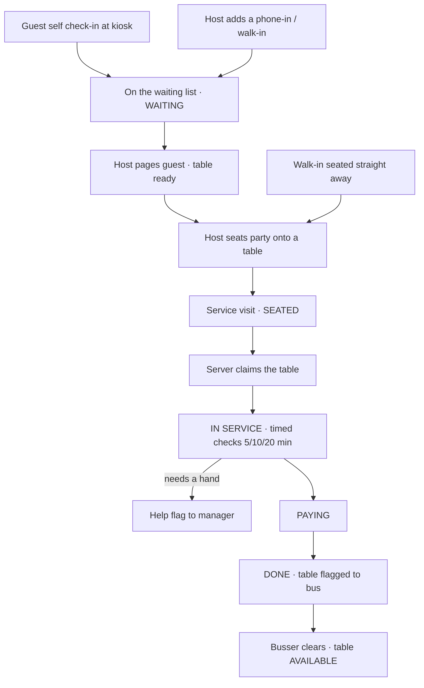

1. **Join the list** — Guest self-checks-in at the kiosk (lands tagged *SELF
   CHECK-IN*), or the host adds them. A pure walk-in the host seats immediately
   skips waiting.
2. **Page & seat** — When a table frees, the host pages the guest (kiosk flips to
   "table ready") and seats them onto a specific table — creating the service visit.
3. **Serve** — A server claims the table on the Staff app, works timed checks, and
   can raise a help flag for a manager.
4. **Close out** — Move to paying, then done; the table is flagged for a busser, who
   clears it back to available.

### 6.2 Staff check-in / check-out & payroll

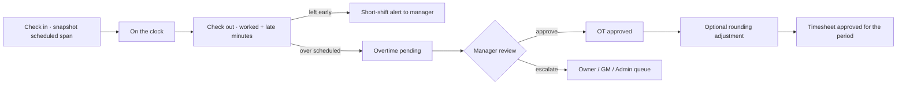

Time flows from the clock station into the manager's review and a period sign-off.
Staff watch their own totals in **My Hours**.

### 6.3 Weekly scheduling

A manager builds the week from the Location → Schedule grid (every staff member ×
seven days):

- Click **+** on a day → set start/end, pick one or more **jobs** from the catalog,
  add paid **breaks** (10 min each; unlocked once a shift is ≥ 3.5 h; max 2/day
  unless the day tops 10 h).
- A day can hold multiple work periods (e.g. 8–12 and 12–16), each with its own
  break.
- Soft limits: **8 h/day** and **40 h/week** turn the cell red ⚠ and block the save
  until the manager ticks **"Approve overtime exception"** — so going over is
  deliberate.
- Because each shift carries its own location, a person can be scheduled at different
  stores on different days; away shifts show as read-only "@ store" cards.
- **Leave** — the **+** entry has a **Type**: Work shift, or **Sick / Vacation /
  On-leave**. Leave takes a duration — **all day** (8 h), a **number of hours**, or a
  **from–to** span — and shows as a coloured chip (🤒 / 🏖️ / 🗓️). Leave never counts
  toward worked hours or the 8h/40h limits; instead the **timesheet totals it as sick,
  vacation, or leave hours** — on the person's **My Hours** (Sick / Vacation / On-leave
  tiles) and on the manager's **Timesheet** as a **Leave** column (per-period total,
  included in the CSV export). A person's HR **status** can also be set to `on_leave`
  on their profile.

### 6.4 Inventory replenishment & the central kitchen

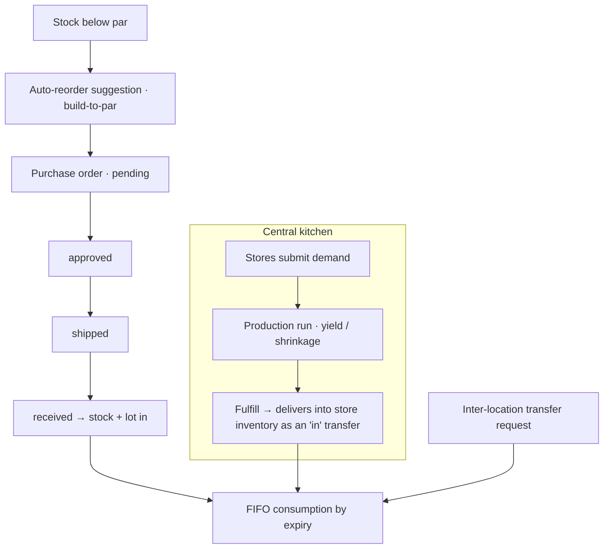

Two ways stock arrives: vendor POs and central-kitchen fulfillment. Waste and cycle
counts also adjust the ledger.

### 6.5 Team messaging

Everyone can send **direct** messages; managers and above can **broadcast** to all
staff or a whole location. Assigning a task notifies the assignee. Threads support
replies, mark-unread and archive, and unread counts push to the sidebar/nav badge in
real time.

| Sender | Can message |
|---|---|
| Owner / Admin / GM | Anyone — everyone, a group, or an individual |
| Manager | Owner/admin, their staff, and manager peers |
| Staff (self-service) | Their manager, owner/admin, and peers |

### 6.6 Daily tasks: start, done, proof photo

Managers assign specific day tasks on the Management **Day Tasks** board. Each
working staff member sees their own tasks in the Staff app's **My Tasks**:

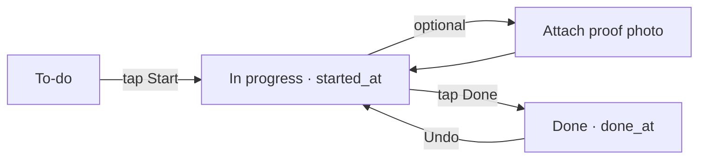

1. **Start** — the staff member taps Start; `started_at` is stamped and the card
   shows as in progress.
2. **Proof photo (optional)** — before finishing, they may attach one photo (camera
   or library). It's sent as raw image bytes and stored in `task_photos` on the
   Management DB volume, then shown as a thumbnail (tap to zoom).
3. **Done** — tapping Done stamps `done_at`. The manager's Day Tasks board sees the
   Start/Done times and can view the proof photo.

The photo is optional — a task can be completed without one. Managers and the task's
owner can view a stored photo; it persists with the database.

---

## 7. Access levels

Access levels are defined once in `lib/auth.js` as a **scope** (all locations /
their own / just themselves) plus **capabilities**. Route permissions, the sidebar,
and the on-screen access-level page all derive from that one table — and the API
returns **403** on any disallowed action, so hiding in the UI is convenience, not
the security boundary.

**Scopes:** `all` (sees and switches between every location) · `location` (pinned to
their own store) · `self` (only their own schedule, tasks & messages).

| Access level | Scope | Capabilities | In short |
|---|---|---|---|
| **Owner** | all | org · manage · ops · reports · central | Everything; only an owner can create owners |
| **Admin** | all | org · manage · ops · reports · central | Everything; created by an owner |
| **General Manager** | all | manage · ops · reports · central | Operations across every store |
| **Regional Manager** | all | manage · ops · reports | Multi-store ops, no central kitchen |
| **Manager** | location | manage · ops · reports | Runs their own store end to end |
| **Assistant / Kitchen Manager** | location | manage · ops · reports | Same store powers, lower rank |
| **Analyst / Accountant** | all | reports | Read-only reports & analytics, all stores |
| **Inventory Support** | location | ops | Stock operations at their store |
| **Driver** | location | delivery | Read-only delivery manifests + own schedule |
| **Server · Host · Busser · Chef · Line/Prep Cook · Cashier · Bartender · Barista · Dishwasher** | self | — | My schedule, my tasks, messages, my hours |

> **Positions share permissions, differ by title.** Server, Host, Busser and the
> kitchen positions are all `self`-scoped with the same access — the job title just
> changes what they're called and which Staff-app views appear.

---

## 8. User guide by role

Hand each tester the section that matches their job.

### Owner / Admin

1. **Sign in to the Management console** — you land on an org-wide overview. Use the
   location picker (top bar) to switch between all ten stores + the central kitchen.
2. **Add a staff member** — Staff → Add staff: fill the account + HR profile, set
   access level, home location and any "also works at" stores. Confirm they appear
   in the A–Z directory.
3. **Check the central kitchen** — Central Kitchen → Demand → "Generate from sales",
   then Production to scale a batch sheet, then Fulfillment to deliver into a store.
4. **Review reports & the activity log** — Reports for sales/analytics/timesheets;
   Staff → Activity Log for every sign-in, change and denied attempt.

### Store Manager (Assistant / Kitchen Manager)

1. **Sign in** — you land on your store's dashboard (KPI tiles, today's roster,
   schedule health, needs-attention). Everything is scoped to your location.
2. **Build the week** — Locations → your store → Schedule: add shifts, attach jobs,
   add paid breaks. Try to exceed 40 h and confirm the guardrail blocks the save
   until you approve the exception.
3. **Run inventory** — Inventory → Orders & Reorder: accept an auto-reorder
   suggestion into a PO, then receive it and watch stock + a lot appear.
4. **Approve time** — Reports → Timesheets: review late/short/OT flags, approve
   overtime (or escalate), round a day, and sign off the period.
5. **Update your staff** — Staff → Directory → **Edit** on any of your store's
   people to update their full HR profile (contact, address, emergency contact,
   employment, payroll, skills/notes), status, or reset a password. Access level and
   home location changes stay with owner/admin, and only they can Add staff.

### Inventory Support · Analyst / Accountant · Driver

- **Inventory Support** (ops · own store) — sign in to Management; you get the
  Inventory module for your store (receive, transfer, count, waste, create orders).
  No staff or menu admin.
- **Analyst / Accountant** (reports · all) — sign in to Management; you get Reports
  only, read-only, across every location: sales, analytics, timesheets, payments.
- **Driver** (delivery) — sign in to Management; you get a read-only Deliveries view
  (central-kitchen manifests / packing slips) plus your own schedule and messages.

### Host / Front Desk

1. **Sign in to the Front Desk app** — header shows your store 📍. The live queue
   lists each party with waited time and quoted wait; self-check-ins are flagged.
2. **Add & seat a party** — Add party (name, size, phone — quote auto-suggests).
   When a table frees, Notify the guest, then Seat them onto a table.
3. **Or use the Staff app** — front-desk staff also get the 🍜 Front Desk board and
   🍽️ Floor in the Staff app on their phone.

### Server / Busser

1. **Open the Staff app on your phone** — you land on **My Tables**. The floor shows
   open tables to claim.
2. **Work a table** — claim a seated party, run the timed checks, raise a help flag
   if you need a manager, move to paying, then done. Bussers pick up the "ready to
   bus" flags.
3. **Check your hours** — ⏱ My Hours shows your day/week/month totals with late and
   overtime highlighted.

### Kitchen & other positions (Chef, Line/Prep Cook, Cashier, Bartender, Barista, Dishwasher)

Self-service everywhere: **My Schedule** (Management) or the Staff app's **My
Tasks**, **Messages** and **My Hours**. Punch in and out at the time-clock station.

### Guest (no login)

Walk up to the lobby tablet or scan the store QR → open `/checkin`, enter name /
party size / phone / any requests, join, and keep the screen open to watch your
place in line until "your table is ready."

---

## 9. Test plan & logins

> **Shared demo sandbox.** Anyone signed in can edit the data — please don't enter
> real guest or staff information while testing. Machines idle-sleep and cold-start
> in ~1–2 s.

### Where to go

| Surface | URL |
|---|---|
| Management console | `pho-ha-noi-management.fly.dev` |
| Front Desk / Staff app | `pho-ha-noi-waitlist.fly.dev` |
| Guest self check-in | `pho-ha-noi-waitlist.fly.dev/checkin` |

### Demo logins

> **One login, both apps.** Sign-in is unified to the Management directory, so **the
> same email + password works on both the Management console and the Staff / Front
> Desk app** — every account below is verified working on both. Signing in works
> everywhere; each role then sees the UI appropriate to it (e.g. an Analyst or Driver
> can open the Staff app but only sees the self-service views — My Tasks, Messages,
> My Hours). Front-desk staff use the Staff app; back-office roles use the console.

| Role | Email | Password |
|---|---|---|
| Owner (all) | `harry@phohanoi.com` | `Harry123!` |
| Admin (all) | `admin@phohanoi.com` | `Admin123!` |
| General Manager (all) | `gm@phohanoi.com` | `Gm123456!` |
| Manager (location) | `manager1@phohanoi.com` | `Manager123!` |
| Analyst (reports) | `analyst@phohanoi.com` | `Analyst123!` |
| Inventory Support (ops) | `support@phohanoi.com` | `Support123!` |
| Driver (delivery) | `driver@phohanoi.com` | `Driver123!` |
| Server (self) | `server@phohanoi.com` | `Server123!` |
| Chef (self) | `chef@phohanoi.com` | `Chef123456!` |
| Host — role `host` (waitlist) | `host@phohanoi.com` | `Host123!` |
| Front Desk — role `frontdesk` (waitlist) | `host1@phohanoi.com` | `Host123!` |

> **Note:** all logins above are verified working on production, on **both** apps. If
> a login ever fails, the owner account (`harry@phohanoi.com` / `Harry123!`) is the
> safe fallback.

### A 10-minute smoke test for a store

1. **Guest joins** — on a phone, open `/checkin`, join the list, keep the tracker
   open.
2. **Host seats** — sign in as the host, page the guest (their tracker flips to
   "ready"), seat them onto a table.
3. **Server serves** — as a server in the Staff app, claim the table, run a check,
   mark paying then done.
4. **Manager reviews** — as the manager, open Reports → Timesheets and the Overview
   dashboard; confirm the store's numbers moved.
5. **Owner watches** — as the owner, switch locations and confirm the visit shows in
   Guest History and the daily report.
