# Phở Hà Nội — Platform Handbook

_Last updated: September 4, 2026_

One reference for the whole system: how the apps fit together, the full back-end
database design, the day-to-day workflows, and a role-by-role guide you can hand
to staff at any location for testing.

> **Owner:** Harry Nguyen · **Stack:** Node.js + Express + built-in `node:sqlite`,
> vanilla-JS front ends (no build step) · **Scale:** 10 stores + 1 central
> kitchen · **57 tables** across 2 databases.

A styled, interactive version of this document (with rendered diagrams and a
sticky table of contents) is also published as a Claude Artifact.

## Contents

1. [Platform overview](#1-platform-overview)
2. [System architecture](#2-system-architecture)
3. [Database design](#3-database-design)
4. [Table catalog](#4-table-catalog)
5. [The apps in detail](#5-the-apps-in-detail)
6. [Workflows](#6-workflows)
7. [Roles & access levels](#7-roles--access-levels)
8. [User guide by role](#8-user-guide-by-role)
9. [Test plan & logins](#9-test-plan--logins)

---

## 1. Platform overview

Phở Hà Nội runs on **two deployed services** that together present **four things**
a person actually uses. Everything is scoped by **location** and gated by **access
level**, so the same platform serves an owner watching all ten stores and a busser
who only sees their own tasks.

| Surface | Where | What it is |
|---|---|---|
| **Management app** | service · port 4001 | The back-office console — staff, locations, inventory, central kitchen, menu & recipes, scheduling, timesheets, reports, messaging. The **system of record**. |
| **Waitlist / Front Desk app** | service · port 4002 | The host station for a single store: run the waiting list, seat parties onto the floor, launch the guest kiosk and the staff time clock. |
| **Guest Check-in kiosk** | surface · no login | A public page (`/checkin`) or QR at the door. Guests join the waitlist themselves and track their spot live until "your table is ready." |
| **Staff app** | surface · staff PWA | The floor-facing phone app for servers, hosts and bussers: my tasks, my tables, the live floor, team messages, my hours. Installs to the home screen. |

> **"Check-in" and "check-out" mean two different things here.** Guests *check in*
> to the waiting list at the kiosk. Staff *check in / check out* on the time-clock
> station to start and end a shift. Both are covered in [Workflows](#6-workflows).

---

## 2. System architecture

Each service is a small Node.js + Express app with its own SQLite database, a
vanilla-JS single-page front end, and a REST API under `/api/*`. Auth is a 12-hour
JWT; passwords are bcrypt hashes. **Staff sign in with their 10-digit phone number**
(any format is accepted and normalized to digits); email is kept only as an optional
internal identity.

The Management app holds the authoritative data. The Front Desk and Staff apps read
and write the shared operational data (floor plan, guest visits, staff messages,
time clock) by calling Management over a trusted **service key** — so both apps act
on one source of truth instead of keeping parallel copies.

*Two services, two databases. Dotted lines are trusted server-to-server calls
carrying a service key.*

- **Single-source sign-in** — staff sign in with their **10-digit phone number**; the
  Front Desk / Staff app authenticates against the Management directory (the system of
  record), so one phone + password per person works across both apps and can't drift.
  Local Front-Desk accounts are an **offline break-glass** only: if Management is
  unreachable, a host can still sign in (by phone) and keep the local waiting list running.
- **Service key + `as=`** — cross-app calls send `X-Service-Key` and act "as" the
  signed-in staff email (the internal identity carried in the token), so Management
  applies that person's permissions.
- **Server-sent events** — one SSE stream pushes waitlist, visit and message
  changes to the boards sub-second; a seated guest appears on the floor instantly.

**Deployment.** Both services deploy to Fly.io on every push to `main` via GitHub
Actions — Management at `pho-ha-noi-management.fly.dev`, Waitlist at
`pho-ha-noi-waitlist.fly.dev`. HTTPS is forced; machines idle-sleep and cold-start
in ~1–2 s.

---

## 3. Database design

The Management database is organized into eight subject areas, each drawn on its own
below; the [table catalog](#4-table-catalog) then lists every table with its
purpose. The Waitlist database (§3.9) is deliberately small.

> **Reading the diagrams.** `PK` = primary key, `FK` = foreign key, `UK` = unique.
> A crow's-foot (many) at one end and a bar (one) at the other reads "one location
> has many staff." Only key columns are drawn to keep each figure legible — full
> columns live in the schema and the catalog.

### 3.1 People, access & locations

Every person is a `users` row with a `role` and a home `location_id`; their full HR
record is a 1:1 `staff_profiles` row, and `staff_locations` lists the other stores
they can cover. Each `role` points at the `roles` registry (the access levels
Owner/Admin manage). **SSN and bank details are intentionally not stored** — those
stay in the payroll provider.

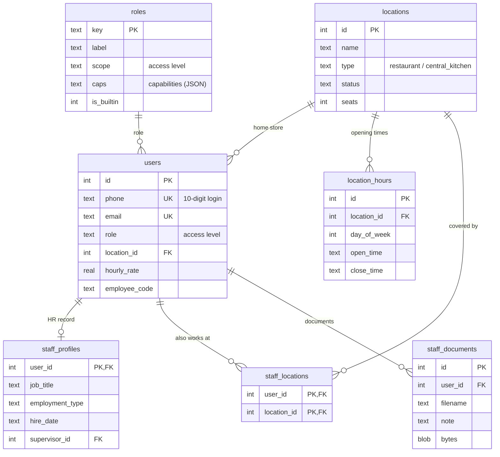

### 3.2 Floor plan & guest visits

`service_visits` is the spine of the guest experience: one row per party as it moves
`waiting → seated → in_service → paying → done`. Every move is appended to
`visit_events` for history and performance reporting.

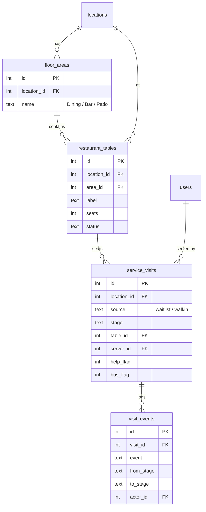

### 3.3 Scheduling & jobs

A weekly `shifts` row places a person at a store on a day; each shift can carry
several jobs from the shared `jobs` catalog and paid `shift_breaks`. Separately,
`task_assignments` pins a specific day-task to a working person. Breaks are 10 min &
paid; the grid enforces 8h/day and 40h/week soft limits. When a staff member works a
day task they tap **Start** (`started_at`) then **Done** (`done_at`), and may attach
**one or more proof photos** (up to 8, stored as bytes in `task_photos`, one row per
image) and **comments / feedback** (`task_comments`). Managers view every photo and
comment on a task from the **Day Tasks** board, and can reply with feedback.

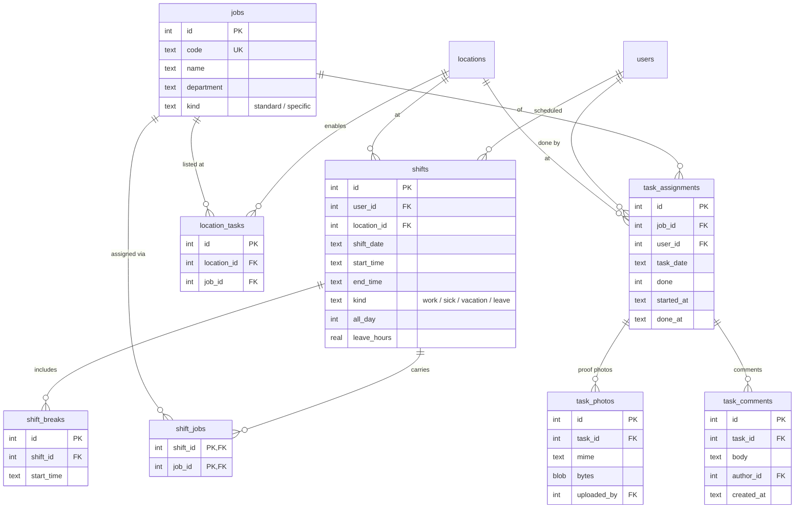

### 3.4 Time clock, overtime & approvals

A `time_entries` row is one work day: clock-in snapshots the scheduled span,
clock-out fills worked minutes and any `late_minutes`. Overtime needs a manager's
`ot_approvals` sign-off (which can be escalated to Owner / GM / Admin); managers can
`time_adjustments` (rounding) and finally `timesheet_approvals` a whole period.

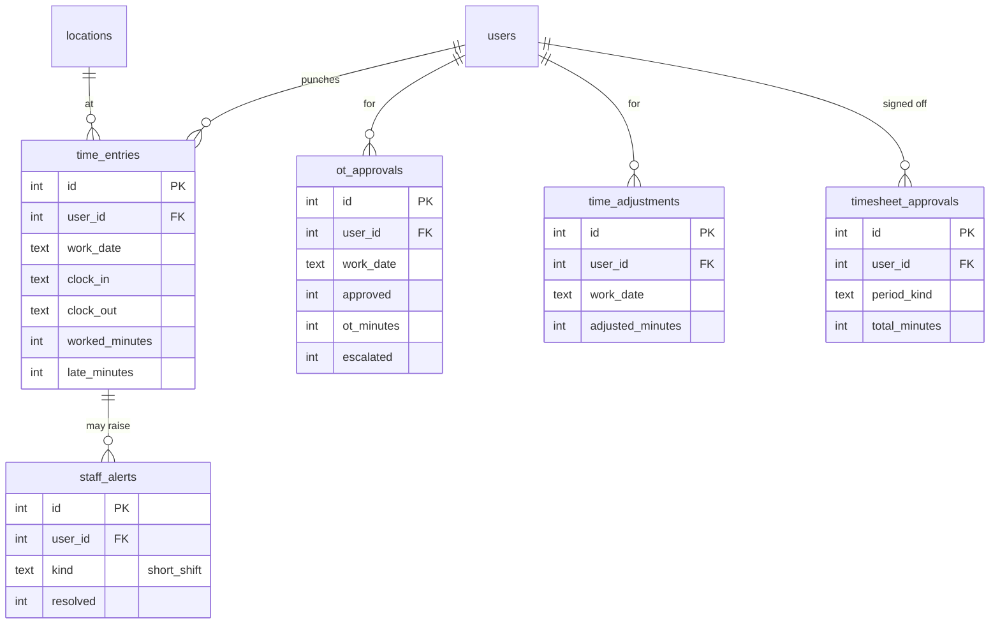

### 3.5 Inventory & stock movement

Stock is per `(item, location)`. Every movement is an immutable
`inventory_transactions` row; received stock also lands as `inventory_lots` drawn
down FIFO by expiry. Purchase orders, transfers, waste and cycle counts all feed the
ledger. PO lifecycle: `pending → approved → shipped → received` (receiving adds
stock).

### 3.6 Central kitchen

The central kitchen produces broths and prepped proteins. Stores submit
`store_requests` (demand); `ck_production_runs` record batch output with
yield/shrinkage; fulfilling a request delivers stock into that store's inventory as
a logged transfer.

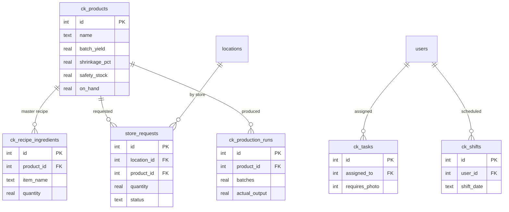

### 3.7 Menu & recipes

Menu items belong to categories; each item's `recipe_ingredients` link to inventory
items by name, so food cost is computed live from real stock unit costs.

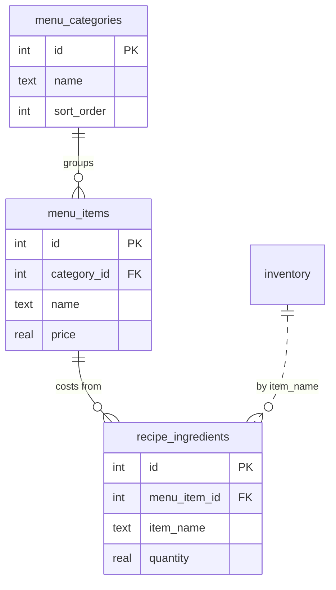

### 3.8 Equipment, sales, messaging & audit

The remaining tables round out the console: equipment registers per location, daily
sales for reporting, threaded team `messages` with per-recipient read state, and two
audit trails.

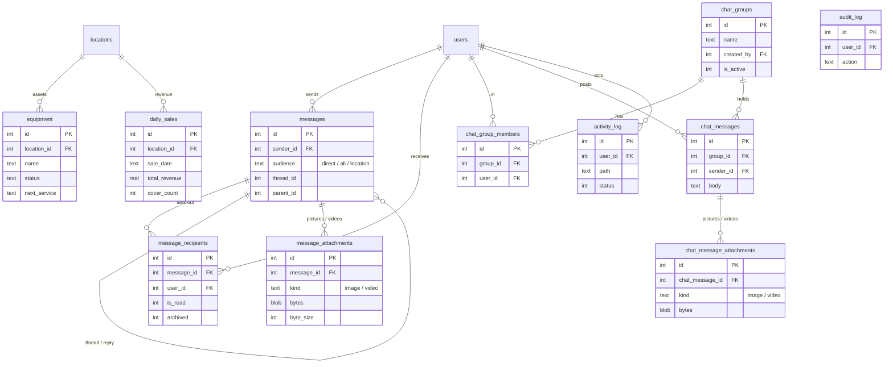

### 3.9 Waitlist database

The Front Desk app keeps a lean local database: its own `users`, the `waitlist`
parties (with `source` = staff or self-kiosk and a `public_ref` code for live
tracking), the page log, a local floor plan, and its own audit trails.

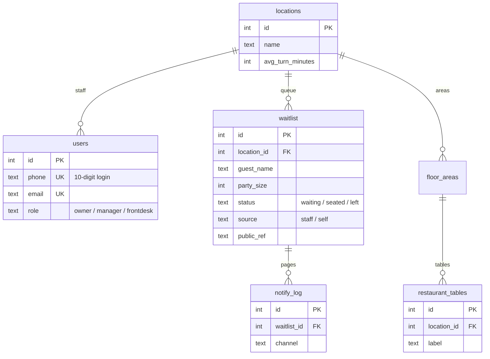

---

## 4. Table catalog

### Management database — 50 tables

| Table | Domain | Purpose |
|---|---|---|
| `users` | People | Staff accounts: name, **phone (10-digit login)**, email, role, home location, hourly rate |
| `roles` | People | Access-level registry (Roles): label, access level (scope) & capabilities; Owner/Admin-managed |
| `staff_profiles` | People | Full HR record, 1:1 with users — incl. a transformed 9-digit **Personal ID** (no SSN / bank data) |
| `staff_documents` | People | Per-staff document holder — contracts, certificates, licenses, scans (bytes in the DB, each with a note) |
| `staff_locations` | People | Additional stores a person can work at |
| `locations` | Org | Restaurants + the central kitchen |
| `location_hours` | Org | Per-day opening / closing times |
| `floor_areas` | Floor | Named areas (Dining, Bar, Patio) per store |
| `restaurant_tables` | Floor | Numbered tables with position, seats & live status |
| `service_visits` | Service | The guest-visit spine: waiting → seated → done |
| `visit_events` | Service | Append-only log of every visit stage change & check |
| `shifts` | Schedule | Weekly shift: person × day × store, start/end |
| `shift_jobs` | Schedule | Jobs attached to a shift |
| `shift_breaks` | Schedule | Paid 10-min breaks within a shift |
| `jobs` | Schedule | Shared job/task catalog by department |
| `task_assignments` | Schedule | A specific day-task pinned to a working person, with Start/Done timestamps |
| `task_photos` | Schedule | Optional proof photos for a day task — many per task, one row per image (image bytes in the DB) |
| `task_comments` | Schedule | Comments / feedback on a day task — staff notes and manager replies (many per task) |
| `location_tasks` | Schedule | Which specific tasks apply at which store |
| `time_entries` | Time | One work day: clock-in/out, worked & late minutes |
| `ot_approvals` | Time | Manager approval of overtime; can escalate |
| `time_adjustments` | Time | Manager rounding of a day's worked minutes |
| `timesheet_approvals` | Time | Sign-off on a period's total hours |
| `staff_alerts` | Time | Alerts to a manager (e.g. left early) |
| `break_reminders` | Time | Audit archive of "your break is in 10 min" alerts sent to staff (sent + acknowledged times) |
| `inventory` | Inventory | Stock per item per location with min/par/cost |
| `inventory_transactions` | Inventory | Immutable in/out/transfer movement ledger |
| `inventory_lots` | Inventory | Received batches with expiry, drawn FIFO |
| `vendors` | Inventory | Supplier master records |
| `supply_orders` | Inventory | Purchase orders with a lifecycle |
| `transfer_requests` | Inventory | Inter-location transfers with approval |
| `waste_log` | Inventory | Spoilage / write-offs with reason |
| `cycle_counts` | Inventory | Physical counts vs system (variance) |
| `ck_products` | Central K. | Items the central kitchen produces |
| `ck_recipe_ingredients` | Central K. | Master recipe per product |
| `store_requests` | Central K. | Daily item requests from each store |
| `distribution_orders` | Central K. | A store's raw-food order to the CK, with its CK-fill / vendor-shortfall split |
| `ck_production_runs` | Central K. | Batch runs with yield & shrinkage |
| `ck_tasks` | Central K. | Photo-verified kitchen tasks |
| `ck_shifts` | Central K. | Central-kitchen shift schedule |
| `menu_categories` | Menu | Menu groupings |
| `menu_items` | Menu | Dishes with price |
| `recipe_ingredients` | Menu | Item → inventory ingredient links for costing |
| `equipment` | Assets | Equipment register with maintenance schedule |
| `daily_sales` | Reporting | Per-day revenue & covers by location |
| `messages` · `message_recipients` | Messaging | Threaded team messaging + per-person read state |
| `message_attachments` | Messaging | Pictures & videos on a message (bytes in the DB; per-kind size caps) |
| `chat_groups` | Chat | Persistent staff chat groups (channels); `is_active=0` when deleted (kept for audit) |
| `chat_group_members` | Chat | Who belongs to each chat group |
| `chat_messages` | Chat | Messages posted in a chat group (retained for audit) |
| `chat_message_attachments` | Chat | Pictures & videos on a chat message (bytes in the DB; per-kind size caps) |
| `chat_reads` | Chat | Per-member read cursor for unread counts |
| `floor_alerts` | Messaging | Urgent on-screen pings a manager pushes to working staff (person / role / everyone) |
| `floor_alert_acks` | Messaging | One row per staff member who acknowledged an alert ("On it") |
| `sms_messages` | Messaging | One row per SMS blast a manager/owner composes (target, body, recipient & sent counts, provider) |
| `sms_recipients` | Messaging | Per-person delivery record for a blast (phone + status: sent / logged / failed / no_phone) |

Plus `audit_log`, `activity_log` and the legacy `timesheets` table.

### Waitlist database — 8 tables

| Table | Purpose |
|---|---|
| `locations` | Stores, each with an average table-turn time for quoting waits |
| `users` | Front-desk accounts (owner / manager / frontdesk) |
| `waitlist` | Parties in the queue: staff- or self-added, with a live tracking code |
| `notify_log` | Record of every guest text — join confirmation & "your table is ready" page (with SMS status) |
| `floor_areas` · `restaurant_tables` | Local floor plan for seating |
| `audit_log` · `activity_log` | Who-did-what and access trails (incl. guest check-ins) |

---

## 5. The apps in detail

### Management console (port 4001)

A left sidebar filtered by access level, with per-module tab bars. Managers land on
a location dashboard; self-service staff land on a personal home screen.

| Module | What's inside | Who |
|---|---|---|
| **Overview** | KPI tiles, today's roster, schedule health, needs-attention panel | All (manager dashboard for managers) |
| **Locations** | Directory + details, operating hours, staff, weekly schedule, equipment register | Owner/Admin all · Manager own |
| **Staff** | Directory (A–Z, searchable by phone/name/code), full HR-profile edit, jobs/tasks catalog, Roles matrix (Access Levels), activity log. Adding staff requires a **mandatory 10-digit login phone** (email optional). **Add staff** + role/location changes are owner/admin-only; **managers edit their own store's staff** (name, login phone, status, password, all HR fields) | Owner/Admin/Manager |
| **Inventory** | Stock, orders & reorder, transfers, lots & expiry, vendors, reports, glossary | Ops+ (own location) |
| **Central Kitchen** | Demand, production, **distribution** (raw-food warehouse → stores), recipes, fulfillment, CK staff & PIN clock | Owner/Admin/GM |
| **Menu / Recipes** | Menu items, recipe links, live food-cost costing | Manage tier |
| **Reports** | Items, sales, analytics, timesheets, payments — location + date filters | Reports tier |
| **Messages** | Inbox, sent, compose (direct or broadcast) with **picture & video attachments**, **💬 Chat** groups (channels; leadership can audit any), **Floor alerts** (urgent on-screen pings), **📱 Text** (SMS blasts to staff phones) | All · alerts & texts sent by managers |
| **My Schedule** | Read-only weekly shifts across every store they work | Scheduled staff |

> **Editing staff.** Open a person from Staff → Directory and click **Edit** to change
> their **full HR profile** — Account (name), Personal, Contact, Mailing address,
> Emergency contact, Employment, Payroll, "Also works at," and Skills/Notes — plus
> reset password and activate/deactivate. **Who can edit whom:**
> - **Owner / Admin** — anyone, every field, including **role** and **home
>   location**; only they can **Add staff**.
> - **Managers** — their own store's staff (all-location managers: any store), but not
>   owner/admin accounts. They edit the full profile, **login phone**, status, and
>   password, while **role and home location stay read-only** and there's **no
>   Add staff** button.
>
> **Phone is the sign-in** (a 10-digit number, mandatory when adding staff) and can be
> edited by anyone who can edit the account; email is an optional internal identity and
> is read-only here. Change **role** or location to move someone between roles or
> stores (owner/admin).
>
> **Adding staff** also requires a **date of birth**, and takes an **Employee code**
> (exactly 6 digits — left blank, it's generated from the DOB as MMDDYY) and an optional
> **Personal ID** (entered as 9 digits, stored in a transformed form). The Employment
> section has a **Terminated date** for when someone permanently leaves.
>
> **Documents.** Each staff profile has a **document holder** — upload signed contracts,
> certificates, licenses and scans (images, PDF, Word/Excel/PowerPoint or text, 25 MB
> each), each with a note; open, re-note or remove them later. Files are stored in
> `staff_documents`; the same people who can edit a person can manage their documents.

### Front Desk / Waitlist app (port 4002)

The authenticated host station, scoped to the signed-in host's store (owners get a
store switcher). Runs the live queue with waited time and quoted wait, add-party,
notify/page, seat (onto a table) and mark-left, plus live stats, "handled today"
history, guest history & daily reports (owner/admin), and an access/activity log
(owner).

### Guest Check-in kiosk (no login)

Public page at `/checkin`, or per-store `/checkin/<slug>` / `/checkin?loc=<id>` for
a lobby tablet or QR. The guest sees the current wait, enters just **name, party
size and mobile number**, joins, and then **tracks their spot live** — the screen
flips to "🔔 Your table is ready!" the moment the host pages them. Hardened with
per-IP rate limits, a duplicate-submit guard and a 16 KB body cap.

### Staff app (PWA)

The floor-facing phone app. Installs to the home screen — an **install banner**
offers a one-tap **Install** on Android/desktop Chrome, and the **Share → Add to
Home Screen** hint on iPhone/iPad (dismissible; it snoozes for two weeks). Its nav
collapses to a hamburger drawer on phones. Views depend on role:

| View | Purpose | Shown to |
|---|---|---|
| 📋 My Tasks | Assigned day-tasks — Start, Done, optional proof photos (multi-upload) and comments / feedback | Everyone |
| 🛎️ My Tables | The staff member's own tables, claim queue & timed checks | All front & back-of-house roles |
| 🍜 Front Desk | The live waiting-list board for the store | Host / Front Desk / managers |
| 🍽️ Floor | Live table map — front-of-house + managers can seat / update; kitchen roles view-only | All front & back-of-house roles + managers |
| ✉️ Messages | Team inbox with unread badge; send/reply with picture & video attachments; **💬 Chat** groups | Everyone |
| ⏱ My Hours | Own timesheet — day / week / month, OT & late | Everyone |
| ⚙️ Settings | Per-device preferences — floor-alert sound & vibration | Everyone |
| 🔔 Alert | Send an urgent floor alert (header button) | Managers / owner |
| 📜 📊 🧾 History / Report / Activity | Cross-store oversight | Owner |

### Time-clock kiosk (per location, no login)

Each location has its own clock URL — **`/clock/<slug>`** (e.g.
`pho-ha-noi-management.fly.dev/clock/milpitas`); the bare **`/clock`** lists the
stores. New locations get a slug automatically, and slugs match case- and
hyphen-insensitively (`/SanJose` = `/san-jose`). The page needs **no login**: a
tablet at the store sits ready, and staff clock in/out with just their **employee
code** (the physical location + code is the trust model).

Entering a code shows a message panel:
- bad format (too short / wrong characters) → "check your employee code and try again";
- valid format but unknown → "not found — check again or ask your manager";
- valid → a time-of-day greeting ("**Good morning Nha Le, welcome to Pho Ha Noi
  Milpitas**") and **Clock In / Clock Out** buttons (only the applicable one is enabled).

**Clock in** goes straight through when they're within 30 minutes of a shift here.
Otherwise it warns and asks them to confirm — **not scheduled today**, **scheduled at
another location**, or **more than 30 minutes early** — and on confirm it clocks them
in and **messages the location's manager(s)** to review for the timesheet. **Clock out**
says goodbye on time; **more than 30 minutes early** warns, and on confirm messages the
manager. Punches write to the same `time_entries` the Time-Clock board and Timesheets
read. A background sweep reminds a staff member (and messages their manager) when they're
still clocked in **30 minutes past a scheduled end**. Those overruns also appear on the
**Time-Clock board** under "Still clocked in past their scheduled end," where a manager
**approves the extra hours** (they keep working) or **clocks them out now** — either way
it's recorded on the entry for the timesheet.

**Break reminders.** A background sweep pops a live alert to a staff member **a set number of
minutes before each scheduled break** ("your break is at 9:10 — take it in about 10 minutes");
they acknowledge it like any floor alert. The lead time is **per location** — set the
**Break reminder lead (minutes before break)** on the location's Details settings (default 10,
1–60), so a store can remind staff earlier or later. Each **store manager can set their own
location's** lead time (owner/admin can set any), and every reminder is archived in `break_reminders` and
listed on the **Time-Clock board** under "☕ Break reminders" with the sent and acknowledged
times — a compliance record that staff were reminded of their breaks. For a cross-location
audit, **Reports → Breaks** rolls up every reminder over a date range (owner/admin/GM see all
locations; a single-store manager sees only theirs), with counts of how many were sent and
acknowledged.

**Text messages (SMS).** The platform can text real mobile phones through a
provider-agnostic sender (`lib/sms.js`, present in both apps). It is **safe by default**:
with no provider configured it runs in **log-only** mode — every message is recorded for
audit but nothing is actually sent (and nothing costs money). Setting `SMS_PROVIDER` +
credentials (as Fly secrets) switches it live:

- **Twilio** — `SMS_PROVIDER=twilio` with `TWILIO_ACCOUNT_SID`, `TWILIO_AUTH_TOKEN`, `TWILIO_FROM`.
- **TextBelt** — `SMS_PROVIDER=textbelt` with `TEXTBELT_KEY` (the key `textbelt` gives 1 free msg/day, for testing).

What gets texted:

- **Guests** — a **join confirmation** when they're added to the waitlist (self-kiosk or
  front desk), with their spot and quoted wait, and the **"your table is ready"** page when
  the host notifies them. Guest texts carry a "Reply STOP to opt out" footer; every page is
  logged in `notify_log` (with `status` = sent / logged / failed and `kind` = joined / ready).
  **Opt-in required (TCPA/CTIA):** a guest is only ever texted if they **agreed** — the
  self-kiosk shows a consent checkbox with the SMS disclosure next to the phone field, and the
  front-desk "Add party" form has a "guest agreed to texts" checkbox the host ticks. The
  agreement is stored on the waitlist row (`sms_consent` + `consent_at`); with no opt-in the
  guest still joins and tracks their spot on-screen, and the host pages them in person.
- **Staff** — the **break reminder** also goes to the staff member's phone, and **manager
  alerts** (missed clock-out, early clock-out, clock-in to review) also text the location's
  leaders.
- **Blast / compose** — **Messages → 📱 Text** lets an owner/admin/manager text **everyone**,
  **a role**, or **one person** (e.g. "cover needed tonight", a task reminder). Managers are
  scoped to their own store; owner/admin/GM can pick any store or all. Every blast is archived
  in `sms_messages` + `sms_recipients` for audit, and the composer shows a log-only banner
  until a provider is live.

---

## 6. Workflows

### 6.1 The guest journey — check-in to done

A party joins the list one of two ways, then moves across the floor as a single
visit. Every arrow appends a `visit_events` row for history and performance
reporting.

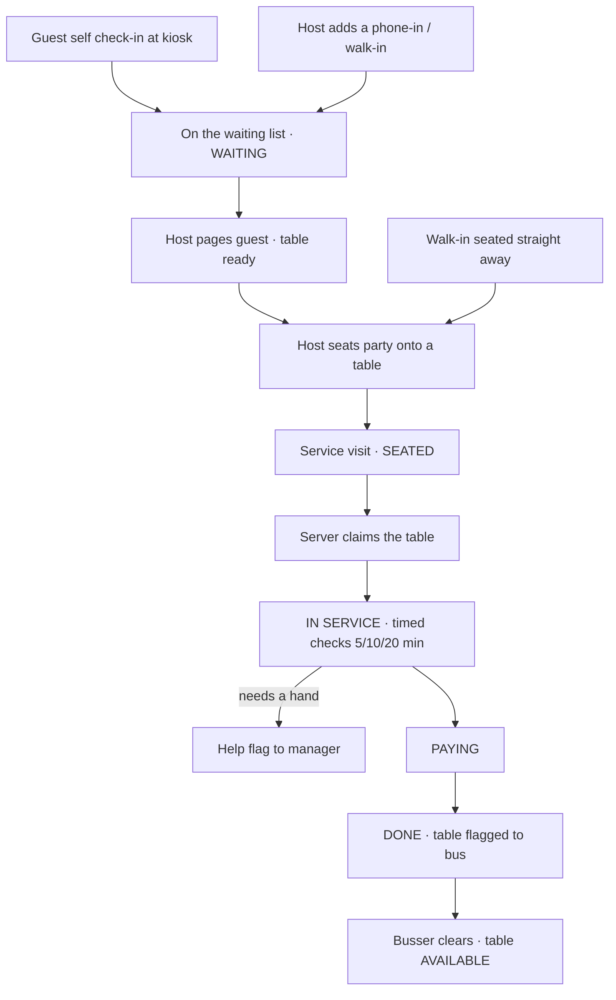

1. **Join the list** — Guest self-checks-in at the kiosk (lands tagged *SELF
   CHECK-IN*), or the host adds them. A pure walk-in the host seats immediately
   skips waiting.
2. **Page & seat** — When a table frees, the host pages the guest (kiosk flips to
   "table ready") and seats them onto a specific table — creating the service visit.
3. **Serve** — A server claims the table on the Staff app, works timed checks, and
   can raise a help flag for a manager.
4. **Close out** — Move to paying, then done; the table is flagged for a busser, who
   clears it back to available.

### 6.2 Staff check-in / check-out & payroll

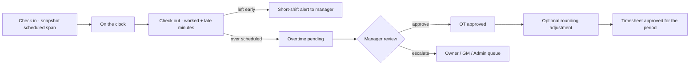

Time flows from the clock station into the manager's review and a period sign-off.
Staff watch their own totals in **My Hours**.

### 6.3 Weekly scheduling

A manager builds the week from the Location → Schedule grid (every staff member ×
seven days):

- Click **+** on a day → set start/end, pick one or more **jobs** from the catalog,
  add paid **breaks** (10 min each; unlocked once a shift is ≥ 3.5 h; max 2/day
  unless the day tops 10 h).
- A day can hold multiple work periods (e.g. 8–12 and 12–16), each with its own
  break.
- Soft limits: **8 h/day** and **40 h/week** turn the cell red ⚠ and block the save
  until the manager ticks **"Approve overtime exception"** — so going over is
  deliberate.
- Because each shift carries its own location, a person can be scheduled at different
  stores on different days; away shifts show as read-only "@ store" cards.
- **Leave** — the **+** entry has a **Type**: Work shift, or **Sick / Vacation /
  On-leave**. Leave takes a duration — **all day** (8 h), a **number of hours**, or a
  **from–to** span — and shows as a coloured chip (🤒 / 🏖️ / 🗓️). Leave never counts
  toward worked hours or the 8h/40h limits; instead the **timesheet totals it as sick,
  vacation, or leave hours** — on the person's **My Hours** (Sick / Vacation / On-leave
  tiles) and on the manager's **Timesheet** as a **Leave** column (per-period total,
  included in the CSV export). A person's HR **status** can also be set to `on_leave`
  on their profile.

### 6.4 Inventory replenishment & the central kitchen

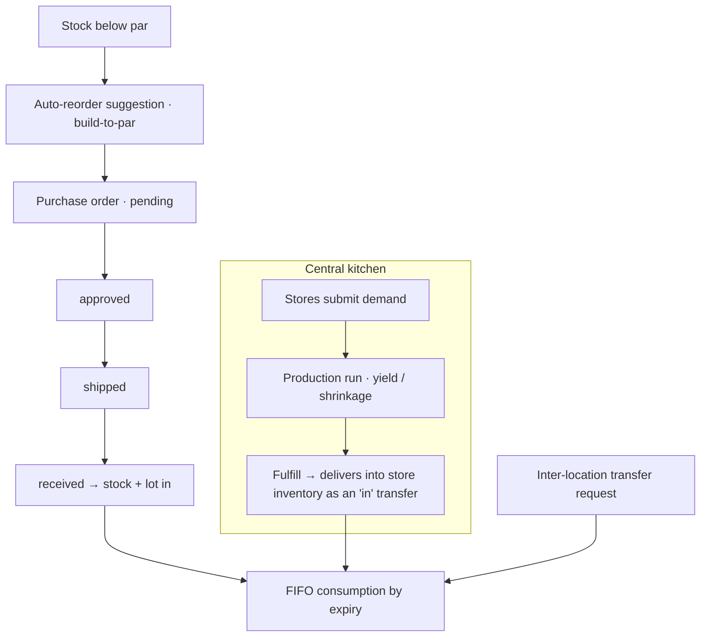

Two ways stock arrives: vendor POs and central-kitchen fulfillment. Waste and cycle
counts also adjust the ledger.

#### Central-Kitchen-first raw ordering

The Central Kitchen is also the group's **raw-food warehouse** — it stocks the same
raw items the stores use and distributes them. On a store's **Inventory → Orders &
Reorder** page, "Order — Central Kitchen first" is the preferred default: each
below-par item is split automatically, filling as much as the CK has on hand and
auto-drafting a **vendor PO for the shortfall** (a manager can still override to a
vendor-only PO).

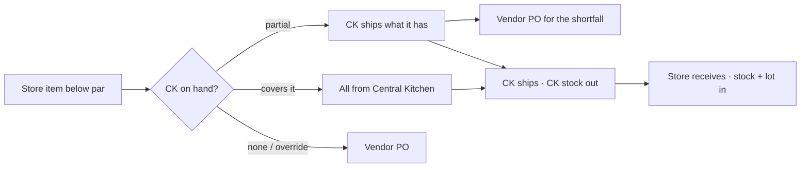

The CK portion moves through a **ship → receive** lifecycle on the Central Kitchen's
**Distribution** tab: shipping deducts CK warehouse stock (an `out` movement), and the
store confirms receipt to land it in its own inventory (an `in` movement). Each order
is one `distribution_orders` row carrying its `ck_qty` / `vendor_qty` split; the
shortfall is an ordinary vendor `supply_orders` PO linked back to it. The CK curates
which items it offers (`inventory.distributable`) and restocks itself from vendors
through the normal inventory tools, scoped to the Central Kitchen.

The CK warehouse is a real stock holding, so the **org-wide inventory report**
(Reports → Items with no location selected) counts it alongside the ten stores — its
value shows up in the total, the by-category and by-location breakdowns, and the top
items. Scope the report to a single store and it stays store-only, as before.

On the **Stock** page, a single item's **Order** button opens a picker whose *source*
**defaults to the Central Kitchen** whenever the CK stocks that item (falling back to
the vendor list otherwise), so ordering CK-first is the one-click default there too.
And **+ Add item** picks its name from the **Glossary** — a dropdown of catalog items
not yet stocked at that location, auto-filling category and unit — so item names stay
consistent; brand-new names are still created on the Glossary tab.

**Everything is audited — with a reason.** Every add, edit, order, receive, transfer,
waste, count and Central-Kitchen action writes an `audit_log` entry recording **who ·
when · what**. The Add / Edit / Order forms across Inventory and the Central Kitchen
also carry an optional **Reason / note** field, so the audit records **why** too. The
full trail is on **Inventory → Activity** ("who did what" — inventory, central kitchen
and distribution), where each row shows the action, the item and quantity, the reason,
and the person who did it.

### 6.5 Team messaging

Everyone can send **direct** messages; managers and above can **broadcast** to all
staff or a whole location. Assigning a task notifies the assignee. Threads support
replies, mark-unread and archive, and unread counts push to the sidebar/nav badge in
real time.

**Pictures & videos.** Both the composer and the reply box carry a **📎 Add photos /
video** control (multi-select). Attachments are stored as bytes in `message_attachments`
(images up to 10 MB, videos up to 25 MB, 10 per message) and shown inline in the thread —
images as tap-to-zoom thumbnails, videos as inline players. Only the message's sender can
attach; every participant can view. A media-only message auto-captions (e.g. "📷 Photo").

**Deleting.** In a thread, a message's own sender — or any **manager** (owner, admin,
general manager, manager), for moderation — can **delete** a whole message (its 🗑 button)
or remove a single **attachment** (its ✕). Deleting removes just that message (replies in
the thread stay); its recipients and attachments go with it.

| Sender | Can message |
|---|---|
| Owner / Admin / GM | Anyone — everyone, a group, or an individual |
| Manager | Owner/admin, their staff, and manager peers |
| Staff (self-service) | Their manager, owner/admin, and peers |

**Chat groups.** The Messages page also has a **💬 Chat** tab: persistent, membership-
scoped group conversations (like channels), stored in `chat_groups` / `chat_group_members`
/ `chat_messages`. **Everyone** can create a group from the staff list; **managers and
above** additionally get quick **add-by-location** and **add-by-role** builders. Only a
group's **members** see and post in it; the whole thread is delivered live over the SSE
stream (both apps). Everyone sees the groups they belong to, with unread counts
(`chat_reads`). **Leadership (owner/admin/GM)** can switch to **All groups (audit)** to
read any group for review — read-only unless they're a member. The **group's creator or
leadership** can **edit membership** from the group's 👥 Members panel (add staff — with
the same by-location / by-role builders — or remove a member with their ✕). **Owner/admin**
can **delete** a group; it's a soft-delete (deactivated and hidden from members) so all
messages are **retained for audit**. A group lives until then.

**Pictures & videos in chat.** Like direct messages, the chat composer carries a **📎**
control (multi-select): members can attach images and videos to a group message — same
caps and formats (images up to 10 MB, videos up to 25 MB, 10 per message), stored as bytes
in `chat_message_attachments` and shown inline in the thread (images tap-to-zoom, videos as
inline players). Only the message's sender can attach to it; **members and auditing
leadership** can view. New media is pushed live over the SSE stream so the group sees it
without reloading. Attachments are retained with their message for audit.

### 6.6 Daily tasks: start, done, proof photos & comments

Managers assign specific day tasks on the Management **Day Tasks** board. Each
working staff member sees their own tasks in the Staff app's **My Tasks**:

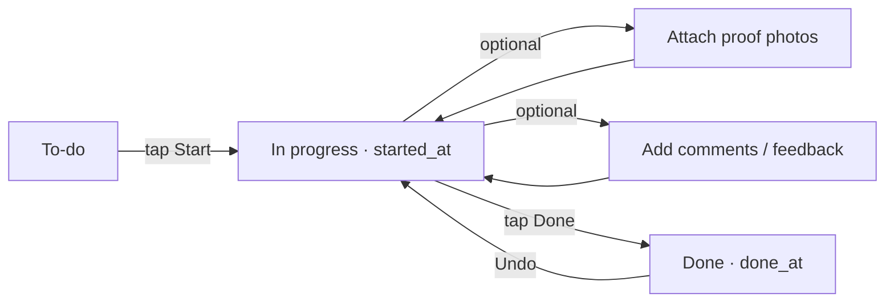

1. **Start** — the staff member taps Start; `started_at` is stamped and the card
   shows as in progress.
2. **Proof photos (optional)** — before finishing, they may attach **one or more
   photos** (camera or library — the picker allows multi-select). Each is sent as raw
   image bytes and stored as its own row in `task_photos` on the Management DB volume,
   then shown in a thumbnail strip (tap to zoom). Up to **8 photos per task**; while a
   task is in progress each thumbnail carries a **✕** to remove it.
3. **Comments / feedback (optional)** — right next to the photos, a **💬 Comments &
   feedback** box lets staff add notes (e.g. "walk-in was warm, flagged maintenance").
   Each comment is stored in `task_comments` with its author and time, and the whole
   thread is shared: a manager can **reply with feedback** from the Day Tasks board and
   the staff member sees it in My Tasks. You can delete your own comment; a manager can
   delete any.
4. **Done** — tapping Done stamps `done_at`. The manager's Day Tasks board sees the
   Start/Done times and can view every proof photo and comment.

Each task row carries a **Done-status checkbox at the far right** ("DONE" label). It
ticks green the instant a task is completed — via the ✓ Done button _or_ by tapping
the checkbox itself — with the running `done/total` header and progress ring updating
in the same moment, ahead of the server round-trip. Tapping a ticked box undoes it.

On the Day Tasks board a manager assigns each task via its **Assigned to** dropdown
(assigning notifies the assignee). Setting a task back to **— unassigned —** clears it
completely: the assignment is removed, so no owner, scheduled time, or "done" tick is
left behind — the task simply returns to the pool for someone else.

Photos and comments are optional — a task can be completed without either. On the Day
Tasks board the **Proof** column shows a **📷 _n_ · 💬 _m_** button (a **💬 +** when
empty); a manager, owner, or general manager clicks it to open a panel with the
**gallery** of every image (each captioned with who uploaded it and when — tap for full
size) and the **comment thread**, where they can leave feedback. The task's own staff
member and any manager can view both; they persist with the database.

### 6.7 Floor alerts: an urgent ping to staff on shift

When a manager/owner needs a staff member's attention *right now* — "help table 5",
"run food to tables 3 & 4", "come bus a table" — a **floor alert** pops up full-screen
on the working staff member's Staff app (with a chime + vibration), separate from the
regular message inbox.

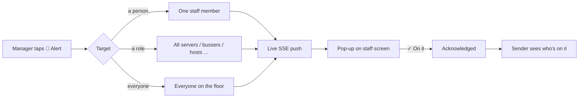

- **Send** from the **🔔 Alert** button in the Staff app header, or in the Management
  console under **Messages → Floor alerts**. Pick **who** (a person, a role, or everyone
  on the floor), tap a **quick message** (with a table-number fill-in) or type your own,
  choose **Urgent** or **Normal**, and send.
- **Receive** — the alert rides the same live stream as messages, so it appears within a
  moment on every targeted staff member's screen; anything still pending also shows when
  they next open the app. They tap **✓ On it** to acknowledge (or Dismiss). Each staff
  member can mute the chime and/or vibration for their own device under
  **⚙️ Settings → Floor alerts** (the pop-up still appears).
- **Track** — the sender's **Floor alerts** tab lists recent alerts with a live
  acknowledgement count, who acknowledged, and a **Close** button. Only owner / admin /
  GM / regional / store managers can send; a manager can only alert their own store.
  Every send is written to the audit log.

Alerts are for immediate floor coordination; use **Messages** (§6.5) for anything that
should live in an inbox or thread.

---

## 7. Roles & access levels

A **role** has an **access level** (its scope — all locations / their own / just
themselves) plus **capabilities** (what it can do). The registry lives in the
`roles` table, seeded from `lib/auth.js` defaults. Route permissions, the sidebar,
and the on-screen page all derive from it — and the API returns **403** on any
disallowed action, so hiding in the UI is convenience, not the security boundary.

On the **Staff → Access Levels** page the columns are **Roles · Access Level · Can
do**. **Owner/Admin** can **＋ Add role**, **Edit** any role (its access level and
capabilities), or **Remove** one — changes take effect immediately, no redeploy.
Guards: the **Owner** and **Admin** roles can't be removed, a role still assigned to
staff can't be removed (reassign those people first), and Owner always keeps org
admin. Everywhere a staff member's role is chosen or shown — **＋ Add Staff**, the
edit form, the directory, the profile — the field is labelled **Role**.

**Access levels (scopes):** `all` (sees and switches between every location) ·
`location` (pinned to their own store) · `self` (only their own schedule, tasks &
messages).

| Role | Access Level | Capabilities | In short |
|---|---|---|---|
| **Owner** | all | org · manage · ops · reports · central | Everything; only an owner can create owners |
| **Admin** | all | org · manage · ops · reports · central | Everything; created by an owner |
| **HR** | all | org · manage · ops · reports · central | Full administrative access, mirroring Admin¹ |
| **General Manager** | all | manage · ops · reports · central | Operations across every store |
| **Regional Manager** | all | manage · ops · reports | Multi-store ops, no central kitchen |
| **Manager** | location | manage · ops · reports | Runs their own store end to end |
| **Assistant / Kitchen Manager** | location | manage · ops · reports | Same store powers, lower rank |
| **Analyst / Accountant** | all | reports | Read-only reports & analytics, all stores |
| **Inventory Support** | location | ops | Stock operations at their store |
| **Driver** | location | delivery | Read-only delivery manifests + own schedule |
| **Server · Host · Busser · Chef · Line/Prep Cook · Cashier · Bartender · Barista · Dishwasher** | self | — | My schedule, my tasks, messages, my hours |

> **Positions share permissions, differ by title.** Server, Host, Busser and the
> kitchen positions are all `self`-scoped with the same access — the job title just
> changes what they're called and which Staff-app views appear.
>
> ¹ **HR** currently has the same full access as Owner/Admin. Owner and Admin are
> slated to keep a few powers to themselves later — **archive, delete, view the
> activity log, and audit information** — which HR would then not have; the checks
> that will change are marked `ORG_ADMIN_ONLY` in the code.

---

## 8. User guide by role

Hand each tester the section that matches their job.

### Owner / Admin

1. **Sign in to the Management console** — you land on an org-wide overview. Use the
   location picker (top bar) to switch between all ten stores + the central kitchen.
2. **Add a staff member** — Staff → Add staff: fill the account + HR profile, set
   the **10-digit login phone** (mandatory; email optional), role, home
   location and any "also works at" stores. Confirm they appear in the A–Z directory,
   then sign in as them with that phone number.
3. **Check the central kitchen** — Central Kitchen → Demand → "Generate from sales",
   then Production to scale a batch sheet, then Fulfillment to deliver into a store.
4. **Review reports & the activity log** — Reports for sales/analytics/timesheets;
   Staff → Activity Log for every sign-in, change and denied attempt.

### Store Manager (Assistant / Kitchen Manager)

1. **Sign in** — you land on your store's dashboard (KPI tiles, today's roster,
   schedule health, needs-attention). Everything is scoped to your location.
2. **Build the week** — Locations → your store → Schedule: add shifts, attach jobs,
   add paid breaks. Try to exceed 40 h and confirm the guardrail blocks the save
   until you approve the exception.
3. **Run inventory** — Inventory → Orders & Reorder: accept an auto-reorder
   suggestion into a PO, then receive it and watch stock + a lot appear.
4. **Approve time** — Reports → Timesheets: review late/short/OT flags, approve
   overtime (or escalate), round a day, and sign off the period.
5. **Update your staff** — Staff → Directory → **Edit** on any of your store's
   people to update their full HR profile (contact, address, emergency contact,
   employment, payroll, skills/notes), status, or reset a password. Role and
   home location changes stay with owner/admin, and only they can Add staff.

### Inventory Support · Analyst / Accountant · Driver

- **Inventory Support** (ops · own store) — sign in to Management; you get the
  Inventory module for your store (receive, transfer, count, waste, create orders).
  No staff or menu admin.
- **Analyst / Accountant** (reports · all) — sign in to Management; you get Reports
  only, read-only, across every location: sales, analytics, timesheets, payments.
- **Driver** (delivery) — sign in to Management; you get a read-only Deliveries view
  (central-kitchen manifests / packing slips) plus your own schedule and messages.

### Host / Front Desk

1. **Sign in to the Front Desk app** — header shows your store 📍. The live queue
   lists each party with waited time and quoted wait; self-check-ins are flagged.
2. **Add & seat a party** — Add party (name, size, phone — quote auto-suggests).
   When a table frees, Notify the guest, then Seat them onto a table.
3. **Or use the Staff app** — front-desk staff also get the 🍜 Front Desk board and
   🍽️ Floor in the Staff app on their phone.

### Server / Busser

1. **Open the Staff app on your phone** — you land on **My Tables**. The floor shows
   open tables to claim.
2. **Work a table** — claim a seated party, run the timed checks, raise a help flag
   if you need a manager, move to paying, then done. Bussers pick up the "ready to
   bus" flags.
3. **Check your hours** — ⏱ My Hours shows your day/week/month totals with late and
   overtime highlighted.

### Kitchen & other positions (Chef, Line/Prep Cook, Cashier, Bartender, Barista, Dishwasher)

Self-service everywhere: **My Schedule** (Management) or the Staff app's **My
Tasks**, **Messages** and **My Hours**. Punch in and out at the time-clock station.

### Guest (no login)

Walk up to the lobby tablet or scan the store QR → open `/checkin`, enter name /
party size / phone / any requests, join, and keep the screen open to watch your
place in line until "your table is ready."

---

## 9. Test plan & logins

> **Shared demo sandbox.** Anyone signed in can edit the data — please don't enter
> real guest or staff information while testing. Machines idle-sleep and cold-start
> in ~1–2 s.

### Where to go

| Surface | URL |
|---|---|
| Management console | `pho-ha-noi-management.fly.dev` |
| Front Desk / Staff app | `pho-ha-noi-waitlist.fly.dev` |
| Guest self check-in | `pho-ha-noi-waitlist.fly.dev/checkin` |

### Demo logins

> **One login, both apps.** Sign-in is by **10-digit phone number** and is unified to
> the Management directory, so **the same phone + password works on both the Management
> console and the Staff / Front Desk app** — every account below is verified working on
> both. Any input format is accepted — `(408) 483-0030`, `408-483-0030`, `4084830030` —
> and normalized to the 10 digits before matching. Each role then sees the UI
> appropriate to it (e.g. an Analyst or Driver can open the Staff app but only sees the
> self-service views — My Tasks, Messages, My Hours). Front-desk staff use the Staff
> app; back-office roles use the console.

| Role | Phone (login) | Password |
|---|---|---|
| Owner (all) | `(408) 483-0030` | `Harry123!` |
| Admin (all) | `(408) 555-0001` | `Admin123!` |
| General Manager (all) | `(408) 555-0004` | `Gm123456!` |
| Manager (location) | `(408) 555-0101` | `Manager123!` |
| Analyst (reports) | `(408) 555-0005` | `Analyst123!` |
| Inventory Support (ops) | `(408) 555-0002` | `Support123!` |
| Driver (delivery) | `(408) 555-0006` | `Driver123!` |
| Server (self) | `(408) 555-0007` | `Server123!` |
| Chef (self) | `(408) 555-0011` | `Chef123456!` |
| Host — role `host` (waitlist) | `(408) 555-0010` | `Host123!` |
| Front Desk — role `frontdesk` (waitlist) | `(408) 555-0201` | `Host123!` |

> **Note:** all logins above are verified working on production, on **both** apps. If
> a login ever fails, the owner account (`(408) 483-0030` / `Harry123!`) is the safe
> fallback. Email is no longer used to sign in — it's kept only as an optional internal
> identity (messaging/directory). The ten store managers are `(408) 555-0101` …
> `(408) 555-0110`.

### A 10-minute smoke test for a store

1. **Guest joins** — on a phone, open `/checkin`, join the list, keep the tracker
   open.
2. **Host seats** — sign in as the host, page the guest (their tracker flips to
   "ready"), seat them onto a table.
3. **Server serves** — as a server in the Staff app, claim the table, run a check,
   mark paying then done.
4. **Manager reviews** — as the manager, open Reports → Timesheets and the Overview
   dashboard; confirm the store's numbers moved.
5. **Owner watches** — as the owner, switch locations and confirm the visit shows in
   Guest History and the daily report.

### Central-Kitchen-first reorder (raw food)

Exercises the CK-first split ordering across the store and Central-Kitchen roles.
Manager logins run `(408) 555-0101` … `(408) 555-0110` (all `Manager123!`); the
Milpitas store (`(408) 555-0102`) carries low **Star Anise** and **Beef Flank** —
items the CK is also short on — so it shows a true split.

1. **Manager sees the split** — sign in as `(408) 555-0102`, open **Inventory →
   Orders & Reorder**. The low-stock list is headed *"Central Kitchen first, vendors for
   the shortfall,"* with **From CK** / **From vendor** columns. Confirm the split, e.g.
   Star Anise (need 14 → CK 5 + vendor 9) and Beef Flank (need 85 → CK 36 + vendor 49).
2. **Place the order** — click **Order all — CK first**. The items appear under **Central
   Kitchen orders** as `requested`, and the shortfall shows as vendor POs under
   **Purchase / supply orders**. (Or use **Vendor PO instead** to skip the CK entirely.)
3. **CK ships** — sign in as the owner / GM, open **Central Kitchen → Distribution →
   Incoming store orders**, and **Ship** an order. Confirm the item's warehouse **On
   hand** drops by the shipped quantity.
4. **Store receives** — back on the store's **Orders & Reorder** (as the manager or the
   CK), **Mark received**. Confirm the quantity lands in the store's **Stock**.
5. **CK restocks itself** — as the CK, open **Inventory** scoped to the Central Kitchen
   and reorder low warehouse items from vendors — the normal PO flow.

> **Access check:** a store manager never sees the **Central Kitchen** nav — they order
> *from* the CK but can't touch its warehouse or fulfilment queue (those return 403).

### Floor alert (manager → working staff)

Needs two devices/tabs: one signed in as a **manager** (`(408) 555-0102` /
`Manager123!`, Milpitas) and one as a **server at that store**
(`(408) 555-0007` / `Server123!`).

1. **Staff waits on the floor** — on the server's device, open the Staff app and stay on
   **My Tables** (their live stream is connected — the green ● Live badge shows).
2. **Manager sends** — on the manager's device, tap **🔔 Alert** in the Staff app header
   (or Management **Messages → Floor alerts**). Choose **A role → Servers**, tap the
   *"Help table {n} right away"* quick message with **#** = 5, leave it **Urgent**, and
   **Send**.
3. **Pops up** — within a moment the server's screen shows a full-screen **URGENT ALERT**
   card ("Help table 5 right away — from …") with a chime. Tap **✓ On it**.
4. **Sender sees it** — the manager gets a "✓ … is on it" toast, and the **Floor alerts**
   tab shows the alert's acknowledgement count tick up (tap **Who** to see the name).
5. **Access check** — sign in as the server and confirm there is **no 🔔 Alert button**;
   a non-manager cannot send (the API returns 403).
