# Phở Hà Nội — Platform Handbook

_Last updated: October 9, 2026_

One reference for the whole system: how the apps fit together, the full back-end
database design, the day-to-day workflows, and a role-by-role guide you can hand
to staff at any location for testing.

> **Owner:** Harry Nguyen · **Stack:** Node.js + Express + built-in `node:sqlite`,
> vanilla-JS front ends (no build step) · **Scale:** 10 stores + 1 central
> kitchen · **57 tables** across 2 databases.

A styled, interactive version of this document (with rendered diagrams and a
sticky table of contents) is also published as a Claude Artifact.

## Contents

1. [Platform overview](#1-platform-overview)
2. [System architecture](#2-system-architecture)
3. [Database design](#3-database-design)
4. [Table catalog](#4-table-catalog)
5. [The apps in detail](#5-the-apps-in-detail)
6. [Workflows](#6-workflows)
7. [Roles & access levels](#7-roles--access-levels)
8. [User guide by role](#8-user-guide-by-role)
9. [Test plan & logins](#9-test-plan--logins)

---

## 1. Platform overview

Phở Hà Nội runs on **two deployed services** that together present **four things**
a person actually uses. Everything is scoped by **location** and gated by **access
level**, so the same platform serves an owner watching all ten stores and a busser
who only sees their own tasks.

| Surface | Where | What it is |
|---|---|---|
| **Management app** | service · port 4001 | The back-office console — staff, locations, inventory, central kitchen, menu & recipes, scheduling, timesheets, reports, messaging. The **system of record**. |
| **Waitlist / Front Desk app** | service · port 4002 | The host station for a single store: run the waiting list, seat parties onto the floor, launch the guest kiosk and the staff time clock. |
| **Guest Check-in kiosk** | surface · no login | A public page (`/checkin`) or QR at the door. Guests join the waitlist themselves and track their spot live until "your table is ready." |
| **Staff app** | surface · staff PWA | The floor-facing phone app for servers, hosts and bussers: my tasks, my tables, the live floor, team messages, my hours. Installs to the home screen. |

> **"Check-in" and "check-out" mean two different things here.** Guests *check in*
> to the waiting list at the kiosk. Staff *check in / check out* on the time-clock
> station to start and end a shift. Both are covered in [Workflows](#6-workflows).

---

## 2. System architecture

Each service is a small Node.js + Express app with its own SQLite database, a
vanilla-JS single-page front end, and a REST API under `/api/*`. Auth is a 12-hour
JWT; passwords are bcrypt hashes. **Staff sign in with their 10-digit phone number**
(any format is accepted and normalized to digits); email is kept only as an optional
internal identity.

The Management app holds the authoritative data. The Front Desk and Staff apps read
and write the shared operational data (floor plan, guest visits, staff messages,
time clock) by calling Management over a trusted **service key** — so both apps act
on one source of truth instead of keeping parallel copies.

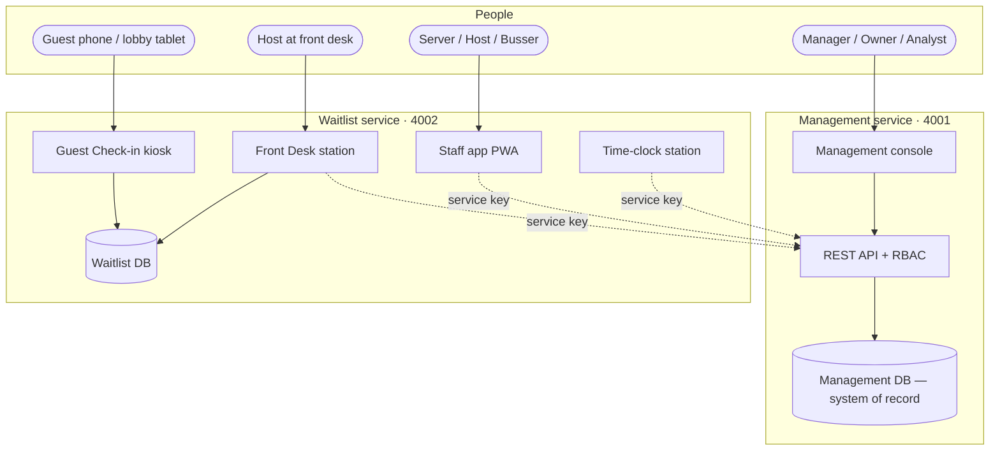
```mermaid
flowchart TB
  subgraph clients[People]
    G([Guest phone / lobby tablet])
    H([Host at front desk])
    S([Server / Host / Busser])
    M([Manager / Owner / Analyst])
  end

  subgraph wl[Waitlist service · 4002]
    KIOSK[Guest Check-in kiosk]
    FD[Front Desk station]
    STAFF[Staff app PWA]
    CLK[Time-clock station]
    WLDB[(Waitlist DB)]
  end

  subgraph mg[Management service · 4001]
    CONSOLE[Management console]
    API[REST API + RBAC]
    MGDB[(Management DB — system of record)]
  end

  G --> KIOSK
  H --> FD
  S --> STAFF
  M --> CONSOLE
  KIOSK --> WLDB
  FD --> WLDB
  FD -. service key .-> API
  STAFF -. service key .-> API
  CLK -. service key .-> API
  CONSOLE --> API
  API --> MGDB
```

*Two services, two databases. Dotted lines are trusted server-to-server calls
carrying a service key.*

- **Single-source sign-in** — staff sign in with their **10-digit phone number**; the
  Front Desk / Staff app authenticates against the Management directory (the system of
  record), so one phone + password per person works across both apps and can't drift.
  Local Front-Desk accounts are an **offline break-glass** only: if Management is
  unreachable, a host can still sign in (by phone) and keep the local waiting list running.
- **Service key + `as=`** — cross-app calls send `X-Service-Key` and act "as" the
  signed-in staff email (the internal identity carried in the token), so Management
  applies that person's permissions.
- **Server-sent events** — one SSE stream pushes waitlist, visit and message
  changes to the boards sub-second; a seated guest appears on the floor instantly.

**Deployment.** Both services deploy to Fly.io on every push to `main` via GitHub
Actions — Management at `pho-ha-noi-management.fly.dev`, Waitlist at
`pho-ha-noi-waitlist.fly.dev`. HTTPS is forced; machines idle-sleep and cold-start
in ~1–2 s.

---

## 3. Database design

The Management database is organized into eight subject areas, each drawn on its own
below; the [table catalog](#4-table-catalog) then lists every table with its
purpose. The Waitlist database (§3.9) is deliberately small.

> **Reading the diagrams.** `PK` = primary key, `FK` = foreign key, `UK` = unique.
> A crow's-foot (many) at one end and a bar (one) at the other reads "one location
> has many staff." Only key columns are drawn to keep each figure legible — full
> columns live in the schema and the catalog.

### 3.1 People, access & locations

Every person is a `users` row with a `role` and a home `location_id`; their full HR
record is a 1:1 `staff_profiles` row, and `staff_locations` lists the other stores
they can cover. Each `role` points at the `roles` registry (the access levels
Owner/Admin manage). **SSN and bank details are intentionally not stored** — those
stay in the payroll provider.

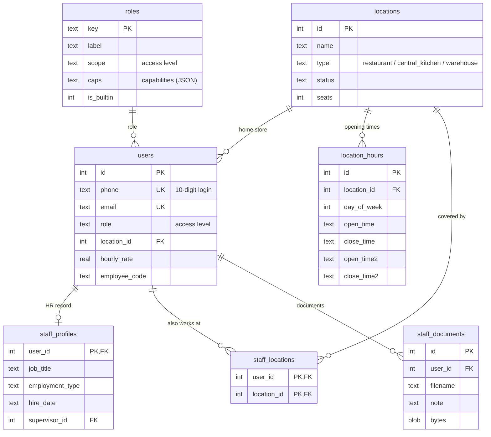
```mermaid
erDiagram
  locations ||--o{ users : "home store"
  locations ||--o{ location_hours : "opening times"
  roles ||--o{ users : "role"
  users ||--o| staff_profiles : "HR record"
  users ||--o{ staff_locations : "also works at"
  users ||--o{ staff_documents : "documents"
  locations ||--o{ staff_locations : "covered by"
  staff_documents {
    int id PK
    int user_id FK
    text filename
    text note
    blob bytes
  }
  roles {
    text key PK
    text label
    text scope "access level"
    text caps "capabilities (JSON)"
    int is_builtin
  }
  locations {
    int id PK
    text name
    text type "restaurant / central_kitchen / warehouse"
    text status
    int seats
  }
  users {
    int id PK
    text phone UK "10-digit login"
    text email UK
    text role "access level"
    int location_id FK
    real hourly_rate
    text employee_code
  }
  staff_profiles {
    int user_id PK,FK
    text job_title
    text employment_type
    text hire_date
    int supervisor_id FK
  }
  staff_locations {
    int user_id PK,FK
    int location_id PK,FK
  }
  location_hours {
    int id PK
    int location_id FK
    int day_of_week
    text open_time
    text close_time
    text open_time2
    text close_time2
  }
```

### 3.2 Floor plan & guest visits

`service_visits` is the spine of the guest experience: one row per party as it moves
`waiting → seated → in_service → paying → done`. Every move is appended to
`visit_events` for history and performance reporting.

**Floor-map layout (2026-09-29).** Tables are plotted at stored `pos_x`/`pos_y` percentages on a
`.floor-board`. On big floors (60–75 tables) a fixed-aspect board packed them so tightly they
touched horizontally and overlapped vertically, which made seating hard on a phone. The map is now
laid out **area-by-area on a clean, non-overlapping grid** (≤7 columns), each area introduced by a
floated **area band label** (Dining Room / Bar / Lounge / Patio…). The board height is no longer
fixed: a per-location `locations.floor_aspect` (padding-bottom %, returned by `/api/floorplan` as
`aspect`, set via the `--fb-aspect` CSS var) makes the board grow taller for larger floors and stay
compact for small ones — so nothing overlaps and staff scroll a tall, tidy map instead of hunting a
cramped one. Seat pickers are scrollable modals (`max-height:90vh`) and widen when they hold a floor
board. The same layout feeds every surface that draws the map: the Staff Table Map + seat/walk-in
pickers, the `/sflow` Front Desk picker, and the Management floor-plan view/editor + snapshot.
Managers can still drag tables in the editor to fine-tune; a one-off `relayout-floors.js` seeded the
initial grid across all locations.

**Floor occupancy reflects the live Service Flow (2026-09-29).** `GET /api/floorplan` overlays
`computeServiceFlow` onto each table:
- **🪑 Seated / ⏳ Awaiting food / 🍜 In service → BUSY.** These active states come from **Toast**, so
  the table usually has no local `service_visits` row and would otherwise look free; the overlay fills
  that gap (Seated / Awaiting food → `waiting_to_order`, In service → `served`) so a host can't pick a
  table that's mid-service. It only ever upgrades an `available` table, never downgrading a local status.
- **💳 Paid → FREE (available).** Once the guest has paid the table is opening up, so the overlay marks
  it available **and reconciles** any lingering local visit to `done`, freeing the table in the DB — so a
  server can immediately seat a new party there. (Bussing still happens on the Cleanup board; that's
  separate from reopening the floor spot.) Reconciliation happens lazily on each `/floormap` read.

Every floor surface and seat picker reads this shared endpoint, so the whole team sees the same
occupancy and paid tables become seatable right away.

**Four-colour service-flow display (2026-10-05).** The floor map now paints each table in one of
four live buckets the owner asked for — **🟢 Available · 🔵 Seated · 🟠 Awaiting food · 🟣 Paid**
(plus **⚪ Cleaning up** for a table being bussed). To do this without disturbing the DB-enum
write path, `/api/floorplan` keeps `status` (the `available`/`waiting_to_order`/`served`/
`waiting_to_pay`/`cleaning` projection used by the seat/status modals) **and** adds two read-only
fields per table: `flow_state` (the raw Toast/seated state when the overlay set one) and `display`
(the folded bucket the UI colours by). It also returns `display_statuses` (the five bucket keys, for
the legend). The fold: a live `flow_state` wins — `seated→Seated`, `awaiting_food→Awaiting food`,
`in_service→Paid`; otherwise the local projection maps in — `waiting_to_order→Seated`,
`served`/`waiting_to_pay→Paid`, `cleaning→Cleaning up`. **"Served/in service" and "paying"
both read as _Paid_** — once the food is out, the table's remaining journey is the check — so
the four labels cover the whole lifecycle (a purely local floor with no Toast won't show _Awaiting
food_, which is a Toast-derived signal). Both apps carry a matching `DISPLAY_STATUS` map + `dispKey`/
`dispOf` helpers (with a `LEGACY_DISPLAY` fallback for an older cached response), used by the
Management Floor Plan tab, its Details-tab snapshot, and the Staff Table Map. (The `ready_to_pay`
bucket's **label was renamed from "Ready to pay" to "Paid" on 2026-10-06** to match the Service Flow
board; the bucket key is unchanged.)

**Full-screen Floor Board for a TV (2026-10-05).** A no-login, read-only wall display for a TV in
the dining room so staff can read the room without pulling out a phone. One store per URL:
`https://pho-ha-noi-management.fly.dev/Floorplan/<slug>` — e.g. `/Floorplan/SanJose`,
`/Floorplan/Milpitas` (the slug is matched case/hyphen-insensitively, so `/floorplan/san-jose` works
too); bare `/Floorplan` shows a location picker. The page (`public/floorboard.html`) colours each
table by its live **display** bucket with a legend + live counts, a wall clock and an "updated"
stamp, auto-refreshes every 8 s, and offers a fullscreen button + screen-wake-lock. It's
**read-only** — a wall screen can't seat, move or free a table. **It picks the layout automatically**:
a wide floor (e.g. Milpitas) shows the exact scaled room map — outline + area bands + every table at
its `pos_x`/`pos_y`, fitted to the screen with no scrolling; a floor too tall to fill a landscape TV
(the Toast-regrouped stores like San Jose, whose `floor_aspect` stacks the service areas vertically)
switches to an **area-panel** layout — each service area is its own panel of big tiles. Each panel's
**width follows its table count** (weighted by `sqrt(count)`) so a busy area gets a wider panel and a
sparse area a narrower one, and each panel fills its own column so tile sizes stay **proportionate**
(a gentle cap keeps the biggest no more than ~1.35× the busiest area's, rather than forcing them all
identical). Served by the
public `routes/floorboard.js` (`GET /api/floorboard/{locations,board?slug=}`, no auth, per-IP rate
guard), which reuses the Floor Plan's own `buildFloorplan()` (extracted from `routes/floorplan.js`)
with `reconcile:false` so the board never writes to the DB. A **📺 TV board** link in the Management
Floor Plan tab opens the board for that location in a new tab. A long table caption (e.g. "BAR 10A",
"Outdoor") **shrinks its font to fit inside the circle** (scales by label length), on the TV board
(both the scaled map and the area-panel layouts) **and the Management Floor Plan tab, its Details-tab
snapshot, and the Staff Table Map** (`ftLabel()` in each app's SPA + `white-space:nowrap` on
`.ftable-l`), so all the floor surfaces look alike.

**Seated guests drop off the waitlist board (2026-10-06).** The waitlist lives in the Waitlist app's
own DB; a seat on the Management side (floor plan, Table Map, or the visit lifecycle) couldn't touch
it, so a guest seated anywhere other than the Front Desk "Seat" button (whose JS fires a companion
`PUT /api/waitlist/:id/seat`) used to linger on the waitlist board. Now any seat that carries the
party's `waitlist_ref` **back-syncs**: management-app `lib/waitlistSync.js` `markWaitlistSeated(ref)`
fires a best-effort (fire-and-forget, never blocks the seat) `PUT ${WAITLIST_URL}/api/wl-feed/seat/:id`
over the shared service key, from both `routes/floorplan.js` and `routes/visits.js` seat endpoints.
The waitlist side (`routes/wl-feed.js` `PUT /seat/:id`, service-key auth) flips a still-`waiting` row
to `seated` (idempotent) and emits a waitlist event so the Front Desk board updates at once. Every
waitlist board filters `status='waiting'`, so the guest drops off all of them; the public live list
(`/checkin/<slug>/current`) also refreshes every **8 s** (was 15 s) so it clears promptly.

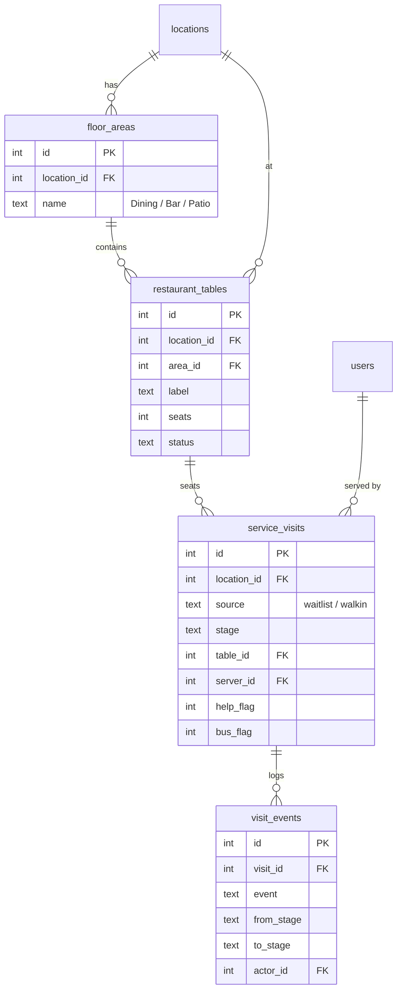
```mermaid
erDiagram
  locations ||--o{ floor_areas : "has"
  floor_areas ||--o{ restaurant_tables : "contains"
  locations ||--o{ restaurant_tables : "at"
  restaurant_tables ||--o{ service_visits : "seats"
  users ||--o{ service_visits : "served by"
  service_visits ||--o{ visit_events : "logs"
  floor_areas {
    int id PK
    int location_id FK
    text name "Dining / Bar / Patio"
  }
  restaurant_tables {
    int id PK
    int location_id FK
    int area_id FK
    text label
    int seats
    text status
  }
  service_visits {
    int id PK
    int location_id FK
    text source "waitlist / walkin"
    text stage
    int table_id FK
    int server_id FK
    int help_flag
    int bus_flag
  }
  visit_events {
    int id PK
    int visit_id FK
    text event
    text from_stage
    text to_stage
    int actor_id FK
  }
```

### 3.3 Scheduling & jobs

A weekly `shifts` row places a person at a store on a day; each shift can carry
several jobs from the shared `jobs` catalog and paid `shift_breaks`. Separately,
`task_assignments` pins a specific day-task to a working person. Breaks are 10 min &
paid; the grid enforces 8h/day and 40h/week soft limits. When a staff member works a
day task they tap **Start** (`started_at`) then **Done** (`done_at`), and may attach
**one or more proof photos** (up to 8, stored as bytes in `task_photos`, one row per
image) and **comments / feedback** (`task_comments`). Managers view every photo and
comment on a task from the **Day Tasks** board, and can reply with feedback.

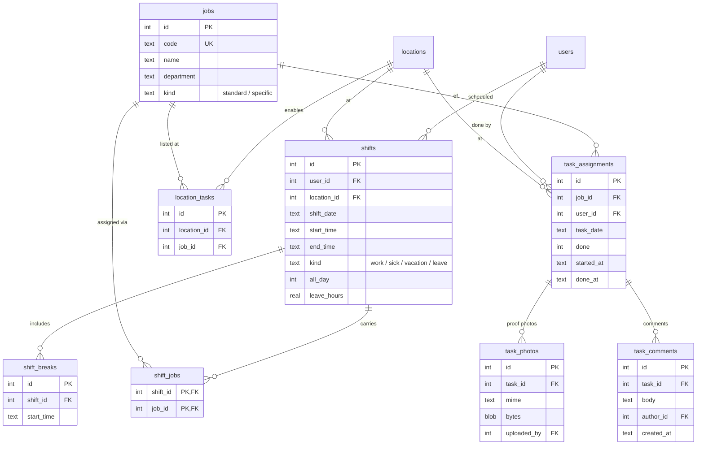
```mermaid
erDiagram
  users ||--o{ shifts : "scheduled"
  locations ||--o{ shifts : "at"
  shifts ||--o{ shift_jobs : "carries"
  jobs ||--o{ shift_jobs : "assigned via"
  shifts ||--o{ shift_breaks : "includes"
  locations ||--o{ location_tasks : "enables"
  jobs ||--o{ location_tasks : "listed at"
  jobs ||--o{ task_assignments : "of"
  users ||--o{ task_assignments : "done by"
  locations ||--o{ task_assignments : "at"
  task_assignments ||--o{ task_photos : "proof photos"
  task_assignments ||--o{ task_comments : "comments"
  jobs {
    int id PK
    text code UK
    text name
    text department
    text kind "standard / specific"
  }
  shifts {
    int id PK
    int user_id FK
    int location_id FK
    text shift_date
    text start_time
    text end_time
    text kind "work / sick / vacation / leave"
    int all_day
    real leave_hours
  }
  shift_jobs {
    int shift_id PK,FK
    int job_id PK,FK
  }
  shift_breaks {
    int id PK
    int shift_id FK
    text start_time
  }
  task_assignments {
    int id PK
    int job_id FK
    int user_id FK
    text task_date
    int done
    text started_at
    text done_at
  }
  task_photos {
    int id PK
    int task_id FK
    text mime
    blob bytes
    int uploaded_by FK
  }
  task_comments {
    int id PK
    int task_id FK
    text body
    int author_id FK
    text created_at
  }
  location_tasks {
    int id PK
    int location_id FK
    int job_id FK
  }
```

### 3.4 Time clock, overtime & approvals

**Punch photos.** The clock kiosk captures a still from the tablet's front camera when a
staffer clocks **in or out** (a `getUserMedia` frame → ~40 KB JPEG), stored per entry in
`time_entry_photos` (`kind` = in/out, image `bytes` in the DB, like task photos) to deter
buddy-punching. It's **best-effort** — if the camera is unavailable or access is denied, the
punch still succeeds without a photo, so a broken camera never blocks a shift. The kiosk
shows a live preview and the notice *"A photo is taken when you clock in or out."* Managers
review them two ways: a **📷 thumbnail on each Time Clock board entry** (in and out), and a
**📷 per-staff drill-in on the Timesheet report** showing that person's punches over the
range. Photos serve JWT-protected and location-scoped via `GET /api/timeclock/photo/:id`;
`GET /api/timeclock/punch-photos?user_id&start&end&location_id` lists them. A background
sweep **auto-purges photos older than 90 days** (override via `PUNCH_PHOTO_RETENTION_DAYS`;
runs at startup then daily) so image bytes don't accumulate — the time entries themselves
(hours) are kept for payroll history.

**Shared-kiosk privacy (2026-10-09).** The clock kiosk is a shared tablet, so the moment a staffer
taps **Continue** (their code is looked up and the Clock In / Out buttons appear) the **employee-code
field is cleared** — the next person in line never sees the previous staffer's ID. The looked-up code
is held in memory just long enough for the actual Clock In / Out punch, then wiped on reset.

A `time_entries` row is one work day: clock-in snapshots the scheduled span,
clock-out fills worked minutes and any `late_minutes`. Overtime needs a manager's
`ot_approvals` sign-off (which can be escalated to Owner / GM / Admin); managers can
`time_adjustments` (rounding) and finally `timesheet_approvals` a whole period.

**Payroll timesheet report** (Reports → Timesheets). Reads clocked hours straight from
`time_entries` (completed shifts only — `worked_minutes` set), grouped per staff member,
filterable by **location or all locations** + a date range. A **Run report** button
refreshes it, and **CSV** / **Excel** (`.xls`) export buttons hand the finance team a
per-staff sheet — name, employee code, role, location, days, total/regular/OT/double-time
hours, hourly rate and gross pay — plus a **gross-pay-by-location** summary with a grand
total, for running payroll.

**Overtime** follows the platform's California daily rule (identical to the Time Clock
payroll export's `daySplit`): regular ≤ 8h/day, **OT 1.5×** for 8–12h, **double-time 2×**
beyond 12h — computed per day, then rolled up. The **OT hrs** column combines OT+DT hours;
gross pay applies the correct multipliers. Each day's pay is attributed to the location it
was worked at, so a staffer who covers two stores contributes to each store's total (their
row shows their primary store). Gross pay is 0 where a staffer's `hourly_rate` is unset.
`GET /api/reports/timesheets?location_id&start&end` → `by_staff`, `by_location`,
`total_hours`, `total_ot_hours`, `total_labor_cost`. (The legacy `timesheets` table is
unused — the clock never wrote to it, which is why the report was previously blank.)

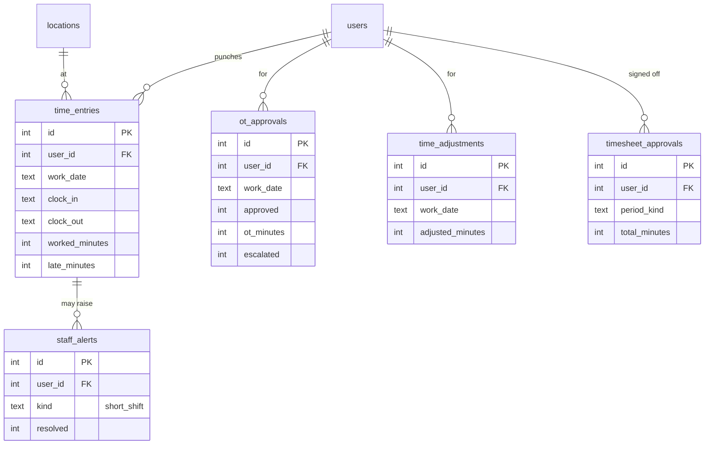
```mermaid
erDiagram
  users ||--o{ time_entries : "punches"
  locations ||--o{ time_entries : "at"
  time_entries ||--o{ staff_alerts : "may raise"
  users ||--o{ ot_approvals : "for"
  users ||--o{ time_adjustments : "for"
  users ||--o{ timesheet_approvals : "signed off"
  time_entries {
    int id PK
    int user_id FK
    text work_date
    text clock_in
    text clock_out
    int worked_minutes
    int late_minutes
  }
  ot_approvals {
    int id PK
    int user_id FK
    text work_date
    int approved
    int ot_minutes
    int escalated
  }
  time_adjustments {
    int id PK
    int user_id FK
    text work_date
    int adjusted_minutes
  }
  timesheet_approvals {
    int id PK
    int user_id FK
    text period_kind
    int total_minutes
  }
  staff_alerts {
    int id PK
    int user_id FK
    text kind "short_shift"
    int resolved
  }
```

### 3.5 Inventory & stock movement

Stock is per `(item, location)`. Every movement is an immutable
`inventory_transactions` row; received stock also lands as `inventory_lots` drawn
down FIFO by expiry. Purchase orders, transfers, waste and cycle counts all feed the
ledger. PO lifecycle: `pending → approved → shipped → received` (receiving adds
stock).

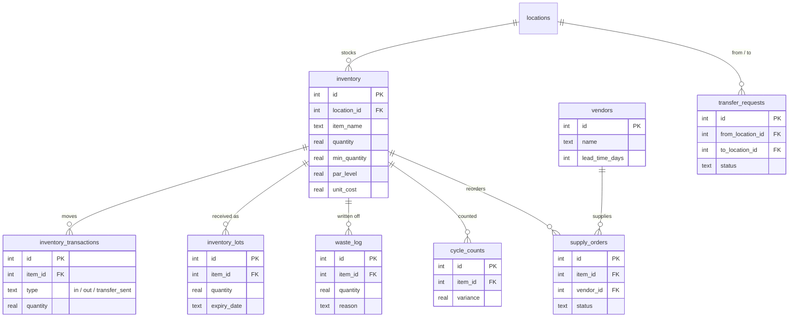
```mermaid
erDiagram
  locations ||--o{ inventory : "stocks"
  inventory ||--o{ inventory_transactions : "moves"
  inventory ||--o{ inventory_lots : "received as"
  inventory ||--o{ waste_log : "written off"
  inventory ||--o{ cycle_counts : "counted"
  vendors ||--o{ supply_orders : "supplies"
  inventory ||--o{ supply_orders : "reorders"
  locations ||--o{ transfer_requests : "from / to"
  inventory {
    int id PK
    int location_id FK
    text item_name
    real quantity
    real min_quantity
    real par_level
    real unit_cost
  }
  inventory_transactions {
    int id PK
    int item_id FK
    text type "in / out / transfer_sent"
    real quantity
  }
  inventory_lots {
    int id PK
    int item_id FK
    real quantity
    text expiry_date
  }
  supply_orders {
    int id PK
    int item_id FK
    int vendor_id FK
    text status
  }
  transfer_requests {
    int id PK
    int from_location_id FK
    int to_location_id FK
    text status
  }
  vendors {
    int id PK
    text name
    int lead_time_days
  }
  waste_log {
    int id PK
    int item_id FK
    real quantity
    text reason
  }
  cycle_counts {
    int id PK
    int item_id FK
    real variance
  }
```

### 3.5b Barcode scanning

Each inventory item carries an optional `barcode` (the retail **UPC-A / EAN-13
GTIN** printed on the product). We **reuse the existing manufacturer barcode** — no
in-house label system — so any item bought from a supermarket, Costco or a supplier
can be scanned straight into stock.

**A barcode is scoped per location, not global.** The *same* barcode (e.g. one bottle of
soy sauce's UPC) is a **separate inventory record at the Central Kitchen and at each of the 10
stores** — 11 rows sharing that GTIN, each with its own on-hand, cost and lots — and a scan
at a location resolves to that location's record. What's enforced is **no two items with the
same barcode inside one location**: create, edit and link all reject a same-location barcode
clash (`WHERE location_id=? AND barcode=?`) with a message pointing you to scan the existing
item instead. Central Kitchen barcodes replicate to store copies with the rest of the master
catalog.

**The Glossary — a shared product dictionary (2026-09-23 redesign).** There are now two
distinct things, on two tabs:

- **Stock** — the **per-location inventory** (the `inventory` table for the selected location). The
  old separate **"Items"** catalog tab was **merged into Stock (2026-10-07) everywhere** — stores,
  Central Kitchen and Warehouse — so each location has one inventory tab. Stock shows the levels
  (on-hand, Min / Par, status, unit cost) **and** each item's **Description / Notes** (as a muted
  line under the item name) in one place, plus — at the CK — the "master copies to every location"
  note. Row actions are compact icons (Receive 📥, Order 🛒, Count 🔢, Waste ♻️, Cost history 💲,
  Scan history 📜, Edit ✏️, Delete 🗑) and the **Actions column is pinned to the right**, so the
  buttons stay on screen even when the table is wide enough to scroll horizontally. **On phones
  (≤640px)** the eight action icons are wider than the screen, so the pin is dropped there (2026-10-09):
  Actions becomes the normal trailing column — the item name & details show first, and you scroll the
  table right to reach the buttons (they no longer blanket the row). Tablets and desktops keep the pin.
- **Glossary** — the **group-wide product dictionary** (`product_catalog`), **one row
  per GTIN, shared across the Central Kitchen and every location**. Managed by hand (search /
  **+ Add product** / edit / delete) and used to **pre-fill the scan-to-receive form**. Fields:
  **GTIN, Name (English), Name (Vietnamese), Name (Spanish), Brand, Category, Unit of measure,
  Description, Notes, Pack size, Default unit cost, Barcode type, Supplier code, Deli scale code**,
  plus two behaviour flags:
  - **Name (Vietnamese) / Name (Spanish)** — optional translations of the English name. Pho Ha Noi
    employs many Vietnamese- and Spanish-speaking staff, so when anyone **scans** an item (Receive /
    Ship / **Use** / kiosk) the result shows an **amber VI · ES line** under the English name, so
    kitchen and warehouse staff recognize what they're handling. English stays the canonical name;
    the line is omitted when no translation is set. Both are searchable in the Glossary.
  - **Stackable** (default yes) — a repeat scan of this barcode just **adds to the count**
    (e.g. a soy-sauce bottle: always the same barcode, so pooling the count is correct).
  - **Catch-weight** (default no) — a **variable-weight** item (meat, produce): stock is
    tracked **by weight** and every scan captures the label's net weight.
  - **Deli scale code** — the item number programmed in the **Code** field of the in-store
    **AvaWeigh** price-computing scale. Set the scale to **Barcode Type 06** (weight-embedded;
    Type 02 embeds price). It prints an in-store **EAN-13** which — on the AvaWeigh 334PCSP30 —
    always reserves 4 bytes for total price, so the layout is
    `dept (2) + item code (2) + total price (4, =0000 on a weight label) + weight WWWW (= WW.XX lb) + check`.
    That leaves a **2-digit item code (00–99)** — ample for the handful of weighed items, and the
    scale's **LF Code** field is *not* used by Type 06 (ignore it; set the **Code** field). A scan
    decodes this (`parseScan`): the **2-digit code** resolves the Glossary entry by **scale_code**
    (`catalogGetByScaleCode`, leading zeros ignored, so Glossary `7` matches label code `07`) and the
    embedded **net weight** pre-fills the catch-weight amount — so a weighed item receives its exact
    pounds from the label. (The varying barcode isn't a stable key, so it's matched by scale code,
    never as a GTIN; the price field is ignored.)

  API `GET/POST /api/glossary`, `DELETE /api/glossary/:gtin` (manager/ops). The dictionary is
  still auto-filled from external lookups (below), but a manual entry is authoritative and is
  never overwritten by an external cache.

**Smart scan-to-receive (`lib/receive.js`).** One flow at the Central Kitchen, the Warehouse and
every store, identical across the console, the staff app and the kiosk. **The scanner sends the
RAW scanned code**, so the server recovers the full label — GTIN, net **weight**, **serial (21)**,
**production / pack / expiry dates**, **lot** — on every receive (not just the fields the form
pre-filled). Everything the box carried is captured: on the `inventory_lots` row (serial, net
weight, pack & production dates, expiry/lot, `received_at` — which drives **FIFO**) and in full in
`scan_events`.

1. **New to stock** → the panel shows a **"from the label / from the Glossary" review** (name,
   brand, weight, pack/prod/expiry dates, lot, serial) plus editable fields including a **Shelf /
   Section** (type-or-pick; creates the shelf on the fly), with an explicit **"✓ Confirm & add"**.
   Confirming creates the stock item at the scanning location **and** writes a **group-wide
   Glossary entry** (recognized at every location on the next scan). A new item scanned at the
   **Central Kitchen** also seeds a 0-qty stock row at every store (linked by `source_id`) so
   stores can order it and CK edits propagate — same as the manual Add-Item form; the **Warehouse**
   does not replicate.
2. **True duplicate** → a **⚠ warning with override-to-add** when it's the exact same box: a GS1
   **serial** already on hand, **or** the **same GTIN with the same net weight AND the same label
   date** already in stock here — **checked whether or not the label carries a serial** (meat/case
   labels carry a per-box serial, but a re-scan of that box, or another box of the same batch with
   the same weight + date, should still be confirmed): *"You may be scanning the same item again…
   Please confirm before adding it."* The scanner must confirm before the count/weight is added. The
   "date" is whichever the label carries — GS1 **(13) pack date OR (11) production date** (meat/case
   labels usually use production date) — matched against the same column on the stored lot. A rapid
   accidental re-scan of the same plain code is also flagged. A genuinely different box (different
   weight *and* date) still just adds. (The same-box check needs **both** a weight and a date, so a
   plain count item with no weight is never caught this way.)
3. **Already in stock, a different box** → same GTIN with a **different weight / pack date / lot**
   shows an amber **"↔ different from the last box"** note plus a **live new-total preview**, so
   the operator reviews the box's data before adding to the total (**weight** for a catch-weight
   item, otherwise **count**).

**Deli-scale labels** resolve by the 2-digit **scale code** to pull the item name/unit/catch-weight
straight from the Glossary (no manual entry), with the embedded net weight pre-filled; a brand-new
scale item gets a stable **`SCALE-NN`** key and its scale code saved to the Glossary.

Endpoints — console: `GET /inventory/barcode/resolve/:code`, `POST /inventory/barcode/receive`,
`POST /inventory/barcode/create`. Staff: `GET /invscan/resolve/:code`,
`POST /invscan/receive`, `POST /invscan/receive-create`. The standalone kiosk shares the same
glossary-aware core: `POST /api/scannerkiosk/kiosk/:slug/{resolve,receive,create}` (all three
consult the Glossary too).

**All barcode types (`lib/barcode.js`).** Every scanned code is parsed before use:
- **UPC-A / UPC-E / EAN-8 / EAN-13** — the digits, with leading-zero padding normalised so
  `0602569000493` and `602569000493` are one key.
- **GS1-128 / GS1 DataMatrix** (case & meat labels, e.g. Central Valley Meat) — an
  Application-Identifier payload like `(01)96063000120625(3202)004294(11)260818(21)…`. We
  extract the **GTIN (01)** as the stable barcode key, and read the **net weight** (310x/320x),
  **production / pack / expiry dates** (11/13/15/17) and **lot** (10). The per-case **serial
  (21) is ignored for matching**, so every case of the same product resolves to one item
  (this was the bug: previously the whole varying string was stored, so each case looked new).
- **Code 39 / Code 128** alphanumeric SKUs — kept verbatim.

On a scan, the extracted weight pre-fills the receive quantity (a 42.94 lb case → 42.94), and
the label's date + lot flow into the received **`inventory_lots`** row for **expiry / FIFO /
batch tracking**. The create form captures the full item record — name/description, category,
SKU, unit, unit cost, quantity, **reorder (min) & par levels**, expiry/lot, and the
**supplier + supplier product code** (`inventory.vendor_id` / `vendor_code`; pick an existing
vendor or type a new name to quick-add one at that location) — pre-filled from the label where
possible.

The **supplier is a first-class field on every item**, not just scanned ones: it shows as a
**Supplier** column on both the **Stock** and **Glossary** tables and is set/edited in the item
editor (free-text name → find-or-create the vendor at that location, case-insensitive so no
duplicates). The item list API returns the joined `vendor_name` alongside `vendor_code`.

The **Stock** table has a dedicated **Unit** (of measure) column — the On-hand column shows just
the number, not "5 units". Each row's actions are **🛒 Order · Receive · Waste · Count · 📜 (scan
history) · Edit · 🗑 Delete**. **Delete** (also "Remove" on the Items tab) removes an unused item or
one scanned by accident — it's a **soft-delete** (confirm by typing *REMOVE* + an optional reason):
the item leaves the active list but its transaction, lot & scan history is kept, and it reappears if
scanned or re-added. OPS-gated and location-scoped.
**Stock Edit and Glossary Add/Edit share one full item editor** (name,
category, unit, SKU, barcode, description, notes, min, par, unit cost, supplier + supplier code).
**Category** and **Unit of measure** are visible **dropdowns** pre-populated with a comprehensive
list (categories by storage zone; ~85 units) — each ending in an **"✏️ Other…"** choice that
reveals a text box for anything not listed. The **Supplier** field is a type-or-pick datalist of
this location's vendors. The same dropdowns appear on the scanner's **Create item** form (console,
staff app and kiosk).

**Reusing the GTIN — scan once, then just update.** The **GTIN** is the number that stays the
same across every box/batch of a product (the whole UPC/EAN, or the `(01)` on a GS1 label);
lot/serial/dates change, the GTIN doesn't. It's stored as the item's `barcode`, so re-scanning
any later box resolves straight to the existing item and opens a quick **receive** panel —
edit just the **quantity, expiry date and lot** (pre-filled from the label) and apply; no
re-entering name, category, supplier, etc.

The scanned **GTIN is always captured** on the item (`inventory.barcode`) — the receive flow
finds items by it, ship resolves/copies it, and it's now an **editable field in the item
editor** (so you can add a GTIN to a manually-created item, or confirm one). Ship carries the
GTIN onto any destination copy it creates, so the item stays scannable there too.

**Every scan's full detail is kept.** On each meaningful scan (receive / count / ship / create /
link) a `scan_events` row records the GTIN, **net weight**, **production / pack / expiry dates**,
**lot** and **serial**, plus a **JSON of every GS1 Application Identifier found** (`lib/barcode.js`
`logScan`) — so nothing a box's label carried is lost, even AIs we don't otherwise use.

**Duplicate-scan protection** (`lib/barcode.js` `recentDuplicate`). To avoid receiving or
shipping the same box twice, each receive/ship is checked against the scan history first:
- **GS1 label with a serial `(21)`** — the serial uniquely identifies the physical box. If that
  exact GTIN+serial was already received/shipped (last 14 days) it's flagged as a duplicate; a
  **different** serial is a genuinely different box and always counts (never falsely blocked).
- **Plain UPC (no serial)** — can't tell two identical boxes apart, so it only guards a genuine
  accidental double-scan: the same item+action(+qty) within ~10 s. **Deliberate repeat receiving
  always just adds to the count** — you buy the same item many times, and each scan adds stock.

A flagged scan returns a **confirm prompt** ("This exact box … was already received — receive it
again anyway?"); the staffer confirms only if it's genuinely a second box, and the app re-sends
with `confirm:true`. Apply/Ship buttons also disable on tap to stop double-submits.

**Where to view it:** a **📜 Scan history** button on every row of the **Stock** and **Glossary**
tables opens a per-item log — each scan's date/time, action, quantity, weight, packed & expiry
dates, lot, serial, who scanned it, and an "all barcode data" line listing every AI. (Also
`GET /inventory/:id/scan-history`; the **Check** mode shows the item's most recent scan detail.)
The **net weight drives the quantity**: it pre-fills the amount on receive (added) and on ship
(subtracted), so a 42.94 lb case adds/removes 42.94 with one tap.

**Per-purchase cost layers (2026-10-07).** The same item's cost moves with the market — Flank bought
at $5.20, then $5.40, then $6.00 — so the unit cost is kept **per purchase**, not as one frozen
number on the stock row. Each scan-to-receive is its own **cost layer** (an `inventory_lots` row)
carrying the price actually paid that time; the receive panel has a **Unit cost** field (defaults to
the last price, editable to today's; blank keeps the last) on all three surfaces. The **Stock "Unit
cost" column shows the TOTAL cost of the on-hand lots** (2026-10-07) — `Σ(remaining qty × that lot's
price)`, computed live so it matches Lots & Expiry — with an **all-or-nothing** rule: if any on-hand
lot has no price yet, the column reads **$0.00** until every lot is priced (a missing price never
understates the total). The underlying per-unit `inventory.unit_cost` (kept at the **latest** purchase
price) is untouched, so recipe costing and valuation stay correct. No new table — `inventory_lots` already *is* the per-purchase ledger
and already drives FIFO. A **💲 Cost history** button on every **Stock** and **Central Kitchen** row
opens the layers — each purchase's date, qty bought, qty remaining, weight and unit cost — with
on-hand value (each layer at its own cost), total purchased, and the weighted-average cost; the
**unit cost is editable inline** (correct a typo or enter the real invoice price later — the newest
layer also updates the item's current price). Saving a lot's price **refreshes the Stock view right
away**, so the Stock "Unit cost" total reflects the change without navigating. The **standalone kiosk** has the same view: a
**💲 Cost history** button on a scanned item's receive panel, scoped to the kiosk's location. **FIFO
Use** draws the oldest layer first and reports the true **COGS** valued at each layer's cost. API:
`GET /inventory/:id/cost-history`, `PATCH /inventory/lots/:id/cost` (console) and
`POST /api/scannerkiosk/kiosk/:slug/{cost-history,lot-cost}` (kiosk), all over the shared
`costHistory` / `setLotCost` / `consumeFIFOCosted` helpers in `lib/lots.js` + `lib/receive.js`.

**Scan modes.** The **console scanner**, the **staff app**, and the **per-location kiosk**
(`/scanner/<slug>`) have a mode toggle:
- **📥 Receive** — the smart glossary-aware receive above (add count/weight, or create + write
  the glossary for a new barcode); the console/kiosk also keep a **🔢 Set count** option (cycle
  count → `cycle_counts`, FIFO draw-down on a negative variance).
- **📋 Check** — read-only: scan an item to see **how much every location is holding**
  (per-location on-hand + total), so staff can look up stock **anywhere** (their own store is
  flagged). Console `GET /inventory/barcode/stock/:code`, staff `GET /invscan/check/:code`,
  kiosk `POST /kiosk/:slug/stock`.
- **🔁 Transfer** — an ad-hoc move to another location. **Two-step (2026-10-08):** the sender's scan
  decrements the source (FIFO) and creates an **in-transit** transfer (`transfer_requests`, status
  `in_transit`); the stock is **not** added to the destination until someone there **receives** it
  (by scanning — see below — or **Mark received** on the Transfers tab). Shared core `lib/transfer.js`.
  Console `POST /inventory/barcode/transfer`; staff `POST /invscan/ship`; kiosk `POST /kiosk/:slug/transfer`.
  The Transfers tab shows in-transit transfers with received progress and **Mark received / Cancel**
  (cancel returns the undelivered remainder to the source).

> **📥 Order/transfer-aware receiving (2026-10-08).** When a store **Receives** a scan, it first
> checks whether the item is on an open **shipped order** (from the CK/Warehouse) or an **in-transit
> transfer** to this location. If so it offers *"📦 incoming order/transfer from X — Shipped N,
> remaining M → Receive"* (a confirm step) instead of a plain add: the stock lands at the **source's
> cost**, `received_qty` advances, and the order/transfer **closes only on an exact qty/weight match**.
> A short or over receipt still lands what physically arrived but leaves the line **open and flagged
> for review** (never silently closed) — so a 60 lb order can arrive as several boxes that accumulate
> until it's complete. No match → the normal new-item / increase-count receive. Shared core
> `lib/inbound.js` (`inboundMatches` / `receiveAgainstOrder` / `receiveAgainstTransfer`); surfaced via
> `resolveScan().inbound` and `POST .../receive-inbound` on all three surfaces (console, staff, kiosk).
> `distribution_orders` now carries `received_qty` (Ordered → Shipped → **Received**).
- **📤 Shipping (hubs only — Central Kitchen / Warehouse)** — order fulfilment (2026-10-07 rework).
  Tapping Shipping shows the **queue of orders waiting to ship** for this hub, grouped per store
  (`GET /distribution/ship-queue?source_location_id=<hub>`); tap a store to see its open items
  (`GET /distribution/ship-queue/:storeId`, with the hub's on-hand + barcode for matching), then scan
  an item on the order (`POST /distribution/ship-scan`). The scan shows the item name, its on-hand,
  and what the order still needs, and confirms a quantity: **under**-ship leaves the line open
  (partial — progress tracked in `shipped_qty`); **over**-ship asks to confirm, then records the extra
  in `shipped_qty`. The order's **original ordered amount (`requested_qty`) is never overwritten**
  (2026-10-07) — the requester always sees what they ordered next to what actually shipped (e.g.
  order 40, ship 41.63 → the store's order shows **Ordered 40 / Shipped 41.63 (over)**), and the
  store **receives the actual shipped amount**. Each scan **decrements the hub** (FIFO) and the stock goes
  **in transit** (`transfer_sent`); the store then **receives** it to add it to on-hand (two-step,
  `PUT /distribution/orders/:id` → `received`). A disabled hook (`DIST_NOTIFY_SENDER`) will text the
  order's requester when it ships (enabled later). Orders are placed against a chosen hub on the store
  order screen — the "Order from" dropdown lists each hub (CK + Warehouse) that stocks the item.
  The same flow runs on the **standalone kiosk** — `POST /api/scannerkiosk/kiosk/:slug/ship-queue`
  (no body → the hub's order queue; `to_location_id` → that store's lines) and `POST .../ship-scan` —
  so a hub staffer can fulfil orders from the tablet at the dock. It **also runs in the staff app**
  (2026-10-09): hub staff (CK/Warehouse) get a **📤 Shipping** mode in the phone scanner, surfaced
  only when `GET /invscan/hub` reports the staffer's own location is a hub. The staff app proxies
  `GET /invscan/{hub,ship-queue,ship-queue/:storeId}` and `POST /invscan/ship-scan` to Management
  (service-key + `?as=<staff email>`). Console, kiosk and staff app share one core
  (`lib/shipOrder.js`: `hubQueue` / `storeLines` / `shipScanOrder`) so the three can never drift.

Every location (and every scan surface) can **📥 Receiving**, **🔁 Transferring**, **📋 Checking
Inventory** and **🍳 Use**. The **Warehouse** and **Central Kitchen** (the distribution hubs) add
one more — **📤 Shipping** — since they're the only locations with store orders to fulfil, for the
full set **Receiving · Shipping · Transferring · Checking Inventory · Use**. **Shipping** is the
order-queue fulfilment flow above (pick an order, scan its items — `/distribution/ship-scan`), while
**Transferring** is an ad-hoc destination move (`/inventory/barcode/transfer`). **Use** consumes stock on site
(production / prep / to serve) — FIFO with an `out` transaction. The **staff app** (always
store-scoped to the staffer's own store) shows Receiving / Transferring / Checking Inventory / Use —
**plus Shipping when the staffer's own store is a hub** (Central Kitchen / Warehouse), so hub staff
can load store orders straight from their phone.
The **standalone kiosk** (`/scanner/<slug>`) is section-aware: it reads its location's `type` (from
`GET /kiosk/:slug`) and shows the store four, adding **Shipping** at the Warehouse or Central Kitchen.
- **🍳 Use** (every console section, the staff app, and the kiosk) — mark stock **used** (prep /
  production / to serve): decrements the scanned location (FIFO) and logs an `out` transaction.
  `POST /inventory/barcode/use` (console) / `POST /invscan/use` (staff) / `POST /kiosk/:slug/use` (kiosk).

**All scanning is done with a hardware barcode scanner** (e.g. an Inateck Hyper 160 on a USB
dongle / Bluetooth) — the **phone-camera option was removed** on all three surfaces (console,
staff app and kiosk) once the team standardized on the handheld scanner. A handheld scanner is a
**keyboard-wedge** (it types the barcode + Enter), so each scan screen is just an **auto-focused**
barcode field (re-focused after each scan) that feeds the typed/scanned code into the
resolve → receive/ship/check/use flow. It works the same on a laptop/PC, phone or tablet — a
Bluetooth scanner pairs with an iPhone/iPad or Android in **HID (keyboard) mode**; the USB dongle
is for a laptop/PC. No driver or backend change — set the scanner to US-English layout with an
Enter suffix. (The old `html5-qrcode` camera library is no longer shipped.)

- **Management console** — a **📠 Scan** button on Inventory → Stock and Glossary
  (and in the Central Kitchen, scoped to CK). Uses the JWT inventory API scoped by the
  selected location.
- **Staff app** — a **📠 Scan** nav item for store staff (hidden for all-location
  leadership), with **Receive / Check / Ship / Use** modes. Calls the `/api/invscan/*` proxy,
  which forwards to Management with the service key + `?as=<staff email>` so every **action** is
  pinned to the staffer's own store (Check is read-only across all locations).
- **Standalone scanner kiosk** — a public per-location link, `/(S)canner/<slug>`
  (e.g. `pho-ha-noi-management.fly.dev/scanner/san-jose` or `/scanner/central-kitchen`;
  slugs are case- and punctuation-insensitive, so `/Scanner/SanJose` also works). Bare
  `/scanner` shows a location picker. Same trust model as the `/clock/<slug>` kiosk: no
  login — a staffer identifies with their **employee code** (writes are attributed to
  them, and they must be assigned to that location — home store, an additional store, or
  all-location leadership — or the scan is refused). Served by `routes/scannerkiosk.js`
  under `/api/scannerkiosk/kiosk/:slug/*` (`identify`, `resolve`, `scan`, `link`,
  `create`, `items`, `lookup/:code`), with a per-IP throttle.

Flow after a scan:

| Outcome | Action |
| --- | --- |
| Barcode **matches** an item | Add stock (`in`, → `receiveLot` + transaction) or set a cycle count (`count`, → `cycle_counts`, FIFO draw-down on a negative variance) |
| Barcode **unknown** | Resolve a name/brand/size (see below), then **create** a new item pre-filled with it, or **link** the barcode to an existing item |

**Product resolution (`lib/productLookup.js`).** A scanned barcode is resolved through a
chain, first hit wins, so coverage is far higher than a single food database:

1. **`product_catalog`** — a **group-wide dictionary** keyed by barcode, shared across every
   location. A barcode is stored here **only when the item is confirmed and added to stock**
   (create or link), as `source='staff'` (authoritative) — so an unconfirmed scan never
   pollutes the dictionary. Once named at any store it auto-fills everywhere after.
2. **Open Food Facts** + its non-food sister DBs (**Open Products / Beauty / Pet Food
   Facts**) — free, community.
3. **UPCitemdb** free trial — broad general-merchandise catalog (name / brand / size); this
   is what catches the non-food items Open Food Facts misses.

An online name lookup runs **in the background** (the add form opens immediately and the name
fills in when it returns) and its result is held in a per-process **in-memory cache**, not the
Glossary — nothing is written to `product_catalog` until the item is confirmed. **Price is
deliberately not fetched** — a GTIN carries no price, and
online-listing APIs return wildly varying figures; item cost is `unit_cost`, entered once.
The one exception: **weighed / price-embedded in-store barcodes** (Type-2 UPC-A beginning
with `2`) are detected locally and their embedded price is decoded (no lookup — that number
is store-specific), pre-filling the cost field.

Endpoints — Management (JWT, location-scoped): `GET /inventory/barcode/{:code,resolve/:code}`,
`POST /inventory/barcode/{link,scan,receive,create}`, `GET /inventory/lookup/:code`,
`GET /api/glossary`, `POST /api/glossary`, `DELETE /api/glossary/:gtin`. Staff proxy (service
key, own store): `GET /invscan/{:code,resolve/:code,check/:code}`,
`POST /invscan/{scan,link,create,receive,receive-create,ship,use}`,
`GET /invscan/{lookup/:code,items/list,ship/targets,ship/orders}`.

### 3.5c Storage layout — shelves & sections

To make putting food away and picking it fast, each **inventory item can live on a named
shelf/section** (e.g. "Shelf A — meat", "Section 5 — chicken"). Sections are a **managed list,
per location** (`storage_sections`, one row per shelf at a store/CK; the item points at one via
`inventory.section_id`). They're **location-specific** — Shelf A at San Jose is independent of
Shelf A at Fremont — and a CK item's shelf is **not** replicated to the store copies.

- **Manage them** on the console's **Inventory → Storage** tab (per the picked location) or the
  staff app's **📍 Storage** screen (scoped to the staffer's own store): **add / rename / delete**
  a shelf, and **browse-by-shelf** — every section with the items on it, plus an **Unassigned**
  bucket — with a dropdown on each item to **move** it between shelves. Deleting a shelf only moves
  its items to Unassigned; **stock is never touched**.
- **Assign** an item to a shelf from the item editor (a type-or-pick **Shelf / Section** field —
  typing a new name creates the shelf) or from the browse view's move dropdown. The **Stock** table
  shows a **Shelf / Section** column.
- **On every scan** — Receive / Ship / Use / Check, across the staff app, console scanner and
  kiosk — the result shows **📍 Stored on `<shelf>`**, so staff know where to put it away or grab
  it. Check shows each location's shelf.
- API — console (JWT, location-scoped): `GET /inventory/sections`, `GET /inventory/sections/map`,
  `POST /inventory/sections`, `PUT/DELETE /inventory/sections/:id`; items carry `section_id` on
  create/edit. Staff proxy (own store): the same under `/invscan/sections…` plus
  `POST /invscan/sections/assign`.

### 3.6 Central kitchen

The central kitchen produces broths and prepped proteins. Stores submit
`store_requests` (demand); `ck_production_runs` record batch output with
yield/shrinkage; fulfilling a request delivers stock into that store's inventory as
a logged transfer.

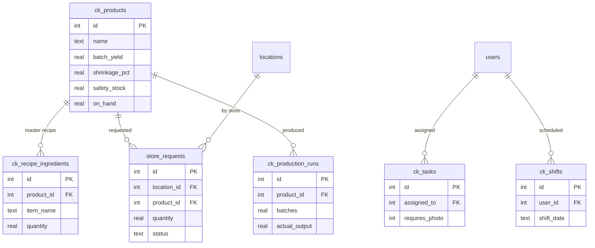
```mermaid
erDiagram
  ck_products ||--o{ ck_recipe_ingredients : "master recipe"
  ck_products ||--o{ store_requests : "requested"
  locations ||--o{ store_requests : "by store"
  ck_products ||--o{ ck_production_runs : "produced"
  users ||--o{ ck_tasks : "assigned"
  users ||--o{ ck_shifts : "scheduled"
  ck_products {
    int id PK
    text name
    real batch_yield
    real shrinkage_pct
    real safety_stock
    real on_hand
  }
  ck_recipe_ingredients {
    int id PK
    int product_id FK
    text item_name
    real quantity
  }
  store_requests {
    int id PK
    int location_id FK
    int product_id FK
    real quantity
    text status
  }
  ck_production_runs {
    int id PK
    int product_id FK
    real batches
    real actual_output
  }
  ck_tasks {
    int id PK
    int assigned_to FK
    int requires_photo
  }
  ck_shifts {
    int id PK
    int user_id FK
    text shift_date
  }
```

#### Warehouses (storage & distribution hubs)

`locations.type` is one of **`restaurant`** (a dining store), **`central_kitchen`**
(the single production hub — fixed, never reassigned), or **`warehouse`**. A
warehouse is a storage & distribution location: it **receives, stores and
ships/transfers items to any location**, but has **no catalog fan-out** (items
appear at a store only when shipped there — nothing is replicated automatically).
It is **not** a production location — the one thing the Central Kitchen has that a
warehouse doesn't is **Fulfillment** (recipe pick-lists / batch manifests): a
warehouse stores and ships, it doesn't cook.

Because a warehouse is not a dining location it is **hidden from Service / Floor /
Waitlist / guest check-in**: `GET /api/inventory/locations` returns only
`restaurant` rows by default, so every dining location picker (which reads
`S.locations`) excludes warehouses and the CK. The endpoint takes `?type=warehouse`
(storage hubs, loaded into `S.warehouses` at boot) or `?type=all`
(restaurants + warehouses).

A warehouse gets its own **🏬 Warehouse** nav section — the same dedicated-section
pattern as the Central Kitchen, and (2026-10-08) with the **same inventory tabs**:
Overview, Stock, Glossary, Storage, Orders & Reorder, Transfers, Lots & Expiry,
Vendors, **Reports** and **Distribution** — everything the CK has **except
Fulfillment** (production). Conversely the Central Kitchen gained the warehouse's
**Storage** and **Transfers** tabs, so the two hubs' layouts match. The inventory
views are scoped via `invLoc()` (which returns `S.whLocId` while the section is
active). The section shows only when at least one warehouse exists; when several do, a
picker appears in the tab bar. Overview surfaces item count / low-stock / value KPIs
plus quick actions (incl. **scan to receive / ship**).

**Staff is unified, not per-hub (2026-10-08).** A hub has **no "Staff" tab** of its
own. Its people are part of the one Pho Ha Noi staff system: the **Central Kitchen and
every Warehouse appear as locations** in the staff **Home location** dropdown and the
**"Also works at"** checkboxes (backed by `GET /inventory/locations?type=staffable` =
restaurants + CK + warehouses), so anyone can be based at, or also cover, a hub. Their
roster, **Scheduling**, **Day Tasks** and **clock in/out** live where every store's do
— under **Locations → that hub**, which (being a normal location) carries the **Staff ·
Schedule · Day Tasks · Time Clock** tabs (the dining-only tabs — Service Flow,
Menu/Recipes, Floor Plan, Performance — are hidden for a hub). Clock in/out uses the
ordinary per-location kiosk **`/clock/<slug>`** (e.g. `/clock/central-kitchen`), writing
to `time_entries` → payroll like any store. (This replaced an earlier hub-only PIN
clock that wrote to the dead `timesheets` table, so those hours never reached payroll.)

**Distribution** is one shared implementation per hub, not CK-only code: the client
`renderHubDistribution` reads the current hub from `invLoc()`; `routes/distribution.js`
`/orders` (`scope=hub`) and `/ck-stock` resolve the hub from `source_location_id` and
gate on `isHubStaff`, so each hub sees only its own incoming store orders and
on-hand/reserved/free stock. The **Distribution** board lists a hub's incoming store
orders (order #, priority, requested-by) with **Ship / Mark received / Cancel** (the
two-step lifecycle) and the offer-to-stores toggle; a warehouse can also ship by
scanning on **Transfers** / the scanner.

Designate a warehouse in **Locations → Edit → Type = Warehouse** (the field is
locked for the Central Kitchen). Location cards show a **🏬 Warehouse** / **🏭
Central Kitchen** type badge, and ship-target / scan-stock lists tag destinations
with **(WH)** / **(CK)**. Shipping into or out of a warehouse uses the ordinary
scan **Ship** mode and the **Transfers** view — `GET /inventory/ship/targets`
already offers every active location except self.

### 3.7 Menu & recipes

Menus & recipes are **per location** — each store owns its own, independent menu
(`menu_categories` and `menu_items` both carry a `location_id`). They live **under
Locations**: open a location (Locations → Manage → **🍽️ Menu/Recipes**, manage-capability
roles only) to edit that store's Menu, Recipes and Costing. Each item's
`recipe_ingredients` link to inventory items by name, and **costing uses that location's
own inventory unit costs**, so food-cost % reflects the store's real costs. Endpoints are
scoped by `?location_id=` (`/api/menu/{categories,items,ingredients,costing}` +
`/api/menu/items/:id/recipe`).

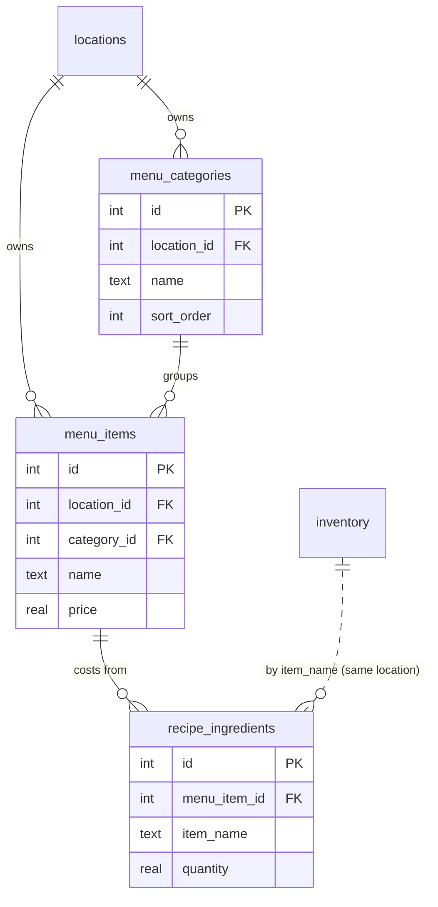
```mermaid
erDiagram
  locations ||--o{ menu_categories : "owns"
  locations ||--o{ menu_items : "owns"
  menu_categories ||--o{ menu_items : "groups"
  menu_items ||--o{ recipe_ingredients : "costs from"
  inventory ||..o{ recipe_ingredients : "by item_name (same location)"
  menu_categories {
    int id PK
    int location_id FK
    text name
    int sort_order
  }
  menu_items {
    int id PK
    int location_id FK
    int category_id FK
    text name
    real price
  }
  recipe_ingredients {
    int id PK
    int menu_item_id FK
    text item_name
    real quantity
  }
```

### 3.8 Equipment, sales, messaging & audit

The remaining tables round out the console: equipment registers per location, daily
sales for reporting, threaded team `messages` with per-recipient read state, and two
audit trails.

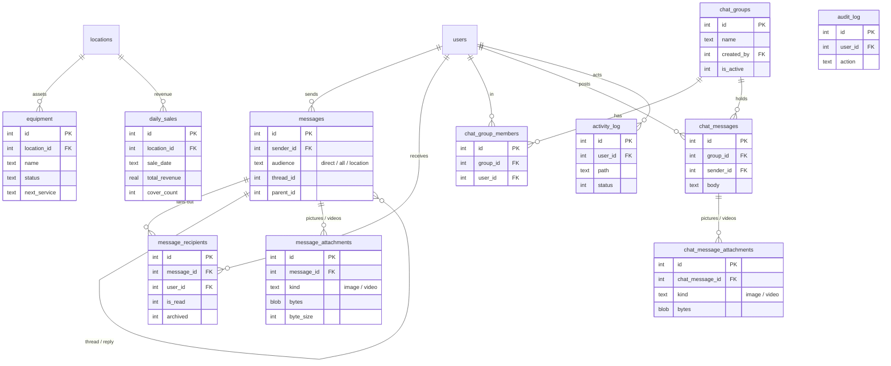
```mermaid
erDiagram
  locations ||--o{ equipment : "assets"
  locations ||--o{ daily_sales : "revenue"
  users ||--o{ messages : "sends"
  messages ||--o{ message_recipients : "fans out"
  users ||--o{ message_recipients : "receives"
  messages ||--o{ messages : "thread / reply"
  messages ||--o{ message_attachments : "pictures / videos"
  chat_groups ||--o{ chat_group_members : "has"
  users ||--o{ chat_group_members : "in"
  chat_groups ||--o{ chat_messages : "holds"
  users ||--o{ chat_messages : "posts"
  chat_messages ||--o{ chat_message_attachments : "pictures / videos"
  users ||--o{ activity_log : "acts"
  equipment {
    int id PK
    int location_id FK
    text name
    text status
    text next_service
  }
  daily_sales {
    int id PK
    int location_id FK
    text sale_date
    real total_revenue
    int cover_count
  }
  messages {
    int id PK
    int sender_id FK
    text audience "direct / all / location"
    int thread_id
    int parent_id
  }
  message_recipients {
    int id PK
    int message_id FK
    int user_id FK
    int is_read
    int archived
  }
  message_attachments {
    int id PK
    int message_id FK
    text kind "image / video"
    blob bytes
    int byte_size
  }
  chat_groups {
    int id PK
    text name
    int created_by FK
    int is_active
  }
  chat_group_members {
    int id PK
    int group_id FK
    int user_id FK
  }
  chat_messages {
    int id PK
    int group_id FK
    int sender_id FK
    text body
  }
  chat_message_attachments {
    int id PK
    int chat_message_id FK
    text kind "image / video"
    blob bytes
  }
  activity_log {
    int id PK
    int user_id FK
    text path
    int status
  }
  audit_log {
    int id PK
    int user_id FK
    text action
  }
```

### 3.9 Waitlist database

The Front Desk app keeps a lean local database: its own `users`, the `waitlist`
parties (with `source` = staff or self-kiosk and a `public_ref` code for live
tracking), the page log, a local floor plan, and its own audit trails.

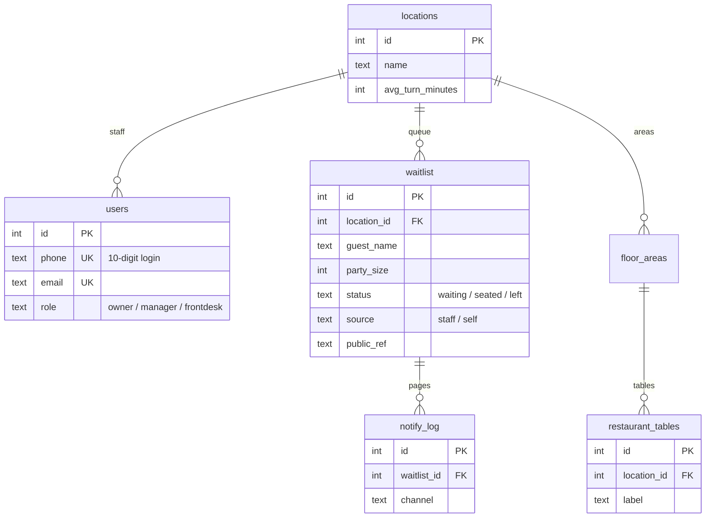
```mermaid
erDiagram
  locations ||--o{ users : "staff"
  locations ||--o{ waitlist : "queue"
  waitlist ||--o{ notify_log : "pages"
  locations ||--o{ floor_areas : "areas"
  floor_areas ||--o{ restaurant_tables : "tables"
  locations {
    int id PK
    text name
    int avg_turn_minutes
  }
  %% avg_turn_minutes = minutes quoted PER PARTY AHEAD (default 3). The guest wait estimate is
  %% parties_ahead * avg_turn_minutes, so 3 waiting -> 9 min, 4 -> 12 min. Kept short so a long
  %% quote doesn't scare guests into walking away.
  waitlist {
    int id PK
    int location_id FK
    text guest_name
    int party_size
    text status "waiting / seated / left"
    text source "staff / self"
    text public_ref
  }
  users {
    int id PK
    text phone UK "10-digit login"
    text email UK
    text role "owner / manager / frontdesk"
  }
  notify_log {
    int id PK
    int waitlist_id FK
    text channel
  }
  restaurant_tables {
    int id PK
    int location_id FK
    text label
  }
```

---

## 4. Table catalog

### Management database — 62 tables

| Table | Domain | Purpose |
|---|---|---|
| `users` | People | Staff accounts: name, **phone (10-digit login)**, email, role, home location, hourly rate |
| `roles` | People | Access-level registry (Roles): label, access level (scope) & capabilities; Owner/Admin-managed |
| `staff_profiles` | People | Full HR record, 1:1 with users — incl. a transformed 9-digit **Personal ID** (no SSN / bank data) |
| `staff_documents` | People | Per-staff document holder — contracts, certificates, licenses, scans (bytes in the DB, each with a note) |
| `staff_locations` | People | Additional stores a person can work at — a person appears on the roster (Locations → store → **Staff**) of their home store **and** every store here, flagged **"also works here"**, and is included in each of those stores' **Staff count** (active only). Per-store counts therefore differ from the true headcount (double-count multi-store staff, miss unassigned ones); the **Locations** header shows the deduplicated org total — **distinct active people** — for all-location roles, and an expandable **"N active people have no store assigned"** panel lists active staff with no home store and no coverage (typically org-level roles) so they can be given one (`GET /api/locations/headcount` → `{active,total,unassigned[]}`) |
| `locations` | Org | Restaurants + the central kitchen |
| `location_hours` | Org | Per-day opening / closing times — up to two service periods (lunch + dinner) |
| `floor_areas` | Floor | Named areas (Dining, Bar, Patio) per store |
| `restaurant_tables` | Floor | Numbered tables with position, seats & live status |
| `service_visits` | Service | The guest-visit spine: waiting → seated → done |
| `visit_events` | Service | Append-only log of every visit stage change & check |
| `shifts` | Schedule | Weekly shift: person × day × store, start/end |
| `shift_jobs` | Schedule | Jobs attached to a shift |
| `shift_breaks` | Schedule | Paid 10-min breaks within a shift |
| `jobs` | Schedule | Shared job/task catalog by department (Front House / Kitchen / Bar / Management; empty = Department Not Set) — `kind` = standard role or specific day-task |
| `task_assignments` | Schedule | A specific day-task pinned to a working person, with Start/Done timestamps |
| `task_photos` | Schedule | Optional proof photos for a day task — many per task, one row per image (image bytes in the DB) |
| `task_comments` | Schedule | Comments / feedback on a day task — staff notes and manager replies (many per task) |
| `location_tasks` | Schedule | Which specific tasks apply at which store |
| `time_entries` | Time | One work day: clock-in/out, worked & late minutes |
| `ot_approvals` | Time | Manager approval of overtime; can escalate |
| `time_adjustments` | Time | Manager rounding of a day's worked minutes |
| `timesheet_approvals` | Time | Sign-off on a period's total hours |
| `staff_alerts` | Time | Alerts to a manager (e.g. left early) |
| `break_reminders` | Time | Audit archive of "your break is in 10 min" alerts sent to staff (sent + acknowledged times) |
| `inventory` | Inventory | Stock per item per location with min/par/cost. `source_id` links a store copy back to the Central Kitchen master item it was replicated from (CK edits propagate to those copies) |
| `inventory_transactions` | Inventory | Immutable in/out/transfer movement ledger |
| `inventory_lots` | Inventory | Received batches with expiry, drawn FIFO |
| `vendors` | Inventory | Supplier records, now **per-location** (`location_id`); the Central Kitchen's vendors replicate one-way to every store (`source_id` links each copy for edit propagation) |
| `supply_orders` | Inventory | Purchase orders with a lifecycle |
| `transfer_requests` | Inventory | Inter-location transfers with approval |
| `waste_log` | Inventory | Spoilage / write-offs with reason |
| `cycle_counts` | Inventory | Physical counts vs system (variance) |
| `ck_products` | Central K. | Items the central kitchen produces |
| `ck_recipe_ingredients` | Central K. | Master recipe per product |
| `store_requests` | Central K. | Daily item requests from each store |
| `distribution_orders` | Central K. | A store's order to a hub (`source_location_id` — CK or Warehouse), with its hub-fill (`ck_qty`) / vendor-shortfall split, `shipped_qty` / `received_qty` / `received_by`, and each line's review `approval` (pending/approved/held/rejected) + `approval_note`. Lines share one `order_no` (`LOC-YYMMDD-NN`) with a `priority` + `requested_by` |
| `distribution_order_headers` | Central K. | One header per order (`order_no`) carrying the fulfilment **stage** (new → approved → loaded → in_transit → delivered, + cancelled/rejected), who reviewed it, the driver, and the loaded/dispatched/delivered timestamps. Drives the hub's one-row-per-order board |
| `ck_production_runs` | Central K. | Batch runs with yield & shrinkage |
| `ck_tasks` | Central K. | **Legacy** — CK day-tasks now use the unified `task_assignments` (Locations → CK → Day Tasks) |
| `ck_shifts` | Central K. | **Legacy** — CK scheduling now uses the unified `shifts` (Locations → CK → Schedule) |
| `menu_categories` | Menu | Menu groupings |
| `menu_items` | Menu | Dishes with price |
| `recipe_ingredients` | Menu | Item → inventory ingredient links for costing |
| `equipment` | Assets | Equipment register with maintenance schedule |
| `daily_sales` | Reporting | Per-day revenue & covers by location |
| `messages` · `message_recipients` | Messaging | Threaded team messaging + per-person read state |
| `message_attachments` | Messaging | Photos, videos & files (PDF/Office/CSV/ZIP…) on a message — bytes in the DB, per-kind caps; kind = image/video/file |
| `chat_groups` | Chat | Persistent staff chat groups (channels); `is_active=0` when deleted (kept for audit) |
| `chat_group_members` | Chat | Who belongs to each chat group |
| `chat_messages` | Chat | Messages posted in a chat group (retained for audit) |
| `chat_message_attachments` | Chat | Photos, videos & files on a chat message — bytes in the DB, per-kind caps; kind = image/video/file |
| `chat_reads` | Chat | Per-member read cursor for unread counts |
| `msg_reactions` | Messaging | Emoji reactions (tapbacks) on a direct message or chat message — one row per person per emoji (`kind` + `target_id` + `user_id` + `emoji`); toggling the same emoji removes it |
| `reaction_unseen` | Messaging | Per-person unseen-reaction flag per conversation (`kind` + `conv_id`) so a reaction bumps that person's Messages/Chat unread badge like a new message; cleared when they open the conversation |
| `floor_alerts` | Messaging | Urgent on-screen pings a manager pushes to working staff (person / role / everyone). Service Flow alerts add a claim-and-track lifecycle: `flow_guid` / `flow_kind` tie the alert to a table, `claimed_by` / `claimed_at` lock it to the staffer who tapped **On It**, `status` walks open → claimed → waiting → resolved |
| `floor_alert_acks` | Messaging | One row per staff member who acknowledged ("On it") an alert, plus when they marked it **done** (`completed_at`) |
| `sms_messages` | Messaging | One row per SMS blast a manager/owner composes (target, body, recipient & sent counts, provider) |
| `sms_recipients` | Messaging | Per-person delivery record for a blast (phone + status: sent / logged / failed / no_phone) |
| `push_subscriptions` | Messaging | Web Push subscriptions — one row per device a user enabled notifications on (endpoint + keys); dead endpoints auto-pruned |
| `toast_locations` | Toast | Maps each location to its Toast restaurant GUID (+ cached name, auto-sync flag) |
| `toast_sync_log` | Toast | One row per Toast pull (ping / orders / labor) — status, record count, window, timing |
| `toast_orders` · `toast_checks` · `toast_payments` | Toast | Read-only mirror of Toast sales: orders → checks → payments, keyed by Toast GUID |
| `toast_employees` | Toast | Toast staff roster, each matched to an app user (by email / phone / name) |
| `toast_jobs` | Toast | Toast job catalog (title, tipped, wage) |
| `toast_menu_items` | Toast | Published Toast menu flattened to one row per item per location (price book; cross-location price compare) |
| `toast_selections` | Toast | Line items on each check (item, category, qty, price) — the item-level detail for sales analysis |
| `toast_config` | Toast | Reference data per location — tables, dining options, service areas, revenue centers — to resolve order GUIDs into names |
| `toast_service_alerts` | Toast | "Check on this table" events (dry-run = logged only, live = staff notified); one per order |
| `toast_flow_state` | Toast | Service Flow manual state per order — **Served** / **Paid** / **Bussed (Done)** timestamps + who tapped (Paid can be staff-marked as well as from Toast; Toast has no served/bussed signal) |
| `toast_flow_alerts` | Toast | One row per (order, escalation type) — `food_late` / `lingering` / `ready_to_bus` — the re-fire marker: `next_at` schedules the next ping, `mode` (`unclaimed` ~3 min vs `waiting` ~5/7 min) picks the cadence |
| `toast_flow_events` | Toast | Audit trail of every staff action on a Service Flow alert (On it / Served / Paid / Not yet / Waiting / Bussed) — who, when, what, which table — for manager review |

Plus `audit_log`, `activity_log` and the legacy `timesheets` table.

### Waitlist database — 8 tables

| Table | Purpose |
|---|---|
| `locations` | Stores, each with an average table-turn time for quoting waits |
| `users` | Front-desk accounts (owner / manager / frontdesk) |
| `waitlist` | Parties in the queue: staff- or self-added, with a live tracking code |
| `notify_log` | Record of every guest text — join confirmation & "your table is ready" page (with SMS status) |
| `floor_areas` · `restaurant_tables` | Local floor plan for seating |
| `audit_log` · `activity_log` | Who-did-what and access trails (incl. guest check-ins) |

---

## 5. The apps in detail

### Management console (port 4001)

A left sidebar filtered by access level, with per-module tab bars. Managers land on
a location dashboard; self-service staff land on a personal home screen. **On phones the
sidebar collapses to a ☰ hamburger drawer** — the drawer uses the dynamic viewport height
(`100dvh`) so its footer (**Account Settings** and **Sign Out**) stays on-screen above the
mobile browser's bottom toolbar rather than being pushed out of view.

| Module | What's inside | Who |
|---|---|---|
| **Overview** | KPI tiles, today's roster, schedule health, needs-attention panel | All (manager dashboard for managers) |
| **Service** | 🛎️ Live guest-visit board (waitlist → seated → in service → paying → done) + servers-today report, and an **⏳ Active waitlist** tab showing the **Front Desk app queue** (guest, party, waited, quoted, phone, source, notified). All-location roles get an All/by-location selector; location roles are pinned to their store | Owner/Admin/HR/GM all · Manager+ own store |
| **Locations** | Directory + details, operating hours, staff, weekly schedule, equipment register. Each card has **✎ Edit** (name/address/seats/status + an editable **kiosk URL slug**) and **🙈 Hide / ↩ Unhide** — **org admins only (Owner / CEO / President / Admin / HR)**. **Hiding** sets the location inactive: it's dimmed + badged *closed*, drops out of location pickers and the staff kiosks, and **stops accepting check-ins**; stock, staff and history are kept and it can be unhidden anytime. Renaming (e.g. Oakland → San Francisco) auto-updates guest check-in URLs (name-derived); update the **slug** to also retire the old `/clock` & `/scanner` links. | Owner/Admin all · Manager own · **edit/hide: Owner/CEO/President/Admin/HR** |
| **Staff** | Directory (A–Z, searchable by name / phone — **including a person's previous login numbers** — / code / email / role), full HR-profile edit, **Jobs** tab (job/task catalog), Roles matrix (Access Levels), activity log. Adding staff requires a **mandatory 10-digit login phone** (email optional). **Add staff** + role/location changes are owner/admin-only; **managers edit their own store's staff** (name, login phone, status, password, all HR fields). **📱 Send Login Info to new Staff** (next to *+ Add staff*) opens a searchable picker and **texts a staff member their portal login** — it resets their password to the default `12345678` (so the texted credentials work immediately) and sends a welcome SMS with the portal link, their phone (login), the password, a reminder to change it on first login, and iPhone/Android *Add to Home Screen* steps. The text can be sent in **English, Vietnamese (Tiếng Việt) or Spanish (Español)** — pick the language in the picker (`?lang=en|vi|es`). `GET /staff/:id/login-message` previews it; `POST /staff/:id/send-login` resets + sends via `lib/sms.js` | Owner/Admin/Manager |
| **Inventory** | Stock, orders & reorder, transfers, lots & expiry, vendors, **reports** (on-hand valuation — counts **active items only**, so removed items drop out — plus 30-day COGS &amp; value-by-category), glossary | Ops+ (own location) |
| **Central Kitchen** | The CK's own **inventory hub** — the same tools as Inventory (Glossary, Stock, Orders & Reorder, Lots & Expiry, Vendors, Reports) scoped to the CK location — plus **Distribution** (raw-food warehouse → stores) and **Fulfillment**. CK staff, scheduling, day-tasks and clock in/out are handled in the unified staff system (Staff Directory + Locations → Central Kitchen), not a CK-only tab. The CK **Glossary & Vendors are the master catalog**: adding or editing an item/vendor there **copies it one-way to every restaurant** (stores can also keep their own local items/vendors, which never push up) | Owner/Admin/GM |
| **Menu / Recipes** | Menu items, recipe links, live food-cost costing | Manage tier |
| **Reports** | Items, sales, analytics, timesheets, payments, **breaks**, and **Waitlist** (every guest ever on the Front Desk waitlist — phone, SMS opt-in, status, texts sent — with CSV export for promotions; manage cap) — location + date filters | Reports tier |
| **Sales Analytics** | 💹 Trends, per-location comparison, top items (menu mix), day/time patterns and **avg time to pay** from the stored Toast history — no live pull; **each report runs manually via its own ▶ Run button** | Manager+ (own store) · Owner/Admin all |
| **Orders** | 🧾 Browse a day's Toast orders (time, table, server, guests, items, net, tips, status) and open any order's full detail | Manager+ (own store) · Owner/Admin all |
| **Service Flow** | ⏱️ Live dine-in board — each table's ordered / served / paid / bussed state with escalating alerts (food runner → server → busser); staff tap **Served / Done**; auto-pulled every 3 min. **Per-location On/Off** — on the board **and** as a **⏱️ Service Flow tab** in each location's manage view (next to Details; renders that store's board + toggle inline). **Any manager can turn their own store on/off** (`…/toggle`, own location); going live stays Owner/Admin. Off / not-Toast-connected shows a clear state with no board and no alerts | Manager toggles own store · Owner/Admin all |
| **Integrations** | 🔌 **Toast POS** — map each location to its Toast restaurant, verify the connection, pull sales, sync the staff roster, backfill history, and toggle auto-sync (read-only) | Owner/Admin |
| **Messages** | Inbox, sent, compose (direct or broadcast). Inside a conversation, the **newest message shows at the top** with the composer pinned at the top, so new messages/chat are visible without scrolling down; with **picture, video & file attachments** (PDF/Office/CSV/ZIP…) and a **😊 emoji picker** in every composer, **emoji reactions** on any message or chat bubble — iMessage-style tapbacks shown at the bubble's **top-left corner** (❤️ 👍 🙏 😮 😢 👎 **plus a "Haha" bubble graphic**); hover a reaction to see who reacted; reacting notifies **everyone in the conversation** — a live toast, an **OS push**, and a **+1 on their Messages/Chat unread badge** (like a new message) that clears when they open the conversation and deep-links straight to it), **💬 Chat** groups (channels; leadership can audit any), **Floor alerts** (urgent on-screen pings), **📱 Text** (SMS blasts to staff phones); two-tap **translate** (EN/ES/VI) on any message or chat | All · alerts & texts sent by managers |
| **My Schedule** | Read-only weekly shifts across every store they work | Scheduled staff |
| **My Tasks** | The staffer's **daily task board** — start → done, proof photos, comments/feedback (same as the Staff app, reads `/stafftasks`) | Store staff |
| **My Tables** | A **server's live tables** — claim open tables, Check / To pay / Done, Call for help / Ready to bus, with covers & tips tally (reads `/visits`, scoped to their own store). Store staff can do these **server actions** and read their own store's service lists; manager actions (seat / assign / transfer) stay manager-only | Store staff |
| **Alerts** | The staffer's **received floor / system alerts** inbox (Active / History, On-it / Done, plus the Service-Flow claim-and-track lifecycle) | Store staff |
| **My Hours** | The staffer's own clocked hours, overtime & late starts (Daily / Weekly / Bi-weekly / Monthly) | Store staff |

> **One app for staff.** Store staff (any non-all-location role) can now do everything they need
> from the **Management console** — **My Schedule, My Tasks, My Tables, Alerts, My Hours** and (2026-10-09)
> **📠 Scan** sit in the sidebar alongside Messages, so they no longer need the separate Staff app. These
> sections are hidden for all-location leadership (owner / admin / CEO / president / HR / GM / regional),
> who aren't shift-scheduled. The views are ported from the Staff app and call the same Management API.
> **Scan** is the full store-scoped scanner (Receiving / Transferring / Checking Inventory / Use; hubs also
> get 📤 Shipping) — it goes through `/api/invscan/*`, which scopes to the signed-in staffer's own store via
> their JWT, exactly as the Staff PWA's Scan did.

> **Editing staff.** Open a person from Staff → Directory and click **Edit** to change
> their **full HR profile** — Account (name), Personal, Contact, Mailing address,
> Emergency contact, Employment, Payroll, "Also works at," and Skills/Notes — plus
> reset password and activate/deactivate. **Who can edit whom:**
> - **Owner / Admin** — anyone, every field, including **role** and **home
>   location**; only they can **Add staff**.
> - **Managers** — their own store's staff (all-location managers: any store), but not
>   owner/admin accounts. They edit the full profile, **login phone**, status, and
>   password, while **role and home location stay read-only** and there's **no
>   Add staff** button.
>
> **Phone is the sign-in** (a 10-digit number, mandatory when adding staff) and can be
> edited by anyone who can edit the account — if a staffer changes their number, update
> it here and they keep signing in with the new one. Every login-phone change is recorded
> (the profile shows a **"Previous login numbers"** line, and it's kept in
> `user_phone_history` + the audit log), so an old number still traces back to the person;
> all of their history stays attached because it's keyed by their stable account, not the
> phone. **Directory search matches a person's previous numbers**, so typing an old phone
> still finds them. **Work email** is now **editable** too (optional; a blank one falls back to an
> internal placeholder, and it's kept unique). Change **role** or location to move someone
> between roles or stores (owner/admin). The **Role** dropdown (on both Add and Edit staff)
> lists roles **alphabetically**.
>
> **Adding staff** also requires a **date of birth**, and takes an **Employee code**
> (exactly 6 digits — left blank, it's generated from the DOB as MMDDYY) and an optional
> **Personal ID** (entered as 9 digits, stored in a transformed form). The Employment
> section has a **Terminated date** for when someone permanently leaves. After an account
> is created, a confirmation screen offers **＋ Add another staff** (and a link to the new
> profile), so several people can be added back-to-back without leaving and reopening.
>
> **Documents.** Each staff profile has a **document holder** — upload signed contracts,
> certificates, licenses and scans (images, PDF, Word/Excel/PowerPoint or text, 25 MB
> each), each with a note; open, re-note or remove them later. Files are stored in
> `staff_documents`; the same people who can edit a person can manage their documents.
>
> **Operating hours.** A location's **Details** tab lists opening hours for each day, and
> owner/admin (or the store's manager) can **Edit** them. Each day supports **two service
> periods** — e.g. lunch **11:00–15:00** and dinner **17:00–21:00** — shown as
> `11:00–15:00, 17:00–21:00`. In the editor each day has two numbered time ranges; leave
> the **second period blank** for a single continuous period, or tick **Closed** for a dark
> day. New locations default to the two-period lunch/dinner template. Stored per day in
> `location_hours` (`open_time`/`close_time` + optional `open_time2`/`close_time2`).

### Toast POS integration (🔌 Integrations)

The platform pulls live data from **Toast** (the POS the restaurants run on) so sales
and staff line up with everything else here. It is **read-only** — Toast stays the
system of record; nothing is ever written back — and every pull is recorded in
`toast_sync_log`. Credentials are a Toast **Standard API access** client
(`TOAST_CLIENT_ID` / `TOAST_CLIENT_SECRET`, held as Fly secrets, never in code); each
call carries a Bearer token plus the location's `Toast-Restaurant-External-ID` GUID.

- **Setup (owner/admin).** In **Integrations**, map each location to its Toast restaurant
  GUID, **Ping** to verify the connection, then **Pull sales** for a day or range. Data
  lands in mirror tables (`toast_orders` → `toast_checks` → `toast_payments`), idempotent
  by Toast GUID so a re-pull just refreshes.
- **Auto-sync.** Each mapped location has an **Auto** toggle (on by default): a background
  sweep finalizes the prior business day once a day and re-pulls **today every ~20 min while
  the store is open** (using its operating hours + a post-close grace), so the numbers stay
  current on their own.
- **Pull window (10am–10pm Pacific).** Every **automatic** pull only hits Toast **between
  10:00am and 10:00pm Pacific** — nothing is pulled before 10am or after 10pm. This covers the
  sales sweep, the 5-min service-flow sweep, and the history backfill (which **pauses overnight
  and resumes at 10am**). Yesterday's day therefore finalizes at the first sweep after 10am.
  Hours are configurable via `TOAST_PULL_START_HOUR` / `TOAST_PULL_END_HOUR`. A manual **Pull
  sales** is an explicit admin override and still runs on demand.
- **On the dashboard.** A **Toast sales** panel on the Overview and manager dashboards shows
  each mapped location's latest synced day — net sales, orders, guests, total — with a
  **"⏱ Last pulled from Toast"** timestamp (Pacific, plus a relative "ago") so it's clear how
  fresh the numbers are. Sales reads are manager-capable and **scoped** (a manager sees only
  their own store); mapping, syncing and config stay owner/admin. The whole dashboard
  **auto-refreshes every 2 minutes** (pausing while a modal is open) so KPIs and this
  timestamp stay current without a manual reload. **Click (or tap) any sales card** for a
  **dining-option breakdown** popup — that day's orders, guests, pre-tax sales, sales with
  tax and tips split by **dining type** (Dine In, Take Out, then third-party services like
  DoorDash / Uber Eats), sorted Dine In → Take Out → others, with a reconciling total row.
  The popup also shows a **By payment type** table — payments, amount collected and tips per
  tender, with **credit broken down by card brand** (Visa / Mastercard / Amex / Discover …)
  alongside Cash, Gift card and Other, sorted by amount — plus a **Payment type by dining
  option** cross-tab (amount collected per tender — Credit card / Cash / Gift card / Other —
  for each dining type, with row and column totals). The card totals are the sum of all dining
  types. Scoped like the card (a manager only opens their own store's breakdown).
- **Staff & jobs.** **Sync roster** pulls the Toast employee list and job catalog and
  **matches each Toast employee to a person in this app** (by email → phone → name), so Toast
  sales can be attributed to a real staffer. Unmatched people are listed to reconcile in
  Staff. **Note:** clock-in/out is tracked **in this app, not Toast**, so there are no Toast
  time entries to import — the timesheet stays authoritative here.
- **Menu & pricing.** **Sync menu** pulls each location's published Toast menu into a
  **price book** (`toast_menu_items`, a full snapshot replaced each sync). **Compare prices
  across locations** flags every shared item priced differently between stores (green =
  lowest, amber = highest, sorted by spread). Toast's `multiLocationId` does **not** link
  items across these stores, so the compare matches by **item name** using each store's
  **base (lowest) price**, $0 items excluded — a strong "worth checking" signal, not an exact
  key.
- **Historical store & backfill.** Every sync stores the full order detail — orders →
  checks → payments **→ line items** (`toast_selections`). A **backfill** (Integrations →
  Historical data) pulls **months of past sales** (default ~190 days) for all mapped
  locations into these local tables. It runs in the **background**, is **throttled** and
  **resumable** (`toast_locations.backfilled_from` records how far back each store goes), so
  re-running continues where it left off. It also **auto-resumes on server boot** if any store
  isn't covered back to the target yet (`TOAST_BACKFILL_DAYS`, default 190), so a restart or
  deploy never leaves the history half-pulled. Everything is reviewed from the local mirror —
  Toast is only touched to *fill* it.

**Sales Analytics (💹).** A separate section reads only the stored history — no live Toast
call — with a **From / To / granularity / location** filter (managers see their own store;
owner/admin all). **Reports run manually, not on open:** each report has its own **▶ Run**
button (plus a **▶ Run all reports** button in the filter bar), so opening the page fires no
queries — you load exactly the reports you want. Changing a filter marks any loaded report
**stale** and waits for you to re-run; nothing auto-refetches. The reports are **Summary**
(headline KPIs: net sales, orders, guests, avg check, items, tips, and **avg time to pay** —
the average open→paid duration — plus a **By dining type** table under the KPIs: orders,
guests, pre-tax sales, sales with tax and tips split by dining option — Dine In, Take Out, then
third-party services like DoorDash / Uber Eats — a **By payment type** table (payments, amount
and tips per tender, with **credit split by card brand** — Visa / Mastercard / Amex / Discover
— alongside Cash, Gift card and Other), and a **Payment type by dining option** cross-tab
(amount per tender for each dining type) — all over the selected range and location, with
reconciling totals), a **sales-trend** chart (day / week / month), a **by-location**
comparison (net, orders, avg check, guests, **avg pay**), **top items** (menu mix, by revenue,
from line items), and **day-of-week + hour-of-day patterns** for staffing/planning. Hours are
shown in approximate Pacific time. Each report has a **⬇ CSV** button that exports exactly
what's on screen for the current filter (opens directly in Excel; a UTF-8 BOM keeps accented
item names intact).

*Avg time to pay* comes from a precomputed `pay_minutes` column on `toast_orders` (open→paid
duration, stored once at sync time), averaged over a 0–600-min window so forgotten/employee
tabs left open for hours don't skew it. Across the stored 6-month history the fleet average is
~**32 min** (Cupertino fastest ~27, Fountain Valley slowest ~38). Date-leading covering indexes
keep every report sub-second to a few seconds even over the full 6 months.

**Orders (🧾).** Browse the stored Toast orders for a location + date — each row shows the
time, **table**, **server**, guests, item count, net, **tips** and a derived **status**
(open / paid / voided). Open any order for the full detail: server, table, dining option,
tips, **line items**, checks and payments. GUIDs are resolved to names via `toast_config`
(tables/dining options) and the matched staff roster (server). Read-only from the local store.

**Service Flow (⏱️).** A live board of each **dine-in table** (an order with a real table —
to-go / delivery / online and staff **"Employee" tabs** are excluded), refreshed by a
**3-minute background sweep** per open location (within the 10am–10pm pull window). Ordered
time, **Paid** and **cleared** come straight from Toast; **Served** and **Bussed (Done)** are
tapped by staff on the board (Toast has no such signal), stored in `toast_flow_state`. Each
table sits in one state with its own **escalation** (each fires once, logged in
`toast_flow_alerts`). The board is the **same card layout everywhere** — the Management console
**Service Flow** section, each location's **⏱️ Service Flow** tab, and the **/sflow** kiosk all render
the identical KPI row + card grid (Seated cards first, Paid cards last, tap **✅ Served**). The
Management console additionally shows the manager-only controls above the cards (On/Off toggle,
live/dry-run banner, per-store alert-timing panel and the alert-activity log).

- **🪑 Seated** — the **first** status, *before* a Toast order exists. When a host seats a party
  from the **Front Desk** floor-map (or a walk-in is seated), that `service_visits` row
  (`stage='seated'`, its real floor table) shows here so the whole team sees the table is filling
  even though nothing's rung in yet. It carries **no** Served/Bus actions, but it does have a
  **🚪 Guest left — free table** button: if the party leaves before ordering, a staffer taps it to
  cancel the seating (`service_visits.stage='canceled'`) and free the floor table
  (`status='available'`), so it drops off the Seated count and shows available again instead of busy.
  (Shared `lib/seated.js` → `POST …/seated-left/:vid` on the console, `/sflow` kiosk and staff app.)
  Otherwise it **clears itself** the moment a Toast order opens for that same table number
  (`opened_at ≥ seated_at`, turnover-safe), then flows on as **⏳ Awaiting food**. Sourced live inside
  `computeServiceFlow` as its own `seated[]` array + `counts.seated` (kept out of `tables[]`, so alerts
  are untouched) — a display bridge between host-seating and Toast pickup.
- **⏳ Awaiting food** — not served; past `flow_served_min` → alert the **food runner / back
  server**, then re-alert every `flow_food_renudge_min` until served.
- **🍜 In service** — served, not paid; past `flow_pay_min` **counted from when the food was
  *served*** (not from order-open) → alert the **server / back server**, then re-alert every
  `flow_pay_renudge_min` until paid.
- **💳 Paid** — paid, not yet bussed → alert the **busser**. On the Service Flow board this just shows
  **Paid** (no clear action) — **bussing/clearing moved to the dedicated Cleanup board**, where the
  busser taps Done; that (or the ~20-min paid grace) drops the table from Service Flow. (Internally the
  `ready_to_bus` state; the Service Flow board labels it **Paid**, the Cleanup board still says
  *Ready to bus* — the busser's own verb.)

The KPI row on the Service Flow board is **Seated · Awaiting food · In service · Paid** — the old
**Active** (total-open) box was dropped as redundant now that Seated leads the row. Seated cards
render first on every board — the Management console, the location **⏱️ Service Flow** tab, the
**/sflow** kiosk, and the Staff app.

**Card order (2026-09-29).** `computeServiceFlow` sorts its `tables` so **not-yet-paid tables come
first** (longest-open first) and **Paid tables sink to the bottom** — so on a phone the tables still
needing attention (Awaiting food / In service) sit at the top without scrolling past the paid ones.
One backend sort, so all three boards inherit it.
The **Cleanup** busser board is unaffected (it only ever shows Ready-to-bus).

**Per-location On/Off lives in two places, and store managers control their own store.** The
**Turn ON / Turn OFF** toggle is on the standalone Service Flow board (location picker) **and** on
each location's **manage view** as its own **⏱️ Service Flow tab** (right next to Details) —
Locations → *(a store)* → **Service Flow** — which renders that store's live board (status banner,
timing, tables, alert log) with the toggle inline. A location not yet connected to Toast shows a
clear **"needs a Toast connection"** state. **Any manage-capability role (Owner/Admin/GM/Regional
and single-store Manager/Assistant/Kitchen Manager) can turn its own store's Service Flow on/off**
via `POST /api/toast/service-flow/toggle` (own location only — `canSeeLoc`; flips just
`service_flow_on`). Going **live** (routing alerts to a user) stays Owner/Admin via `…/settings`.
Status without computing the board: `GET /api/toast/service-flow/status`.

**Public Service Flow kiosk (no login).** Same trust model as the `/scanner` and `/clock` kiosks:
a staffer opens the link, enters their **employee code**, and works the live board (tap **✅ Served**;
paid tables just show **💳 Paid**, cleared by the busser on the Cleanup board). Two link forms:
- **Per-location: `/sflow/<slug>`** (e.g. `pho-ha-noi-management.fly.dev/sflow/fountain-valley` —
  slugs are case/hyphen-insensitive, so `/sflow/fountainvalley` also works). The URL **pins** the
  store: enter code → straight to that store's board (no picker). A staffer not assigned to that
  store, or one that isn't running Service Flow, gets a clear message. This is the one to post at
  each restaurant, like the clock kiosk.
- **Bare `/sflow`**: resolves the staffer's own ON stores (home + `staff_locations`; all-location
  roles get every mapped store) — cover one → its board, cover several → a **store picker** (+ a
  **Switch store** button on the board).

Served/Done are attributed to that staffer and allowed only at a store they belong to. Backed by
`routes/sfkiosk.js` (`POST /api/sfkiosk/identify` {code, slug?}, `GET /api/sfkiosk/board?code=&slug=|&location_id=`,
`POST /api/sfkiosk/{served,done}/:guid`); the page keeps the code in `sessionStorage` for the tab
(Sign out clears it). Staff work the board only — turning Service Flow on/off stays a manager/admin
action in the console.

**Two tabs — Front Desk + Service Flow (one page, no two apps).** When the staffer's role is
front-desk-capable (owner/manager/host/frontdesk/server/cashier…), the `/sflow` page shows a
**🍜 Front Desk** tab beside **⏱️ Service Flow**, so a host-stand/kitchen tablet manages the waitlist
*and* the floor from one no-login page. The Front Desk tab is a **full parity port of the staff-app
board**: 5 stats (waiting / longest wait / quote / seated today / walk-ins today), the queue with
**🔔 Notify · Seat · Left**,
**🚶 Walk-in**, and a **live floor-map picker** for both Seat and Walk-in (tap a free green table —
same `roomSvg`/tables as the staff app, seats onto the Management floor plan + marks the party
seated), plus **Handled today** and **Activity log** tables. Auto-refreshes every 15s. It calls the
**Waitlist app** cross-origin: on code entry the page mints a Front-Desk session via waitlist
`POST /api/auth/kiosk` {code, location_id} (validated through management `POST /api/auth/verify-code`,
service key; JWT pinned to the store), then uses the existing
`/api/waitlist/*`, `/api/floormap/*` and `/api/service` endpoints. Same employee-code trust model.
If the staffer isn't a front-desk role (or the waitlist app is unreachable), the page falls back to
Service Flow only.

**Busser Cleanup board (no login) — `/cleanup/<slug>`** (e.g.
`pho-ha-noi-management.fly.dev/cleanup/palo-alto`; bare `/cleanup` shows a store picker). A
stripped-down, **always-on kitchen tablet** view meant to run unattended: **no employee code** (the
tablet is pinned to a store by its URL, like the clock kiosk). It shows **only tables that are
ready to bus** (paid, not yet bussed) as big glanceable cards. A busser taps **🙌 On It** to claim a
table (stored in `toast_flow_state.bus_claimed_at`, so other bussers/tablets see it's being handled;
"not me — release" un-claims), then **✅ Done** to clear it — which sets `bussed_at` and removes it
from **every** Service Flow board too. The page auto-refreshes every 10s, **chimes + pulses** when a
new table appears, and holds a **screen wake-lock** so the tablet stays on. Only shows a board where
the store's Service Flow is **ON**. Backed by `routes/cleanup.js`
(`GET /api/cleanup/{locations,board?slug=}`, `POST /api/cleanup/{claim,release,done}/:guid`) +
`public/cleanup.html`. **It's public** (link + tablet = the trust model) — post it on the kitchen
tablet, don't share it widely.

**Alert timing is a per-store setting** a manager edits on the **Service Flow** page (own store;
owners any) — the food threshold + its re-alert cadence, and the pay threshold (from served) +
its cadence (`POST /api/toast/service-flow/timing`). Trial store **Cupertino**: food **after 12 min,
re-alert every 5**; pay **17 min after served, re-alert every 7**; unclaimed alerts re-pop every 3.

**Claim-and-track alerts.** A Service Flow alert isn't just a ping — it's a small assignable
task with a status the floor works until it's resolved. Each alert is tied to its table
(`floor_alerts.flow_guid` / `flow_kind`). The lifecycle:

1. **On It (claim)** — the first staffer to tap it **claims** it (`claimed_by`); the alert then
   **drops off every other targeted staffer's Active list** (someone's already on it), and its
   3-min re-pop stops.
2. **Status action** — the claimer checks the table, then taps the alert's resolve action:
   **✅ Mark Served** (food-late), **💳 Paid** (pay-check) or **🧽 Mark Bussed** (ready-to-bus).
   These write straight to `toast_flow_state` (`served_at` / `paid_at` / `bussed_at`), so **the
   table moves on the board at once**. A staffer can mark a table **Paid** as well as Toast —
   and **Paid immediately fires the busser (ready-to-bus) alert**, no waiting for the next sweep.
3. **Snooze / re-nudge** — if it's not ready, the claimer taps **⏳ Waiting** (food) / **⏳ Not yet**
   (pay). That **archives the current alert to History** (they've checked the table) and re-alerts the
   floor after the kind's window — **~5 min for food, ~7 min for pay** — recurring at that cadence until
   the table advances (served / paid — by staff or Toast) or drops off via staleness.
4. **Unclaimed re-pop** — an alert that nobody claims re-pops **every ~3 min** so it's never missed,
   until someone taps On It. (The marker's `mode` — `unclaimed` vs `waiting` — picks which cadence
   applies; `next_at` schedules the next fire.)

Every staff action on an alert — **On it, Served, Paid, Not yet, Waiting, Bussed** — is written to
`toast_flow_events` (who / when / what / which table), reviewable by a manager in the **📋 Alert
activity** panel on the Service Flow page (`GET /api/toast/service-flow/log`) to audit and coach.

Staleness cutoffs keep the board to the live floor: an order open past ~2 h with no payment
(stale) or paid more than ~20 min ago (assumed already bussed) drops off, and the food-late
alert only fires in a 10–30-min window. Alerts are delivered as **in-app floor alerts (no SMS)**;
by default a location is **dry-run** (`service_alerts_live=0`, logged only, no one pinged). Set
`flow_alert_user_id` to route a location's alerts to **one person** for a controlled trial (the
claim / re-nudge lifecycle all works single-recipient; the "drops off others' lists" only shows
once alerts are role-targeted to several staff).
The board is on the **management console** (managers) *and* the **Staff app** (floor staff tap
Served/Done on their phone). Scoped per store — a trial recipient sees the store they were
assigned even if their home store differs. **Live now on Cupertino → nolanle** (single-recipient
trial); every other store stays dry-run.

### Front Desk / Waitlist app (port 4002)

The authenticated host station, scoped to the signed-in host's store (owners get a
store switcher). Runs the live queue with waited time and quoted wait, add-party,
notify/page, seat (onto a table) and mark-left, plus live stats, "handled today"
history, guest history & daily reports (owner/admin), and an access/activity log
(owner). Every guest notification (the join confirmation when they opt in, and each
"table ready" page) is logged in `notify_log`. The **join-confirmation text** ends with a
link to that store's live waitlist — `…/checkin/<slug>/current` — so the guest can see
their spot and who's ahead (only sent to guests who gave a phone **and** ticked SMS consent).

> **Management view of the queue.** The Front Desk queue lives in this app's own database.
> A read-only **service-key feed** (`/api/wl-feed`: active queue, full history, per-guest
> notifications) lets the **Management** app show it — the Service → Active Waitlist tab
> (live queue) and the Reports → Waitlist history (every guest, phone, SMS opt-in, texts
> sent, with CSV export for promotions). Location IDs are aligned across both apps, and the
> Management side is role-scoped; only guests who gave a phone **and** opted in count as
> contactable, so the marketing export respects SMS consent.

### Guest Check-in kiosk (no login)

Public page at `/checkin`, or per-store `/checkin/<slug>` / `/checkin?loc=<id>` for
a lobby tablet or QR. The guest sees the current wait, enters just **name, party
size and mobile number**, joins, and then **tracks their spot live** — the screen
flips to "🔔 Your table is ready!" the moment the host pages them. Hardened with
per-IP rate limits, a duplicate-submit guard and a 16 KB body cap.

The `<slug>` is **case/hyphen-insensitive** (like the `/sflow`, `/clock`, `/scanner`
kiosks): `/checkin/fountainvalley` and `/checkin/fountain-valley` both resolve to
Fountain Valley. A slug in the path is an **explicit** store choice — if it doesn't
match a location the page shows the picker; it never silently falls back to the
device's last-used store (that bug once showed a Fountain Valley guest the Sunnyvale
list). `?loc=<id>` and the saved-store fallback apply only when the path has no slug.

**Public "current waitlist" view — `/checkin/<slug>/current`.** A read-only page (the
same URL with `/current` appended — e.g. `/checkin/milpitas/current`,
`/checkin/san-jose/current`) that shows **who is waiting, in order**: position #, name
(first name + last initial), party size and minutes waited. It **auto-refreshes** every
15 s and **never shows phone numbers**. It's backed by the public
`GET /api/public/waitlist/:slug` endpoint (slug resolved from the location name, so San
Jose is `san-jose`). This is the link a guest gets in their **join-confirmation text**
(below), so they can open it on their phone and see who's ahead of them.

### Staff app (PWA)

The floor-facing phone app. Installs to the home screen — an **install banner**
offers a one-tap **Install** on Android/desktop Chrome, and the **Share → Add to
Home Screen** hint on iPhone/iPad (dismissible; it snoozes for two weeks). Its nav
collapses to a hamburger drawer on phones. Views depend on role:

| View | Purpose | Shown to |
|---|---|---|
| 📅 My Schedule | The staff member's own manager-set shifts, in **Day / Week / Bi-weekly / Month** views — each day shows the hours, job(s), breaks and location, plus shift count & scheduled hours for the period. Sits at the **top** of the menu, above My Tasks. **Leads & managers** (any role with the **`manage`** capability — e.g. Shift Lead, Kitchen Lead, store managers) also get a **Mine / Team** toggle: **Team** shows the **whole location's schedule** for the period, grouped by day with each person's name, hours, jobs and breaks (read-only — building shifts stays in the console; scoped to their own store) | Shift-scheduled staff (store managers + floor/kitchen roles); **hidden for all-location leadership** (owner / admin / HR / GM / regional), who aren't shift-scheduled |
| 📋 My Tasks | Assigned day-tasks — Start, Done, optional proof photos (multi-upload) and comments / feedback | Everyone |
| 🛎️ My Tables | The staff member's own tables, claim queue & timed checks | All front & back-of-house roles |
| 🍜 Front Desk | The live waiting-list board for the store | Host / Front Desk / Server / Cashier / managers |
| 🍽️ Floor | Live table map — front-of-house + managers can seat / update; kitchen roles view-only | All front & back-of-house roles + managers |
| ⏱️ Service Flow | The live dine-in board for the store — tap **✅ Served** per table; paid tables show **💳 Paid** (bussing is on the Cleanup board); the tab appears for floor staff at **any store where Service Flow is ON** (live *or* dry-run). **Multi-store staff** (home + `staff_locations`) land on whichever of *their* stores is ON, and get a **store picker** when several are on; acting is allowed at any store they belong to. Via `/api/serviceflow/*` proxy → Management `/api/sf/*` (service key + `as=<email>`) | Floor staff at any ON store |
| 🔔 Alerts | Inbox of every alert sent to you (manager floor alerts + **Service Flow** system pings), **Active / History** tabs; a **count badge** shows alerts awaiting action. Manager alerts use **On it / Done**; **Service Flow** alerts use the claim-and-track lifecycle — **🙋 On It** claims it (removing it from other staff), then **✅ Mark Served** / **💳 Paid** / **🧽 Mark Bussed** resolves it (and moves the board), or **⏳ Waiting** (food) / **⏳ Not yet** (pay) re-alerts the floor (~5 / ~7 min) until it advances. Unclaimed alerts re-pop every ~3 min. Resolved alerts move to History | Everyone |
| ✉️ Messages | Team inbox with unread badge (**counts direct messages + 💬 Chat together**); send/reply with picture & video attachments and a **😊 emoji picker** in every composer; **emoji reactions** on any bubble — iMessage-style tapbacks shown at the **top-left corner** (❤️ 👍 🙏 😮 😢 👎 **plus a "Haha" bubble graphic**); hover/tap a reaction to see who reacted; reacting notifies **everyone in the conversation** — live toast, **OS push**, and a **+1 unread badge** that clears when they open it); **💬 Chat** groups. A new message or chat pops up a small on-screen notification (sound / vibration). Two-tap **translate** on any message/chat between **English / Spanish / Vietnamese** | Everyone |
| ⏱ My Hours | Own timesheet — day / week / bi-weekly / month, OT & late | Everyone |
| ⚙️ Settings | Per-device preferences — **separate sound / vibration** for floor alerts and for messages, **new-message pop-ups**, a **10-min repeat reminder** for anything left unread, and **📲 device notifications** (Web Push — real OS alerts when the app is closed or the phone is on silent) | Everyone |
| 🔔 Alert | Send an urgent floor alert (header button) | Managers / owner |
| 📜 📊 🧾 History / Report / Activity | Cross-store oversight | Owner |

### Time-clock kiosk (per location, no login)

Each location has its own clock URL — **`/clock/<slug>`** (e.g.
`pho-ha-noi-management.fly.dev/clock/milpitas`); the bare **`/clock`** lists the
stores. New locations get a slug automatically, and slugs match case- and
hyphen-insensitively (`/SanJose` = `/san-jose`). The page needs **no login**: a
tablet at the store sits ready, and staff clock in/out with just their **employee
code** (the physical location + code is the trust model).

Entering a code shows a message panel:
- bad format (too short / wrong characters) → "check your employee code and try again";
- valid format but unknown → "not found — check again or ask your manager";
- valid → a time-of-day greeting ("**Good morning Nha Le, welcome to Pho Ha Noi
  Milpitas**") and **Clock In / Clock Out** buttons (only the applicable one is enabled).

**Clock in** goes straight through when they're within 30 minutes of a shift here.
Otherwise it warns and asks them to confirm — **not scheduled today**, **scheduled at
another location**, or **more than 30 minutes early** — and on confirm it clocks them
in and **messages the location's managers and shift leads** to review for the timesheet. **Clock out**
says goodbye on time; **more than 30 minutes early** warns, and on confirm messages the
manager. Punches write to the same `time_entries` the Time-Clock board and Timesheets
read. A background sweep reminds a staff member (and messages their manager) when they're
still clocked in **past their scheduled end**. Those overruns also appear on the
**Time-Clock board** under "Still clocked in past their scheduled end," where a manager or
**shift lead** can **approve the extra hours** (they keep working), **add hours** (extend the
allowed end by a set amount), or **clock them out now** — recorded on the entry for the
timesheet, with a live **auto-clock-out countdown** per person.

**Clock a staffer out when they forgot.** Every person still on the clock also has a **Clock
out** button on their board row — for a **manager / shift lead / owner / HR** (anyone with the
`manage` cap). It opens a small dialog with the finish time (defaults to now for today, editable
for the real end time); saving sets the clock-out, recomputes their worked hours, and notifies
them. This works for anyone on the clock, scheduled or not — not only overruns.

The board is scoped to the day being viewed, but **anyone still clocked in from a previous day**
(an overnight shift, or a forgotten clock-out) **stays on the board** — shown with a **"⏱ since
&lt;date&gt;"** badge — so a currently-open entry never disappears at midnight and a leader can always
see it and clock them out.

The board **auto-refreshes about every 20 seconds** while it's open (it pauses while a dialog is
open and stops when you leave the tab), so a staffer's **clock-in / clock-out appears on the
leaders' board on its own** — no manual reload needed.

The board columns read **Clocked in** and **Clocked out**, and each person carries a **colour
chip of their scheduled role** — the **same colours as the schedule** — so you can tell roles
apart at a glance. (The same **Clocked in / Clocked out** wording is used on the manager
dashboard's clock summary.)

**Auto clock-out (per location).** So unapproved overtime doesn't pile up when someone forgets
to punch out, the system can **automatically clock a staffer out at their scheduled end** once
they're a **grace window** past it with no approval. On the location's **Time Clock** tab, a
manager or **shift lead** sets **⏲ Auto clock-out** — an on/off plus the **grace** in minutes
past the scheduled end (default **30**, 0–240; stored on the location as `clock_out_grace_min` /
`auto_clock_out`). The auto clock-out records the entry at the **scheduled end** (not the current
time) and notifies the person and the leaders; it is **skipped** for anyone a lead **approved**
to keep working or whose shift was **extended** with *Add hours*. Turning it off falls back to
the reminder-only behavior (a lead closes overruns manually). Each store manager / shift lead
sets their **own location's** policy.

The staff-facing notices — the *"Don't forget to clock out"* nudge and the *"Automatically
clocked out"* notice — are sent **from a location leader** (a manager, or the owner/GM as a
system sender), not from the staffer to themselves. The messaging layer drops self-messages, so
sending them from a real leader is what makes them land in the staff member's inbox and push.
Every leader alert here (missed / early / unscheduled clock-in, auto clock-out) goes to
**everyone at the location with the `manage` cap — managers, assistant/kitchen managers AND shift
leads**, not just the store manager.

**Unscheduled clock-in (a substitute).** Someone can clock in even with **no shift today** — e.g.
covering for a sick coworker. They confirm the "not scheduled today" prompt, get clocked in, and
the location's **managers and shift leads are alerted**. On the **Time Clock** board that entry is
**highlighted with a ⚠ no schedule badge** and an **➕ Assign hours** button (a scheduled entry
shows **Adjust** instead). A manager or shift lead opens it and **sets the hours the person was
meant to work** — this writes a work shift for that day (so the person now counts as scheduled,
the **30-minute auto clock-out applies to that assigned end**, and the day feeds their timesheet)
— and can also **correct the clock-in / clock-out times** on the entry. The staffer is notified of
the change. At the end of the day the manager/shift lead **approves the timesheet** as usual
(Reports → Timesheets / the payroll sign-off). If the sub forgets to clock out, once hours are
assigned the normal **30-min grace auto clock-out** takes over at the assigned end.

*Verified end-to-end on production (Sep 11, 2026):* unscheduled kiosk clock-in → leader alert
(including the location's shift lead) → assign hours + correct punch times → auto clock-out at the
assigned end — using throwaway accounts, no real staff contacted.

**Break reminders.** A background sweep pops a live alert to a staff member **a set number of
minutes before each scheduled break** ("your break is at 9:10 — take it in about 10 minutes");
they acknowledge it like any floor alert. The lead time is **per location** — set the
**Break reminder lead (minutes before break)** on the location's Details settings (default 10,
1–60), so a store can remind staff earlier or later. Each **store manager can set their own
location's** lead time (owner/admin can set any), and every reminder is archived in `break_reminders` and
listed on the **Time-Clock board** under "☕ Break reminders" with the sent and acknowledged
times — a compliance record that staff were reminded of their breaks. For a cross-location
audit, **Reports → Breaks** rolls up every reminder over a date range (owner/admin/GM see all
locations; a single-store manager sees only theirs), with counts of how many were sent and
acknowledged.

**Text messages (SMS).** The platform can text real mobile phones through a
provider-agnostic sender (`lib/sms.js`, present in both apps). It is **safe by default**:
with no provider configured it runs in **log-only** mode — every message is recorded for
audit but nothing is actually sent (and nothing costs money). Setting `SMS_PROVIDER` +
credentials (as Fly secrets) switches it live:

- **Twilio** — `SMS_PROVIDER=twilio` with `TWILIO_ACCOUNT_SID`, `TWILIO_AUTH_TOKEN`, `TWILIO_FROM`
  (or `TWILIO_MESSAGING_SERVICE_SID`). If both a Service and a `TWILIO_FROM` are set, the Service wins.
- **TextBelt** — `SMS_PROVIDER=textbelt` with `TEXTBELT_KEY` (the key `textbelt` gives 1 free msg/day, for testing).

> **✅ SMS is LIVE (as of September 10, 2026).** Both production apps run `SMS_PROVIDER=twilio`
> and send real texts from the toll-free number **+1 (888) 365-3670**, which passed Twilio
> **toll-free verification** (`TWILIO_APPROVED`) under the registered legal entity **HaNoi Bistros**.
> Sends go directly *from* that number (no Messaging Service is configured, which is the expected
> setup for a per-number toll-free verification). Both the staff **blast** path and the guest
> **"your table is ready"** path have been verified delivering end-to-end.

What gets texted:

- **Guests** — a **join confirmation** when they're added to the waitlist (self-kiosk or
  front desk), with their spot and quoted wait, and the **"your table is ready"** page when
  the host notifies them. Guest texts carry a "Reply STOP to opt out" footer; every page is
  logged in `notify_log` (with `status` = sent / logged / failed and `kind` = joined / ready).
  **Opt-in required (TCPA/CTIA):** a guest is only ever texted if they **agreed** — the
  self-kiosk shows a consent checkbox with the SMS disclosure next to the phone field, and the
  front-desk "Add party" form has a "guest agreed to texts" checkbox the host ticks. The
  agreement is stored on the waitlist row (`sms_consent` + `consent_at`); with no opt-in the
  guest still joins and tracks their spot on-screen, and the host pages them in person.
- **Staff** — the **break reminder** also goes to the staff member's phone, and **manager
  alerts** (missed clock-out, early clock-out, clock-in to review) also text the location's
  leaders.
- **Blast / compose** — **Messages → 📱 Text** uses the **same "To" picker as the message
  composer** (e.g. "cover needed tonight", a task reminder). The **To** dropdown offers:
  **Everyone** · **Owner / Admin / Managers** · **A role…** · **A specific person…** · **All staff**
  · **A whole location…** (the last shown to all-location roles). *A role…* reveals a role select
  (roles present among textable staff, with per-role counts, **listed alphabetically**) —
  owner/admin/HR/GM text that role company-wide, store managers just their store. The role pickers
  on **Floor alerts** and **Chat** (add members "by role") are alphabetical too. *A specific person…* opens a **type-ahead
  recipient search with chips** — search by name (each result tagged with role · store) and add
  **one or more** staff to text them all at once; **"Clear all"** resets. *A whole location…* adds
  a store dropdown. Only staff **with a phone on file** are selectable (the picker shows "N of M
  have a phone"). Store managers are scoped to their own store; owner/admin/HR/GM reach every
  store. Every blast is archived in `sms_messages` + `sms_recipients` for audit (the recent list
  shows "N people" for a multi-recipient send), and the composer shows a log-only banner until a
  provider is live.

---

## 6. Workflows

### 6.1 The guest journey — check-in to done

A party joins the list one of two ways, then moves across the floor as a single
visit. Every arrow appends a `visit_events` row for history and performance
reporting.

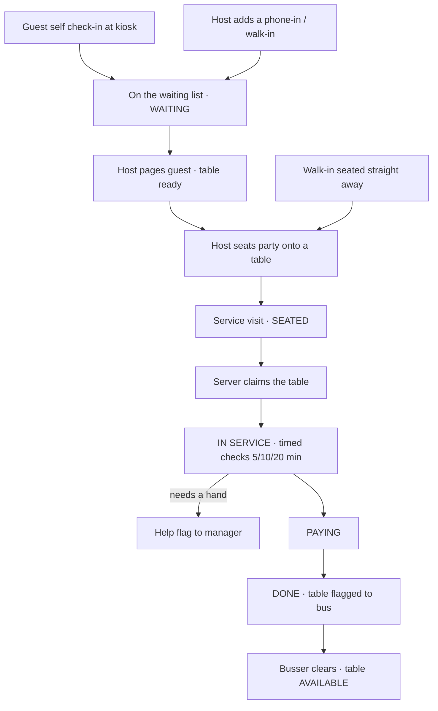
```mermaid
flowchart TB
  A1[Guest self check-in at kiosk] --> W
  A2[Host adds a phone-in / walk-in] --> W
  W[On the waiting list · WAITING] --> N[Host pages guest · table ready]
  N --> SEAT[Host seats party onto a table]
  A3[Walk-in seated straight away] --> SEAT
  SEAT --> V[Service visit · SEATED]
  V --> CLAIM[Server claims the table]
  CLAIM --> SERV[IN SERVICE · timed checks 5/10/20 min]
  SERV -->|needs a hand| HELP[Help flag to manager]
  SERV --> PAY[PAYING]
  PAY --> DONE[DONE · table flagged to bus]
  DONE --> BUS[Busser clears · table AVAILABLE]
```

1. **Join the list** — Guest self-checks-in at the kiosk (lands tagged *SELF
   CHECK-IN*), or the host adds them. A pure walk-in the host seats immediately
   skips waiting. If the guest opted in to texts, the **join-confirmation SMS**
   confirms their spot and links to the store's live waitlist
   (`/checkin/<slug>/current`) so they can watch who's ahead from their phone.
2. **Page & seat** — When a table frees, the host pages the guest (kiosk flips to
   "table ready") and seats them onto a specific table — creating the service visit.
3. **Serve** — A server claims the table on the Staff app, works timed checks, and
   can raise a help flag for a manager.
4. **Close out** — Move to paying, then done; the table is flagged for a busser, who
   clears it back to available.

### 6.2 Staff clock-in / clock-out & payroll

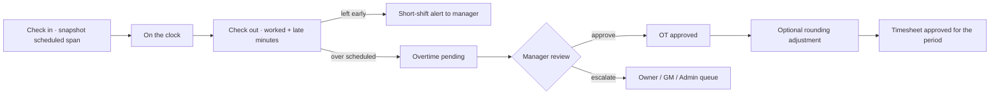
```mermaid
flowchart LR
  IN[Check in · snapshot scheduled span] --> ON[On the clock]
  ON --> OUT[Check out · worked + late minutes]
  OUT -->|left early| AL[Short-shift alert to manager]
  OUT -->|over scheduled| OT[Overtime pending]
  OT --> MGR{Manager review}
  MGR -->|approve| OK[OT approved]
  MGR -->|escalate| LEAD[Owner / GM / Admin queue]
  OK --> ADJ[Optional rounding adjustment]
  ADJ --> SIGN[Timesheet approved for the period]
```

Time flows from the clock station into the manager's review and a period sign-off.
Staff watch their own totals in **My Hours**.

### 6.3 Weekly scheduling

A manager builds the week from the Location → Schedule grid (every staff member ×
seven days):

- **Week / Month / Day** — a period picker at the top-left switches the view (the
  choice is remembered per viewer):
  - **Week** — the editable staff × 7-day grid (the default; everything below).
  - **Month** — a calendar of the location's schedule; each day shows how many staff
    are scheduled and the **total hours (worked + paid leave)**, with a `<n> leave` note
    and a month summary that folds leave in too. The current day is highlighted and
    out-of-month days dimmed. Click any day to jump into **Day** view.
  - **Day** — the same grid focused on one day, with Prev day / Today / Next day. The
    under-name total and the filters apply to that day; the over-limit flag uses the
    **8 h/day** limit.
  - The **view filters** (below) apply in Week and Day; the Month calendar is a
    location-wide roll-up and has its own hours summary instead.
- The **Jobs catalog** (Staff → **Jobs**) holds what you can assign, grouped by
  **department** — **Front House · Kitchen · Bar · Management**, plus **Department Not Set**
  for anything unassigned (sorted last). Each entry is either a **standard** role duty
  (Server, Line Cook, Host, Barista …) picked when building shifts, or a **specific**
  day-task (Opening Checklist, Clean Restrooms, Sanitize Prep Line …) the manager assigns
  on the **Day Tasks** board. All four working departments carry day-tasks — the **Bar**
  set covers restocking the bar, glassware, the bar top &amp; stations, ice wells, garnish
  prep, the coffee/espresso machine and kegs/draft lines, and the **Management** set covers
  cash-drawer reconciliation, bank deposit, the daily sales/labor review, timesheet
  approval, line check &amp; walk-through, and the opening/closing manager checklists.
- Click **+** on a day → set start/end, pick one or more **jobs** — the picker lists
  **roles only** (just the job name under its department); day-tasks are assigned on the
  **Day Tasks** board, not here — add paid **breaks** (10 min each; unlocked once a shift
  is ≥ 3.5 h; max 2/day unless the day tops 10 h).
- A day can hold multiple work periods (e.g. 8–12 and 12–16), each with its own
  break.
- Soft limits: **8 h/day** and **40 h/week** turn the cell red ⚠ and block the save
  until the manager ticks **"Approve overtime exception"** — so going over is
  deliberate.
- Because each shift carries its own location, a person can be scheduled at different
  stores on different days; away shifts show as read-only "@ store" cards.
- **Staff rows are ordered by the job they're assigned** (not account order), front-of-house
  leadership first through the kitchen and cleanup: **Shift Lead / Lead → Host →
  Server / Back Server / Food Runner → Barista / Bartender → Busser → Dishwasher →
  Line Cook (incl. Pho / Nuong / Cuon / Expo) → Clean up / Clean Up LB**, then **everything
  else**, alphabetical by name within a tier. A row's rank is the **highest-priority job
  across that person's shifts at this location** in the current view (Week or Day); someone
  with **no job assigned** falls back to their **account role**. Month view is a calendar,
  not staff rows, so the ordering applies to Week and Day.
- Each work shift is a **colour-coded block** — the whole block takes the assigned job's
  colour (white text), and every job keeps the **same colour everywhere**, so roles are
  easy to tell apart at a glance across the grid. A multi-job shift uses the first job's
  colour; a shift with no job is a neutral grey. The **Staff app** schedule (My Schedule
  and the lead Team view) colours each shift **the same way — the whole block by its job**,
  so a job reads the same colour in both apps.
- Under each staff member's name the grid shows their **total as `<hours> hrs / $<pay>`**
  **for this location** (the week, or the day in Day view). The hours and pay **include
  paid leave — Paid Sick Leave and PTO** — as well as worked hours; pay = (worked +
  paid-leave hours) × the person's pay rate, with a small **"incl. `<n>`h paid leave"**
  note. **Unpaid Time Off is shown on the schedule but is NOT counted toward hours or
  pay.** The **red ⚠** over-limit flag is based on **worked hours only** (leave isn't
  overtime). The totals chip above the grid sums the shown staff the same way.
  - **All-locations total** — when a person is also scheduled at **another store**, a
    second line **"(`<total>` hrs, all locations)"** shows their grand total across every
    location for the period. It turns **red** once the combined worked hours pass the
    40 h/week (or 8 h/day) limit — so cross-store overtime is easy to spot even though
    this store only owes the hours on the first line. (Hidden when **This location only**
    is on.)
- A **read/unread eye 👁️** sits by each scheduled person's name: **solid** once they've
  opened their own schedule (My Schedule in the console or the Staff app) for that week
  **since it last changed**, **dimmed with a slash** if they haven't seen the latest yet.
  Changing someone's shifts — **adding, editing, or removing** one — flips them back to
  unread until they look again; the tooltip shows when they last viewed it. The same eye
  appears in the **Staff app → My Schedule → Team** view, so a shift lead can see on their
  phone who still hasn't checked their schedule.
- **View filters** — a bar above the grid lets whoever is viewing narrow it down without
  changing anyone's schedule (the choices are remembered in that browser):
  - **Scheduled only** — hide staff with no scheduled hours in the current view.
  - **This location only** — hide the read-only "@ store" cards for shifts a person works
    at other locations, so the grid shows just this store's shifts. The under-name
    `hrs / $pay` total then counts only this location's hours.
  - **Show hours & pay** — turn the under-name `hrs / $pay` line on or off.
  - **Time off & requests** — narrow the grid to only staff **scheduled as time off**
    (PTO, Paid Sick Leave or Unpaid Time Off) in the current view, and show a panel of the
    location's **pending time-off requests** awaiting approval. Managers / owner / HR (the
    `manage` cap) can **Approve** or **Reject** each request **inline** — approving writes
    the leave shifts and re-renders the schedule on the spot, without switching to Messages
    → Requests. (An all-location approver's list is scoped to the store being viewed.)
  - **Role** — show only one role (the dropdown lists the roles present at this location).
  - A **Clear** button resets the filters, and a totals chip on the right reads
    **"Showing *N* of *M* · *X* hrs · $*Y*"** for the staff currently shown.
- **⧉ Copy a week** — fill the week on screen from an earlier one in a single confirm,
  so a steady weekly roster doesn't have to be re-entered by hand. Pick any of the last
  **8 weeks** to copy from (defaults to the **previous week**); it clones every **work
  shift** — with its assigned **jobs and breaks** — for people still on the location's
  roster, and you can edit any shift afterward. **Leave** (sick / vacation) is
  date-specific and is **not** carried over. If the target week already has work shifts,
  it asks first — tick **"Replace shifts already in this week"** to overwrite them
  (otherwise the copy is refused so nothing is duplicated). Any scheduler — manager /
  GM / owner / anyone with the **`manage`** cap (e.g. Shift Lead) — can use it on a
  location they can edit.
- **⟳ Auto-copy weekly** — for a location whose roster is the same week to week, a
  scheduler can turn on **"Auto-copy this schedule to next week, every week"** (a toggle
  under the Schedule tab, stored on the location as `auto_roll_schedule`; **off by
  default**, opt-in per store). A background sweep then copies that location's **current
  week** into the **upcoming week** automatically — the same work-shifts-with-jobs-and-breaks
  copy as the button, with the same rules: it **only fills an upcoming week that's still
  empty** (so it never overwrites shifts a manager already set), and it **never carries
  leave** forward. Because it only touches empty weeks it's self-rolling — each time the
  work week flips, the newly-empty next week fills in. Managers can still edit or use
  **Copy a week** on top of it. The sweep runs on server start and every 12 hours.
- **Leave** — the **+** entry has a **Type**: **Work Shift**, **🤒 Paid Sick Leave**,
  **🏖️ PTO**, or **🚫 Unpaid Time Off**. Leave takes a duration — **all day** (8 h), a
  **number of hours**, or a **from–to** span — and shows as a coloured chip. Leave never
  counts toward worked hours or the 8h/40h limits. **Paid Sick Leave** and **PTO** are
  **paid** (they count toward the schedule's hours/pay total); **Unpaid Time Off** is
  **not paid** — it appears on the schedule and timesheet but is excluded from pay. The
  **timesheet** shows the paid-leave hours in its **Leave** column with Unpaid Time Off
  listed separately, and the CSV export breaks them out as **Paid Sick Leave / PTO /
  Unpaid Time Off** hours (the computed **Gross** pays worked/OT/DT hours only). A person's
  HR **status** can also be set to `on_leave` on their profile.

Managers set leave directly with the **+** entry above; staff can also **request** it
themselves (next).

#### Time-off requests (staff → manager approval)

Staff request **PTO** or **Paid Sick Leave** themselves, and a manager approves or
rejects it — no phone calls or paper. (Unpaid Time Off is set by a manager on the
schedule, not self-requested.)

- **Requesting** — on **My Schedule** (Staff app, or the Management console for
  shift-scheduled staff) a **🏖 Request time off** button opens a short form: **type**
  (PTO / Paid Sick Leave), a **date** or **date range** (or a single day of a set number of
  **hours**), and an optional **reason**. Submitted requests, with their status, list
  under **My time-off requests** right there.
- **Reviewing** — every request lands in a **📋 Requests** tab under **Messages**, shown
  to anyone with the **`manage`** capability (manager / owner / HR / GM / shift-lead). It
  is **scoped**: a store's managers and shift-leads see their own location's requests;
  all-location leadership (owner / admin / HR / GM) sees every store. A badge shows the
  pending count. Filter by Pending / Approved / Rejected / All.
- **Approve** → the requested days are written onto the schedule as **leave hours**: a day
  the person was **scheduled to work** has those hours **converted to** vacation / sick
  hours (the work shift is replaced); a day with nothing scheduled becomes a **full 8 h**
  leave day. From then on it behaves like any leave entry — totalled on **My Hours** and
  the **Timesheet**, never counted as worked hours.
- **Reject** → **nothing on the schedule changes.**
- **Either way**, the requester gets a **message** with the decision (and the approver's
  optional note). Requests are stored in `leave_requests`; approval writes the leave via
  the same path as a manager-entered leave shift.

### 6.4 Inventory replenishment & the central kitchen

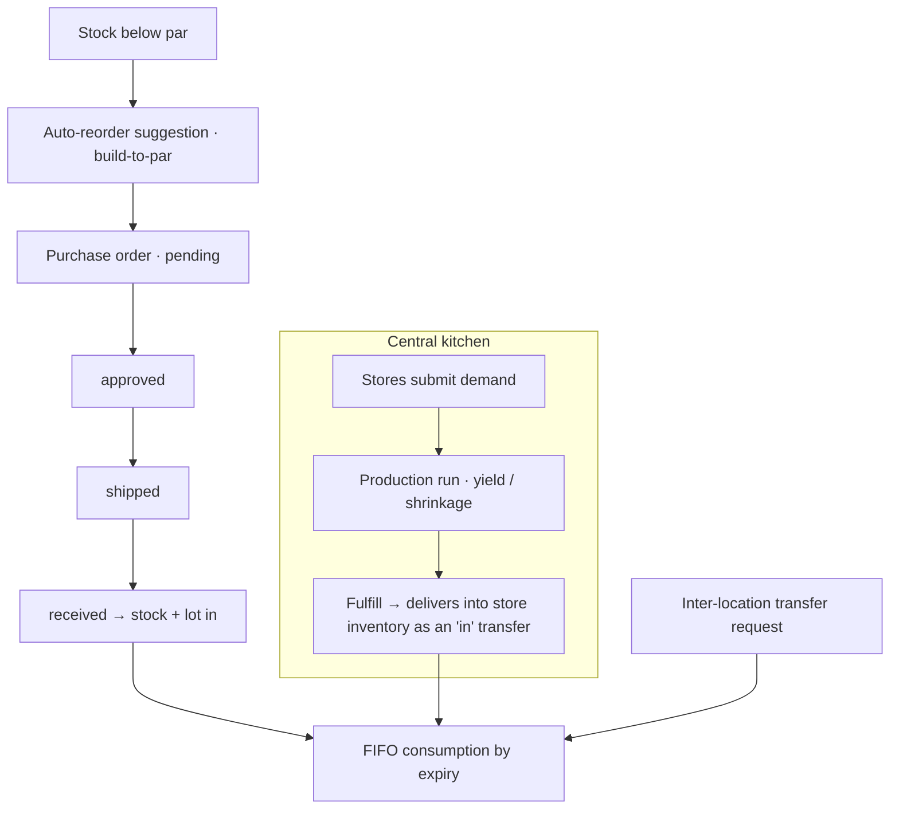
```mermaid
flowchart TB
  PAR[Stock below par] --> SUG[Auto-reorder suggestion · build-to-par]
  SUG --> PO[Purchase order · pending]
  PO --> AP[approved] --> SH[shipped] --> RC[received → stock + lot in]
  RC --> USE[FIFO consumption by expiry]
  subgraph CK[Central kitchen]
    REQ[Stores submit demand] --> PROD[Production run · yield / shrinkage]
    PROD --> FUL[Fulfill → delivers into store inventory as an 'in' transfer]
  end
  FUL --> USE
  XFER[Inter-location transfer request] --> USE
```

Two ways stock arrives: vendor POs and central-kitchen fulfillment. Waste and cycle
counts also adjust the ledger.

#### Central-Kitchen-first raw ordering

The Central Kitchen is also the group's **raw-food warehouse** — it stocks the same
raw items the stores use and distributes them. On a store's **Inventory → Orders &
Reorder** page, "Order — Central Kitchen first" is the preferred default: each
below-par item is split automatically, filling as much as the CK has on hand and
auto-drafting a **vendor PO for the shortfall** (a manager can still override to a
vendor-only PO).

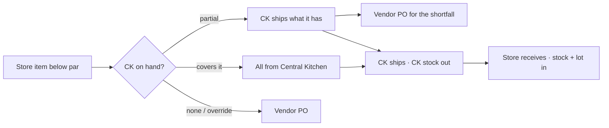
```mermaid
flowchart LR
  NEED[Store item below par] --> SPLIT{CK on hand?}
  SPLIT -->|covers it| CKALL[All from Central Kitchen]
  SPLIT -->|partial| MIX[CK ships what it has]
  SPLIT -->|none / override| VEND[Vendor PO]
  MIX --> VEND2[Vendor PO for the shortfall]
  CKALL --> SHIP[CK ships · CK stock out]
  MIX --> SHIP
  SHIP --> RECV[Store receives · stock + lot in]
```

**The hub's Distribution board: one row per order + a review/approve stage machine
(2026-10-09).** The Central Kitchen / Warehouse **Distribution** tab shows **one row per
order** (not per item) — ranked active-first, then highest priority, then oldest —
so a busy hub isn't a wall of item rows. Clicking an order opens a **detail page** with
all its items. Each order has a header (`distribution_order_headers`, keyed by `order_no`)
carrying its **stage**, over per-item **approval** decisions on the lines. The lifecycle:

1. **New Order** → *Review/Approve* (hub managers + org admins). On the detail page each
   item is **Approved / Held / Rejected** — a hold or reject needs a reason. You can
   **partially approve**: approved items proceed, held items wait (re-reviewable), and a
   **rejected item is kept-but-marked** (reason recorded) and dropped from fulfilment. The
   requester is messaged the outcome. Result: **Approved / Partially Approved / Holding /
   Rejected**.
2. **Approved / Partially Approved** → *Load* (CK staff). Loading **deducts the hub's
   on-hand** for the approved items (stock leaves the shelf onto the truck) → **Loaded**.
3. **Loaded** → a **driver** *Marks in transit* → **In Transit** (the store is notified
   it's on the way).
4. **In Transit** → *Mark delivered* (hand-off at the store) — lands the approved items in
   the store's inventory → **Received** (or **Partially Received** when some items were
   held). The **Load** and **Deliver** steps are **scanner-driven**: at the hub a
   **📠 Scan to load** (the scanner's Ship mode, now listing only approved items) scans each
   item onto the truck — when every approved item is scanned the order moves to *Loaded*;
   at the store the ordinary **Receive** scan is the **hand-off** — scanning the items in
   lands them and moves the order to *Delivered* once all are received. The manual *Load /
   Mark delivered* buttons remain as a fallback for items without a barcode.

**Resolving held items.** A held item isn't orphaned after the approved part delivers — the
order stays **active** on the board (flagged *⏸N held*, action *Resolve held*) until every
hold is settled. On the detail page each held item has **Approve** / **Reject** (hub
managers): approving it **re-enters fulfilment on the same order** — the order reopens to
*Approved* so the hub Loads and delivers just that item (the already-delivered items are
left alone); rejecting it drops it (reason required). Either way the requester is messaged,
and the order settles once the last hold is resolved
(`POST /distribution/hub-orders/:orderNo/resolve-held`).

Vendor shortfall is independent of approval (approval governs only the hub portion).
Endpoints: `GET /distribution/hub-orders` (board) + `/hub-orders/:orderNo` (detail),
`POST /hub-orders/:orderNo/{review,load,dispatch,deliver}`. The underlying line-level
ship/receive primitives (and the kiosk scan flow) are preserved, so the two models
coexist; cancel/recall keep the header in sync.

**The requester sees the same story.** On the store's own **Orders & Reorder** each order
group shows the order-level status chip (New Order / Approved / Partially Approved /
Holding / In Transit / Received / …) and each item's review decision — **approved / held /
rejected**, with the hub's reason on hover — so the store knows exactly what was approved,
held or turned down (on top of the message it gets on review).

The CK portion moves through a **load → in-transit → deliver** lifecycle on the Central
Kitchen's **Distribution** tab: loading deducts CK warehouse stock (an `out` movement),
and the hand-off lands it in the store's inventory (an `in` movement). Each order
is one `distribution_orders` row carrying its `ck_qty` / `vendor_qty` split; the
shortfall is an ordinary vendor `supply_orders` PO linked back to it. The CK curates
which items it offers (`inventory.distributable`) and **restocks itself from vendors,
never from itself**: in the Central Kitchen section the Orders & Reorder page is
**vendor-only** (plain below-par suggestions → "Create vendor PO"; no CK-first split, no
"order from the Central Kitchen" source), and `POST /distribution/order` hard-refuses a
CK-location order. Every store, by contrast, gets the CK-first split above.

**A store's "+ New order" is a multi-item order with a tracking number.** One order
can carry several items (one line each), and the whole order shares a single
**order number** — a short, human-readable `LOCATION-YYMMDD-NN` (e.g. `SJ-261008-01`:
San Jose, 8 Oct 2026, first order that day). Location codes are de-duplicated across
the chain (Milpitas `MIL` vs Milbrae `MILB`) and the sequence counts that store's
distinct orders for the day. The modal's **Order from** dropdown picks the hub —
Central Kitchen or a Warehouse — and only items that hub actually stocks are
selectable; because the two hubs ship from different locations, **each is a separate
order (and a separate tracking block)**. A **priority** (Urgent / High / Standard /
Low) is chosen before sending and rides with the order. `distribution_orders` stays
one row per item, now stamped with `order_no`, `priority` and `requested_by` (who
placed it); lines of one order are grouped by `order_no` for tracking. On the store's
**Orders & Reorder** page the open orders render as grouped blocks — **Central Kitchen
orders** and one block per warehouse (e.g. **Senter Warehouse orders**) — each group
headed by its order number, priority badge, date and who submitted it. On submit the
fulfilment team is **notified** (direct message + web/OS push); the recipient is **Nha
Le** for now (configurable later). The notify is best-effort and never blocks the order.

**Over-stock confirmation (2026-10-09).** Each item in the picker shows the hub's
current on-hand ("— N at hub"). If a line asks for **more than the hub has on hand**,
submitting first pops a confirmation listing each over-stock line (Ordered / At hub /
Short) — the hub ships what it has and the **shortfall is auto-ordered from a vendor** —
and asks whether to still add it. The requester can **Back to edit** (state preserved) or
**Add anyway & submit**. Orders fully within the hub's stock submit straight through. The
check is hub-agnostic, so it applies to the Central Kitchen and every Warehouse.

**Cancelling after submit (2026-10-09).** The store that placed an order can cancel it
**before it ships** — to change it or because it's no longer needed (previously only the
hub could cancel). On **Orders & Reorder** each not-yet-shipped line has a **Cancel**
button, and each order group has a **Cancel order** button (cancels every line not yet
shipped); both confirm first. Cancelling a line also **cancels its linked vendor-shortfall
PO**. A line that has already shipped (`shipped_qty > 0`) or been received can't be
cancelled — receive it, or ask the hub. Backend: `PUT /distribution/orders/:id`
(`status: cancelled`) now permits the requester's store as well as hub staff, and
`POST /distribution/cancel-order` cancels a whole order by its number atomically (scoped
to the caller's store).

**Requesting cancellation of a *shipped* order (2026-10-09).** Once an order ships the
stock is in transit, so the store can't cancel it outright — it **asks the hub**. On
**Orders & Reorder** each shipped line shows **Request cancellation** (and the order
header requests all shipped lines); a pending request shows a **⏳ cancel requested**
badge with a **Withdraw request** button, and the fulfilment contact is notified. On the
hub's **Distribution** board the flagged line shows the badge (reason on hover) with
**Recall & cancel** / **Decline**: *recall* returns the in-transit stock to the hub's
on-hand (a logged `in` movement + a fresh lot), cancels the line and its vendor PO, and
tells the store not to receive it; *decline* clears the request and tells the store to
receive it as normal. Columns: `cancel_requested` / `cancel_reason` / `cancel_requested_by`
on `distribution_orders` (cleared on receive). Endpoints: `POST /orders/:id/request-cancel`,
`/withdraw-cancel`, `/resolve-cancel` (hub: `{action: recall|decline}`), and
`POST /request-cancel-order`.

The CK warehouse is a real stock holding, so the **org-wide inventory report**
(Reports → Items with no location selected) counts it alongside the ten stores — its
value shows up in the total, the by-category and by-location breakdowns, and the top
items. Scope the report to a single store and it stays store-only, as before.

On the **Stock** page, a single item's **Order** button opens a picker whose *source*
**defaults to the Central Kitchen** whenever the CK stocks that item (falling back to
the vendor list otherwise), so ordering CK-first is the one-click default there too.
And **+ Add item** picks its name from the **Glossary** — a dropdown of catalog items
not yet stocked at that location, auto-filling category and unit — so item names stay
consistent; brand-new names are still created on the Glossary tab.

**Everything is audited — with a reason.** Every add, edit, order, receive, transfer,
waste, count and Central-Kitchen action writes an `audit_log` entry recording **who ·
when · what**. The Add / Edit / Order forms across Inventory and the Central Kitchen
also carry an optional **Reason / note** field, so the audit records **why** too. The
full trail is on **Inventory → Activity** ("who did what" — inventory, central kitchen
and distribution), where each row shows the action, the item and quantity, the reason,
and the person who did it.

### 6.5 Team messaging

Everyone can send **direct** messages; managers and above can **broadcast** to all
staff or a whole location. Assigning a task notifies the assignee. Threads support
replies, mark-unread and archive. The **Messages menu badge counts unread direct
messages and team chat together** (on both apps), so a badge shows whenever either is
waiting; it updates in real time as messages or chat arrive.

**Attachments — photos, videos & files.** Both the composer and the reply box carry a
**📎** control (multi-select). Beyond images and videos you can now attach **documents and
files** — PDF, Word, Excel, PowerPoint, CSV/TXT, ZIP, and the like (`lib/attachments.js`
classifies by MIME, with a safe-extension fallback; **executables, scripts and inline-web
files such as .exe/.js/.html/.svg are refused**). Stored as bytes in `message_attachments`
(images ≤ 10 MB, videos & files ≤ 25 MB, 10 per message). Images show as tap-to-zoom
thumbnails and videos as inline players; a **file** shows as a **download card** (type icon +
name + size) served with `Content-Disposition: attachment`. Only the sender can attach; every
participant can view. An attachment-only message auto-captions (e.g. "📷 Photo", "📎 report.pdf").

**Read receipts.** On your **Sent** list and under each of your own messages in a thread, a
**✓ / ✓✓ Read by `<n>` of `<m>`** line shows how many recipients have opened it. **Tap it**
to see the breakdown — who has **read** it (and how long ago) and who **hasn't yet**
(sender-only). Read state is tracked per recipient (`message_recipients.is_read` / `read_at`),
and works on both apps.

**Deleting.** In a thread, a message's own sender — or any **manager** (owner, admin,
general manager, manager), for moderation — can **delete** a whole message (its 🗑 button)
or remove a single **attachment** (its ✕). Deleting removes just that message (replies in
the thread stay); its recipients and attachments go with it.

| Sender | Can message |
|---|---|
| Owner / Admin / GM | Anyone — everyone, a group, or an individual |
| Manager | Owner/admin, their staff, and manager peers |
| Staff (self-service) | Their manager, owner/admin, and peers |

**Chat groups.** The Messages page also has a **💬 Chat** tab: persistent, membership-
scoped group conversations (like channels), stored in `chat_groups` / `chat_group_members`
/ `chat_messages`. **Everyone** can create a group from the staff list; the **New group** and
**Add members** dialogs use the same **type-ahead recipient picker** as the message composer's
"A specific person" — type a letter and a **dropdown of matching names** appears (prefix match
on any word), click to add one or more as removable **chips**. **Managers and above**
additionally get quick **add-by-location** and **add-by-role** builders (which feed the same
chips). Only a
group's **members** see and post in it; the whole thread is delivered live over the SSE
stream (both apps). Everyone sees the groups they belong to, with unread counts
(`chat_reads`). **Leadership (owner/admin/GM)** can switch to **All groups (audit)** to
read any group for review — read-only unless they're a member. The **group's creator or
leadership** can **edit membership** from the group's 👥 Members panel (add staff — with
the same by-location / by-role builders — or remove a member with their ✕). **Owner/admin**
can **delete** a group; it's a soft-delete (deactivated and hidden from members) so all
messages are **retained for audit**. A group lives until then. Each message you post shows a
**✓ Read by `<n>` of `<m>`** line (**✓✓ Read by everyone** once all have); **tap it** to open a
**Read receipts** popup listing who has **read** it and who **hasn't yet**, each with their role
(sender-only) — computed from every member's read cursor (`chat_reads`). Because chat tracks a
per-member read *position* (not a per-message timestamp), the chat popup shows names but no
read-time, unlike direct messages.

**@mentions.** Inside a chat group you can **call out a teammate**: type **`@`** in the
message box and a **type-ahead picker** of the group's members appears — keep typing to
filter, then click (or ↑/↓ + Enter/Tab) to insert **`@Name`**. In the posted thread, any
`@Name` that matches a member is **highlighted** so the person notices it; **your own
mentions get a stronger highlight**. This is a **visual cue only** — it doesn't send a
separate push notification, it's **chat groups only** (not direct messages), and it's for
**individual members** (there's no `@everyone`). The member list comes from the group's
existing read roster, so nothing extra is stored. **Chat does not send on Enter** — Enter
inserts a newline; a message goes only when you press the **Send** button (so long notes
and shift-free line breaks are safe).

**Pictures & videos in chat.** Like direct messages, the chat composer carries a **📎**
control (multi-select): members can attach images, videos **and files** to a group message —
same rules as direct messages (images ≤ 10 MB, videos & files ≤ 25 MB, 10 per message; no
executables/scripts), stored as bytes in `chat_message_attachments` and shown inline (images
tap-to-zoom, videos as players, files as download cards). Only the message's sender can attach to it; **members and auditing
leadership** can view. New media is pushed live over the SSE stream so the group sees it
without reloading. Attachments are retained with their message for audit.

> **Pop-up alerts, chime & vibration (Staff app).** A new direct message or team chat
> raises a small on-screen pop-up with a **chime and a vibration**, each toggled in
> **⚙️ Settings** (Message sound / Message vibration / New-message pop-ups — all on by
> default; a **Test** button previews the chime). Two things to expect:
> - **It notifies the _recipient_, not the sender.** Sending a message or chat doesn't
>   chime your own device — send it to someone else (or use the Test button) to hear it.
> - **It only pops when you're not already on that screen** (no chime for the inbox/chat
>   you're currently looking at), and a **10-min repeat reminder** re-nags anything left
>   unread.
> - **Vibration is Android-Chrome only** — iPhone/iPad and desktops can't vibrate from the
>   web, but the **chime still plays** there. Sound needs one tap on the app first (any
>   sign-in or tap unlocks audio; the browser blocks sound until then).

The chime above only fires while the app is **open in the foreground**. For alerts that
reach a phone that's **locked, backgrounded, or on silent**, turn on **device
notifications (Web Push)** — a real OS notification, with the system's own sound and
vibration, for new **direct messages**, **team chat**, and **floor alerts**. Tapping it
opens the app to the right screen.

> **Turning on device notifications.** Each person enables it **once per device**:
> - **Staff app** → **⚙️ Settings → 📲 Device notifications → Enable notifications**.
> - **Management console** → **Account Settings → 📲 Device notifications → Enable notifications**.
>
> **On iPhone/iPad you must first add the app to your Home Screen** (Safari **Share → Add
> to Home Screen**) and open it from that icon — iOS only allows web notifications for an
> installed app (iOS 16.4+), never in a plain Safari tab. Android/desktop Chrome can enable
> it straight away. Notifications keep coming with the app closed or the phone on silent;
> a person can turn them off again from the same screen, or in their device settings.
>
> **Step-by-step guide for staff.** A shareable, illustrated walk-through (iPhone &
> Android, in **English / Español / Tiếng Việt**) is hosted on each app's own domain,
> no login required: **`pho-ha-noi-waitlist.fly.dev/setup`** (staff) and
> **`pho-ha-noi-management.fly.dev/setup`** (managers). Both apps also link it in-app as
> **"📖 How to set this up"** right under the Device-notifications control.
>
> Under the hood this is VAPID Web Push: the Management app signs and sends each
> notification (`push_subscriptions` holds each device's subscription; dead ones are
> pruned automatically), and both PWAs' service workers show it. The `/setup` page is a
> static how-to (`public/setup.html` in each app) — public and safe to hand out.

### 6.6 Daily tasks: start, done, proof photos & comments

Managers assign specific day tasks on the Management **Day Tasks** board. Each
working staff member sees their own tasks in the Staff app's **My Tasks**:

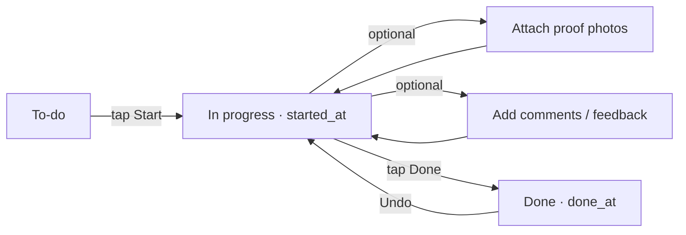
```mermaid
flowchart LR
  TODO[To-do] -->|tap Start| PROG[In progress · started_at]
  PROG -->|optional| PHOTO[Attach proof photos]
  PROG -->|optional| NOTE[Add comments / feedback]
  PHOTO --> PROG
  NOTE --> PROG
  PROG -->|tap Done| DONE[Done · done_at]
  DONE -->|Undo| PROG
```

1. **Start** — the staff member taps Start; `started_at` is stamped and the card
   shows as in progress.
2. **Proof photos (optional)** — before finishing, they may attach **one or more
   photos** (camera or library — the picker allows multi-select). Each is sent as raw
   image bytes and stored as its own row in `task_photos` on the Management DB volume,
   then shown in a thumbnail strip (tap to zoom). Up to **8 photos per task**; while a
   task is in progress each thumbnail carries a **✕** to remove it.
3. **Comments / feedback (optional)** — right next to the photos, a **💬 Comments &
   feedback** box lets staff add notes (e.g. "walk-in was warm, flagged maintenance").
   Each comment is stored in `task_comments` with its author and time, and the whole
   thread is shared: a manager can **reply with feedback** from the Day Tasks board and
   it appears in the staff member's **Comments & feedback** box **live — pushed over the
   SSE stream, no refresh needed** (a brief "💬 New feedback from management" note flags
   it, and any reply they're mid-typing is preserved). You can delete your own comment; a
   manager can delete any.
4. **Done** — tapping Done stamps `done_at`. The manager's Day Tasks board sees the
   Start/Done times and can view every proof photo and comment.

Each task row carries a **Done-status checkbox at the far right** ("DONE" label). It
ticks green the instant a task is completed — via the ✓ Done button _or_ by tapping
the checkbox itself — with the running `done/total` header and progress ring updating
in the same moment, ahead of the server round-trip. Tapping a ticked box undoes it.

On the Day Tasks board a manager assigns each task via its **Assigned to** dropdown
(assigning notifies the assignee). Setting a task back to **— unassigned —** clears it
completely: the assignment is removed, so no owner, scheduled time, or "done" tick is
left behind — the task simply returns to the pool for someone else.

Photos and comments are optional — a task can be completed without either. On the Day
Tasks board the **Proof** column shows a **📷 _n_ · 💬 _m_** button (a **💬 +** when
empty); a manager, owner, or general manager clicks it to open a panel with the
**gallery** of every image (each captioned with who uploaded it and when — tap for full
size) and the **comment thread**, where they can leave feedback. The task's own staff
member and any manager can view both; they persist with the database.

### 6.7 Floor alerts: an urgent ping to staff on shift

When a manager/owner needs a staff member's attention *right now* — "help table 5",
"run food to tables 3 & 4", "come bus a table" — a **floor alert** pops up full-screen
on the working staff member's Staff app (with a chime + vibration), separate from the
regular message inbox.

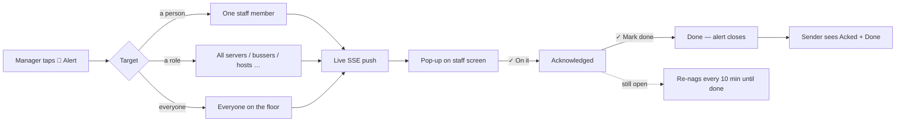
```mermaid
flowchart LR
  M[Manager taps 🔔 Alert] --> T{Target}
  T -->|a person| P[One staff member]
  T -->|a role| R[All servers / bussers / hosts …]
  T -->|everyone| E[Everyone on the floor]
  P --> D[Live SSE push]
  R --> D
  E --> D
  D --> POP[Pop-up on staff screen]
  POP -->|✓ On it| ACK[Acknowledged]
  ACK -->|✓ Mark done| DONE[Done — alert closes]
  ACK -.->|still open| NAG[Re-nags every 10 min until done]
  DONE --> S[Sender sees Acked + Done]
```

- **Send** from the **🔔 Alert** button in the Staff app header, or in the Management
  console under **Messages → Floor alerts**. Pick **who** (a person, a role, or everyone
  on the floor), tap a **quick message** (with a table-number fill-in) or type your own,
  choose **Urgent** or **Normal**, and send.
- **Receive — two steps.** The alert rides the same live stream as messages, so it appears
  within a moment on every targeted staff member's screen; anything still pending also shows
  when they next open the app. The staff member first taps **✓ On it** to acknowledge (or
  Dismiss), then — when the task is actually finished — taps **✓ Mark done**. An alert that's
  been acknowledged **but not yet marked done stays on the person's screen and re-surfaces on
  the 10-minute reminder**, so it can't be silently forgotten. Each staff member can mute the
  chime and/or vibration for their own device under **⚙️ Settings → Floor alerts** (the pop-up
  still appears).
- **Track** — the sender's **Floor alerts** tab lists recent alerts with live **Acked** *and*
  **Done** counts; tap **Who** to see who's *on it* versus *done*. A single-person alert
  **closes automatically** the moment that person marks it done; role/everyone alerts are
  closed by the sender with **Close**. Only owner / admin / GM / regional / store managers can
  send; a manager can only alert their own store. Every send is written to the audit log.

Alerts are for immediate floor coordination; use **Messages** (§6.5) for anything that
should live in an inbox or thread.

---

## 7. Roles & access levels

A **role** has an **access level** (its scope — all locations / their own / just
themselves) plus **capabilities** (what it can do). The registry lives in the
`roles` table, seeded from `lib/auth.js` defaults. Route permissions, the sidebar,
and the on-screen page all derive from it — and the API returns **403** on any
disallowed action, so hiding in the UI is convenience, not the security boundary.

On the **Staff → Access Levels** page the columns are **Roles · Access Level · Can
do**. **Owner/Admin** can **＋ Add role**, **Edit** any role (its access level and
capabilities), or **Remove** one — changes take effect immediately, no redeploy.
Guards: the **Owner** and **Admin** roles can't be removed, a role still assigned to
staff can't be removed (reassign those people first), and Owner always keeps org
admin. Everywhere a staff member's role is chosen or shown — **＋ Add Staff**, the
edit form, the directory, the profile — the field is labelled **Role**.

**Access levels (scopes):** `all` (sees and switches between every location) ·
`location` (pinned to their own store) · `self` (only their own schedule, tasks &
messages).

| Role | Access Level | Capabilities | In short |
|---|---|---|---|
| **Owner** | all | org · manage · ops · reports · central | Everything; only an owner can create owners |
| **CEO** | all | org · manage · ops · reports · central | Executive org admin, mirroring Owner's access |
| **President** | all | org · manage · ops · reports · central | Executive org admin, mirroring Owner's access |
| **Admin** | all | org · manage · ops · reports · central | Everything; created by an owner |
| **HR** | all | org · manage · ops · reports · central | Full administrative access, mirroring Admin¹ |
| **General Manager** | all | manage · ops · reports · central | Operations across every store |
| **Regional Manager** | all | manage · ops · reports | Multi-store ops, no central kitchen |
| **Manager** | location | manage · ops · reports | Runs their own store end to end |
| **Assistant / Kitchen Manager** | location | manage · ops · reports | Same store powers, lower rank |
| **Analyst / Accountant** | all | reports | Read-only reports & analytics, all stores |
| **Inventory Support** | location | ops | Stock operations at their store |
| **Driver** | location | delivery | Read-only delivery manifests + own schedule |
| **Server · Host · Busser · Chef · Line/Prep Cook · Cashier · Bartender · Barista · Dishwasher** | self | — | My schedule, my tasks, messages, my hours |

> **Positions share permissions, differ by title.** Server, Host, Busser and the
> kitchen positions are all `self`-scoped with the same access — the job title just
> changes what they're called and which Staff-app views appear.
>
> ¹ **HR** currently has the same full access as Owner/Admin. Owner and Admin are
> slated to keep a few powers to themselves later — **archive, delete, view the
> activity log, and audit information** — which HR would then not have; the checks
> that will change are marked `ORG_ADMIN_ONLY` in the code.

---

## 8. User guide by role

Hand each tester the section that matches their job.

### Owner / Admin

1. **Sign in to the Management console** — you land on an org-wide overview. Use the
   location picker (top bar) to switch between all ten stores + the central kitchen.
2. **Add a staff member** — Staff → Add staff: fill the account + HR profile, set
   the **10-digit login phone** (mandatory; email optional), role, home
   location and any "also works at" stores. Confirm they appear in the A–Z directory,
   then sign in as them with that phone number.
3. **Check the central kitchen** — Central Kitchen → Demand → "Generate from sales",
   then Production to scale a batch sheet, then Fulfillment to deliver into a store.
4. **Review reports & the activity log** — Reports for sales/analytics/timesheets;
   Staff → Activity Log for every sign-in, change and denied attempt.

### Store Manager (Assistant / Kitchen Manager)

1. **Sign in** — you land on your store's dashboard (KPI tiles, today's roster,
   schedule health, needs-attention). Everything is scoped to your location.
2. **Build the week** — Locations → your store → Schedule: add shifts, attach jobs,
   add paid breaks. Try to exceed 40 h and confirm the guardrail blocks the save
   until you approve the exception.
3. **Run inventory** — Inventory → Orders & Reorder: accept an auto-reorder
   suggestion into a PO, then receive it and watch stock + a lot appear.
4. **Approve time** — Reports → Timesheets: review late/short/OT flags, approve
   overtime (or escalate), round a day, and sign off the period.
5. **Update your staff** — Staff → Directory → **Edit** on any of your store's
   people to update their full HR profile (contact, address, emergency contact,
   employment, payroll, skills/notes), status, or reset a password. Role and
   home location changes stay with owner/admin, and only they can Add staff.

### Inventory Support · Analyst / Accountant · Driver

- **Inventory Support** (ops · own store) — sign in to Management; you get the
  Inventory module for your store (receive, transfer, count, waste, create orders).
  No staff or menu admin.
- **Analyst / Accountant** (reports · all) — sign in to Management; you get Reports
  only, read-only, across every location: sales, analytics, timesheets, payments.
- **Driver** (delivery) — sign in to Management; you get a read-only Deliveries view
  (central-kitchen manifests / packing slips) plus your own schedule and messages.

### Host / Front Desk

1. **Sign in to the Front Desk app** — header shows your store 📍. The live queue
   lists each party with waited time and quoted wait; self-check-ins are flagged.
2. **Add & seat a party** — Add party (name, size, phone — quote auto-suggests).
   When a table frees, Notify the guest, then Seat them onto a table.
3. **Or use the Staff app** — front-desk staff also get the 🍜 Front Desk board and
   🍽️ Floor in the Staff app on their phone.

> **Who has Front Desk access.** The Owner, Managers (incl. Assistant/GM/Regional),
> Front Desk, and Host roles run the Front Desk, plus the **Server** and **Cashier**
> roles — so front-of-house floor staff can add, notify and seat parties from the
> Staff app. (Editing the floor **plan** stays limited to Owner / Manager / Front Desk.)

### Server / Busser

1. **Open the Staff app on your phone** — you land on **My Tables**. The floor shows
   open tables to claim.
2. **Work a table** — claim a seated party, run the timed checks, raise a help flag
   if you need a manager, move to paying, then done. Bussers pick up the "ready to
   bus" flags.
3. **Check your hours** — ⏱ My Hours shows your day/week/month totals with late and
   overtime highlighted.

### Kitchen & other positions (Chef, Line/Prep Cook, Cashier, Bartender, Barista, Dishwasher)

Self-service everywhere: the Staff app's **📅 My Schedule** (their shifts by
day/week/bi-weekly/month), **My Tasks**, **Messages** and **My Hours** — the same
schedule is also read-only under **My Schedule** in the Management console. Punch in
and out at the time-clock station.

### Guest (no login)

Walk up to the lobby tablet or scan the store QR → open `/checkin`, enter name /
party size / phone / any requests, join, and keep the screen open to watch your
place in line until "your table is ready."

---

## 9. Test plan & logins

> **Shared demo sandbox.** Anyone signed in can edit the data — please don't enter
> real guest or staff information while testing. Machines idle-sleep and cold-start
> in ~1–2 s.

### Where to go

| Surface | URL |
|---|---|
| Management console | `pho-ha-noi-management.fly.dev` |
| Front Desk / Staff app | `pho-ha-noi-waitlist.fly.dev` |
| Guest self check-in | `pho-ha-noi-waitlist.fly.dev/checkin` |

### Demo logins

> **One login, both apps.** Sign-in is by **10-digit phone number** and is unified to
> the Management directory, so **the same phone + password works on both the Management
> console and the Staff / Front Desk app** — every account below is verified working on
> both. Any input format is accepted — `(408) 483-0030`, `408-483-0030`, `4084830030` —
> and normalized to the 10 digits before matching. Each role then sees the UI
> appropriate to it (e.g. an Analyst or Driver can open the Staff app but only sees the
> self-service views — My Tasks, Messages, My Hours). Front-desk staff use the Staff
> app; back-office roles use the console.

| Role | Phone (login) | Password |
|---|---|---|
| Owner (all) | `(408) 483-0030` | `Harry123!` |
| Admin (all) | `(408) 555-0001` | `Admin123!` |
| General Manager (all) | `(408) 555-0004` | `Gm123456!` |
| Manager (location) | `(408) 555-0101` | `Manager123!` |
| Analyst (reports) | `(408) 555-0005` | `Analyst123!` |
| Inventory Support (ops) | `(408) 555-0002` | `Support123!` |
| Driver (delivery) | `(408) 555-0006` | `Driver123!` |
| Server (self) | `(408) 555-0007` | `Server123!` |
| Chef (self) | `(408) 555-0011` | `Chef123456!` |
| Host — role `host` (waitlist) | `(408) 555-0010` | `Host123!` |
| Front Desk — role `frontdesk` (waitlist) | `(408) 555-0201` | `Host123!` |

> **Note:** all logins above are verified working on production, on **both** apps. If
> a login ever fails, the owner account (`(408) 483-0030` / `Harry123!`) is the safe
> fallback. Email is no longer used to sign in — it's kept only as an optional internal
> identity (messaging/directory). The ten store managers are `(408) 555-0101` …
> `(408) 555-0110`.

### A 10-minute smoke test for a store

1. **Guest joins** — on a phone, open `/checkin`, join the list, keep the tracker
   open.
2. **Host seats** — sign in as the host, page the guest (their tracker flips to
   "ready"), seat them onto a table.
3. **Server serves** — as a server in the Staff app, claim the table, run a check,
   mark paying then done.
4. **Manager reviews** — as the manager, open Reports → Timesheets and the Overview
   dashboard; confirm the store's numbers moved.
5. **Owner watches** — as the owner, switch locations and confirm the visit shows in
   Guest History and the daily report.

### Central-Kitchen-first reorder (raw food)

Exercises the CK-first split ordering across the store and Central-Kitchen roles.
Manager logins run `(408) 555-0101` … `(408) 555-0110` (all `Manager123!`); the
Milpitas store (`(408) 555-0102`) carries low **Star Anise** and **Beef Flank** —
items the CK is also short on — so it shows a true split.

1. **Manager sees the split** — sign in as `(408) 555-0102`, open **Inventory →
   Orders & Reorder**. The low-stock list is headed *"Central Kitchen first, vendors for
   the shortfall,"* with **From CK** / **From vendor** columns. Confirm the split, e.g.
   Star Anise (need 14 → CK 5 + vendor 9) and Beef Flank (need 85 → CK 36 + vendor 49).
2. **Place the order** — click **Order all — CK first**. The items appear under **Central
   Kitchen orders** as `requested`, and the shortfall shows as vendor POs under
   **Purchase / supply orders**. (Or use **Vendor PO instead** to skip the CK entirely.)
3. **CK ships** — sign in as the owner / GM, open **Central Kitchen → Distribution →
   Incoming store orders**, and **Ship** an order. Confirm the item's warehouse **On
   hand** drops by the shipped quantity.
4. **Store receives** — back on the store's **Orders & Reorder** (as the manager or the
   CK), **Mark received**. Confirm the quantity lands in the store's **Stock**.
5. **CK restocks itself** — as the CK, open **Inventory** scoped to the Central Kitchen
   and reorder low warehouse items from vendors — the normal PO flow.

> **Access check:** a store manager never sees the **Central Kitchen** nav — they order
> *from* the CK but can't touch its warehouse or fulfilment queue (those return 403).

### Floor alert (manager → working staff)

Needs two devices/tabs: one signed in as a **manager** (`(408) 555-0102` /
`Manager123!`, Milpitas) and one as a **server at that store**
(`(408) 555-0007` / `Server123!`).

1. **Staff waits on the floor** — on the server's device, open the Staff app and stay on
   **My Tables** (their live stream is connected — the green ● Live badge shows).
2. **Manager sends** — on the manager's device, tap **🔔 Alert** in the Staff app header
   (or Management **Messages → Floor alerts**). Choose **A role → Servers**, tap the
   *"Help table {n} right away"* quick message with **#** = 5, leave it **Urgent**, and
   **Send**.
3. **Pops up** — within a moment the server's screen shows a full-screen **URGENT ALERT**
   card ("Help table 5 right away — from …") with a chime. Tap **✓ On it**; the card
   switches to **✓ Mark done**.
4. **Finish it** — once the table's handled, tap **✓ Mark done**. (If you dismiss without
   finishing, the alert stays and re-nags after 10 minutes.)
5. **Sender sees it** — the manager gets a "✓ … is on it" then "✓ … marked it done" toast,
   and the **Floor alerts** tab shows the **Acked** and **Done** counts tick up (tap **Who**
   to see who's *on it* vs *done*); a single-person alert auto-closes when done.
6. **Access check** — sign in as the server and confirm there is **no 🔔 Alert button**;
   a non-manager cannot send (the API returns 403).
